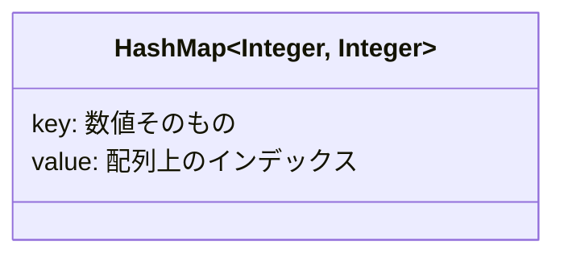
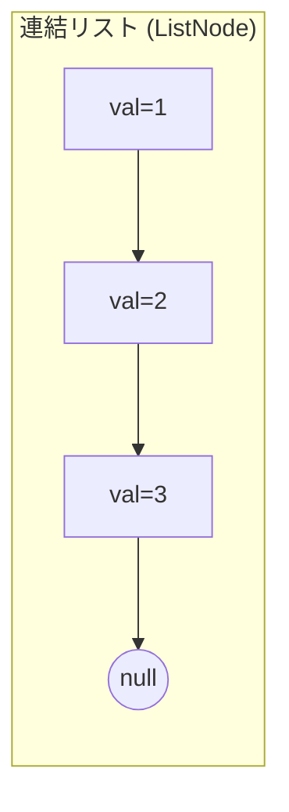
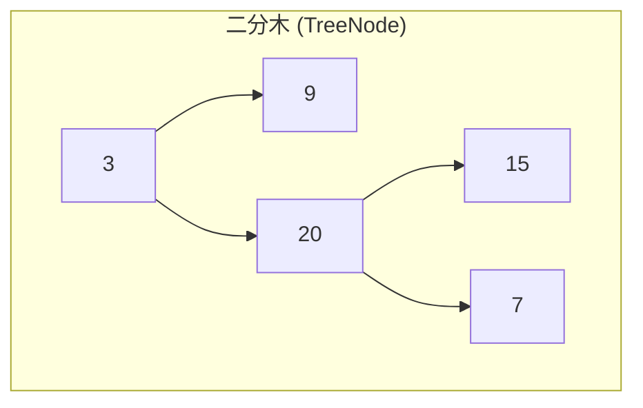
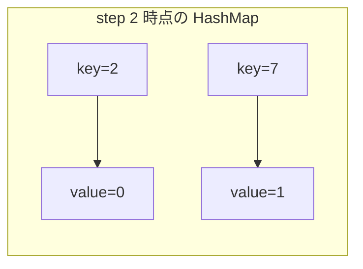

# Blind75 問題作成スキル

LeetCode の問題番号を受け取り、この blind75 リポジトリのカテゴリ構成に合わせて、問題内容を日本語に翻訳した Markdown ファイルと解答ファイル一式を作成する。

## 入力

- **必須**: 問題番号
  - 例: `blind75-create 190`
- **任意**: 出力先カテゴリディレクトリ（未指定の場合は `README.md` から決定する）

## 手順

### 1. 問題番号から対象問題を決定する

1. `README.md` を読み、問題表からその番号の行を探す。
2. 行の問題タイトルを使って LeetCode のスラッグを推定する。
3. スラッグは原則として、英語タイトルを小文字化し、英数字以外をハイフンに変換し、連続ハイフンを1つにまとめる。
4. 既存ディレクトリがある場合は、そのディレクトリ名の `{問題番号}-{スラッグ}` を優先してスラッグを決定する。

例: `blind75-create 190` -> `README.md` の `190. Reverse Bits` -> `reverse-bits`

`README.md` に対象行が見つからない場合、またはスラッグ推定に確信が持てない場合は、勝手に進めずユーザに確認する。

### 2. 同梱スクリプトで問題データを取得する

このスキルに同梱している `scripts/leetcode-fetch` で、LeetCode GraphQL API から問題データを取得する。
グローバルな `leetcode-fetch` コマンドや Nix 配置には依存しない。

```bash
.codex/skills/blind75-create/scripts/leetcode-fetch <slug>
```

レスポンスは JSON 形式で、以下のフィールドを含む:

- `data.question.questionFrontendId`: LeetCode 上で表示される問題番号（例: `"14"`）
- `data.question.title`: 問題タイトル（例: `"Longest Common Prefix"`）
- `data.question.titleSlug`: スラッグ（例: `"longest-common-prefix"`）
- `data.question.difficulty`: 難易度（`"Easy"` / `"Medium"` / `"Hard"`）
- `data.question.content`: 問題文（HTML 形式）

### 3. Blind 75 のカテゴリを決定する

このリポジトリでは、問題ディレクトリを `README.md` のジャンルに合わせたカテゴリディレクトリ配下に作成する。

1. `README.md` を読み、`## Array (配列)` のような見出しと、その直下の問題表を確認する。
2. `questionFrontendId` と `title` を使って、対象問題がどの見出し配下にあるかを特定する。
3. 見出しの英語カテゴリ名を小文字・スペース区切りなしのディレクトリ名に変換して、出力先カテゴリディレクトリにする。

既存カテゴリのディレクトリ名は、原則として以下に揃える:

| README 見出し | ディレクトリ |
| --- | --- |
| `Array (配列)` | `array` |
| `Binary (ビット操作)` | `binary` |
| `Dynamic Programming (動的計画法)` | `dynamic-programming` |
| `Graph (グラフ)` | `graph` |
| `Interval (区間)` | `interval` |
| `Linked List (連結リスト)` | `linked-list` |
| `Matrix (行列)` | `matrix` |
| `String (文字列)` | `string` |
| `Tree (木)` | `tree` |
| `Heap (ヒープ)` | `heap` |

例: `190. Reverse Bits` は `README.md` の `Binary (ビット操作)` 配下にあるため、作成先は `binary/190-reverse-bits/{yyyyMMdd}/`。

対象問題が `README.md` に存在しない場合は、勝手にカテゴリを推測せず、ユーザに出力先カテゴリを確認する。

同じ問題番号が複数カテゴリにある場合は、ユーザが指定したカテゴリを優先する。指定がない場合は、`README.md` で最初に見つかったカテゴリに作成する。

### 4. ディレクトリとファイルを作成する

以下の構造で作成する:

```text
{カテゴリディレクトリ}/{問題番号}-{スラッグ}/{yyyyMMdd}/
├── problem.md              # 原文の問題文（英語）
├── problem-ja.md           # 日本語訳の問題文
├── FirstSolution/
│   ├── Solution.java       # Java の解答用クラスファイル（雛形）
│   └── Solution.cs         # C# の解答用クラスファイル（雛形）
└── AISolution/
    ├── Solution.java       # AI による模範解答（Java、解説コメント付き）
    ├── Solution.cs         # AI による模範解答（C#、解説コメント付き）
    └── explanation.md      # 模範解答の詳細解説（初心者向け）
```

- `{カテゴリディレクトリ}`: `README.md` から決定したカテゴリディレクトリ（例: `binary`）
- `{問題番号}`: `questionFrontendId` を使用（例: `14`）
- `{スラッグ}`: API の `titleSlug` を使用（例: `longest-common-prefix`）
- `{yyyyMMdd}`: 本日の日付（例: `20260331`）

例: `./array/14-longest-common-prefix/20260331/`

### 5. 各ファイルの内容

#### problem.md（原文）

API から取得した HTML の問題文を Markdown に変換し、そのまま英語で記載する:

```markdown
# {問題番号}. {title}

Difficulty: {Easy/Medium/Hard}

## Problem

{原文の問題文をそのまま記載}

## Examples

{各例を原文のまま記載。Input・Output・Explanation を含む}

## Constraints

{制約条件を原文のまま記載}
```

#### problem-ja.md（日本語訳）

`problem.md` の内容を日本語に翻訳して記載する:

```markdown
# {問題番号}. {日本語タイトル}

難易度: {Easy/Medium/Hard}

## 問題

{問題文を日本語に翻訳して記載}

## 例

{各例を日本語で記載。入力・出力・説明を含む}

## 制約

{制約条件を日本語に翻訳して記載}
```

#### FirstSolution/Solution.java / Solution.cs（解答雛形）

LeetCode の問題に対応する Java と C# のクラス雛形を作成する。
API レスポンスの問題文からメソッドシグネチャを読み取り、各言語に対応した雛形を生成する。

```java
class Solution {
    // {メソッドシグネチャ（問題文から読み取る）}
}
```

```csharp
public class Solution {
    // {メソッドシグネチャ（問題文から読み取り、C# の型に置き換える）}

    public static void Main(string[] args) {
        // ローカル実行用のテストコードをここに記述する。
    }
}
```

#### AISolution/Solution.java / Solution.cs（模範解答）

AI が作成する模範解答。Java と C# の両方のファイルを作成し、アルゴリズムの選択理由、計算量、処理の流れをコードコメントで解説する。
2 つの実装は同じアプローチ・同じ計算量に揃えること。変数名は意味が伝わる名前をつけること。ループ変数（`i`, `j`, `k`）を除き、1文字変数の使用は禁止。

```java
// 問題: {問題番号}. {タイトル}
// アプローチ: {使用するアルゴリズム・データ構造の概要}
// 時間計算量: O(...)
// 空間計算量: O(...)
class Solution {
    // {解説コメント付きの完全な実装}
}
```

```csharp
// 問題: {問題番号}. {タイトル}
// アプローチ: {使用するアルゴリズム・データ構造の概要}
// 時間計算量: O(...)
// 空間計算量: O(...)
public class Solution {
    // {解説コメント付きの完全な実装}
}
```

#### AISolution/explanation.md（模範解答の詳細解説）

`AISolution/Solution.java` と `AISolution/Solution.cs` で共通する考え方と処理の流れを、LeetCode 初心者でも追えるレベルで詳しく解説する。
単に正解コードを説明するだけでなく、「なぜその発想になるのか」「他の考え方と比べて何が嬉しいのか」「各ステップで何が起きているか」まで言語化する。

最低限、以下の構成を含めること:

````markdown
# 解説: {問題番号}. {タイトル}

## 1. 問題の整理

- 何を入力として受け取り、何を返すのか
- 問題のゴール
- 見落としやすい制約

## 2. 素直に考えるとどうなるか

- 初見で思いつきやすい方法
- その方法の問題点

## 3. 採用するアプローチ

- 採用したアルゴリズム / データ構造
- なぜその方法を使うのか
- 他案より良い理由

## 4. 全体の流れ

- 入力から出力までの処理を箇条書きで段階的に説明する
- フローチャートやシーケンス図は使わない（見通しが悪くなるため）
- 代わりに、このアプローチで利用するデータ構造を Mermaid で図式化して示す
- 図は「どんな構造を作るのか」「どの要素が何を意味するのか」が一目で分かるようにする

データ構造の図式化例（採用するアプローチに合わせて適切な形を選ぶ）:







## 5. 具体例トレース

- 問題文の例、または分かりやすい小さな例を使って逐次実行する
- 各ステップで変数やデータ構造がどう変わるかを表で示す
- フローチャートやシーケンス図は使わず、表と「データ構造のスナップショット」で説明する

| step | current state | action | result |
| --- | --- | --- | --- |
| 1 | ... | ... | ... |

必要に応じて、各ステップ時点でのデータ構造の中身を Mermaid で図式化して併記する（例: ハッシュマップに何が入っているか、スタックの積み上がり、連結リストのポインタ位置など）:



## 6. コードの読み解き

- `Solution.java` と `Solution.cs` を上から順に、各ブロックの役割を説明する
- 条件分岐、ループ、更新式の意味を省略せずに説明する

## 7. 計算量

- 時間計算量
- 空間計算量
- どの処理が支配的か

## 8. つまずきやすいポイント

- 初心者が誤解しやすい点
- off-by-one、初期値、境界条件、重複処理などの注意点
````

### ルール

- 問題文の日本語訳は正確に翻訳する。意訳は最小限にとどめる
- コード例、変数名、データ構造名（例: `nums`, `ListNode`）は原文のまま残す
- 数式や数値条件もそのまま保持する
- HTML タグは Markdown に変換する（`<code>` -> バッククォート、`<sup>` -> `^` 等）
- `FirstSolution/Solution.java` と `FirstSolution/Solution.cs` のメソッドシグネチャは問題文中のコード例から正確に読み取り、それぞれの言語の型・構文に合わせる
- `FirstSolution/Solution.cs` には、ローカルで実行できるよう `public static void Main(string[] args)` を必ず含める。`Main` には入力例や出力確認のためのテストコードを追記できるようにする
- `AISolution/Solution.java` と `AISolution/Solution.cs` は同じアルゴリズムを、それぞれの言語で自然な構文に落とし込んで実装する
- `AISolution/explanation.md` には「利用するデータ構造を図式化した Mermaid 図」と具体例トレースを十分に含める
- フローチャート（`flowchart`）やシーケンス図（`sequenceDiagram`）は使わない。処理の流れは箇条書きと表で表現し、Mermaid はデータ構造（HashMap・連結リスト・木・スタック・キュー・配列など）の可視化にのみ用いる
- `AISolution/explanation.md` は LeetCode 初心者を読者として、用語の飛躍を避けて丁寧に説明する
- 作成後、対象問題の `README.md` の進捗欄は必要に応じて更新する。既存の進捗記号や周回の意味が不明な場合は、勝手に変更せずユーザに確認する
- skill 完了時、これからユーザは問題を解くので模範解答についてユーザに伝えないこと
