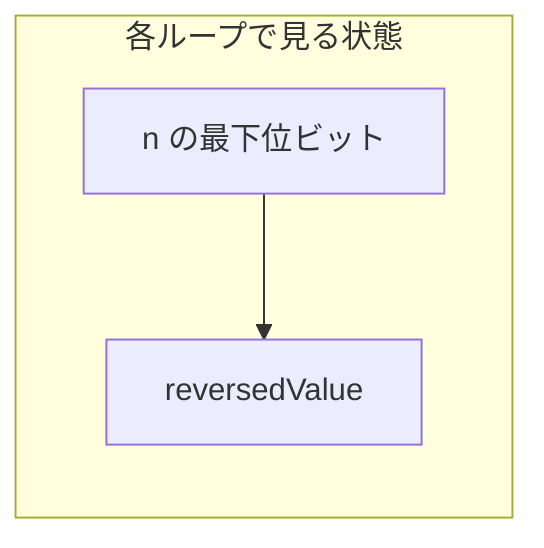
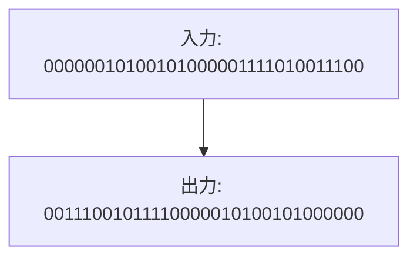

# 解説: 190. Reverse Bits

## 1. 問題の整理

- 入力として 32 ビット整数 `n` を受け取ります。
- やることは、32 個のビットの並び順を左右反転した新しい値を返すことです。
- たとえば、右端のビットは反転後には左端へ移動し、左から 2 番目のビットは右から 2 番目へ移動します。
- この問題では 32 ビット固定で考えることが重要です。入力の値が小さく見えても、先頭側の `0` も含めて 32 桁として扱います。
- Java では符号付き `int` を使うため、右シフトの種類に注意が必要です。

## 2. 素直に考えるとどうなるか

- 初見では、`n` を 2 進文字列に変換して、文字列を逆順に並べ替えて、もう一度数値へ戻す方法を考えやすいです。
- この方法でも考え方は分かりやすいですが、文字列変換や補助配列が必要になります。
- 問題の本質は「ビット操作」なので、数値のまま処理した方が自然です。
- また、32 ビット固定なので、毎回 32 回だけビットを見れば十分です。

## 3. 採用するアプローチ

- 採用するのは、元の値の下位ビットを 1 つずつ取り出し、結果側へ左から順に積んでいく方法です。
- 毎回 `n & 1` で一番右のビットを取り出せます。
- 取り出すたびに `reversedValue` を左に 1 ビットずらせば、新しいビットを末尾に追加できます。
- これを 32 回繰り返すと、元のビット列がちょうど逆順になります。
- 補助的な配列や文字列を使わないので、空間計算量は `O(1)` です。

## 4. 全体の流れ

- `reversedValue` を `0` で初期化する
- 32 回ループする
- 毎回、`reversedValue` を左へ 1 ビットずらす
- `n & 1` で元の値の最下位ビットを取り出して `reversedValue` に加える
- `n` を右へ 1 ビットずらして、次のビットを最下位へ持ってくる
- 32 回終わったら `reversedValue` を返す



## 5. 具体例トレース

例 1 のビット列全体は 32 桁ですが、流れを追いやすくするために末尾側の数ステップを抜き出して見ます。

開始時:

- `n = 00000010100101000001111010011100`
- `reversedValue = 00000000000000000000000000000000`

| step | current state | action | result |
| --- | --- | --- | --- |
| 1 | `n` の最下位ビットは `0` | `reversedValue` を左シフトし、`0` を加える | `reversedValue` の末尾は `0` |
| 2 | `n` を右シフトした後の最下位ビットは `0` | `reversedValue` を左シフトし、`0` を加える | `reversedValue` の末尾 2 桁は `00` |
| 3 | 次の最下位ビットは `1` | `reversedValue` を左シフトし、`1` を加える | `reversedValue` の末尾 3 桁は `001` |
| 4 | 次の最下位ビットは `1` | `reversedValue` を左シフトし、`1` を加える | `reversedValue` の末尾 4 桁は `0011` |
| 5 | これを 32 回続ける | 元の右端から順に結果へ積む | 完成した 32 ビット列が逆順になる |

最終的には次の対応になります。



## 6. コードの読み解き

`Solution.java` を上から順に見ます。

```java
int reversedValue = 0;
```

- 反転した結果をここへ作っていきます。
- 最初は何も入っていないので `0` です。

```java
for (int bitIndex = 0; bitIndex < 32; bitIndex++) {
```

- 32 ビット固定なので、ちょうど 32 回処理します。
- 値の大きさに応じて回数を変えるのではなく、常に 32 回です。

```java
reversedValue <<= 1;
```

- 結果を左へ 1 ビットずらして、新しいビットを右端に入れる準備をします。

```java
reversedValue |= (n & 1);
```

- `n & 1` は、`n` の最下位ビットだけを取り出す操作です。
- そのビットを `reversedValue` の右端へ足しています。

```java
n >>>= 1;
```

- Java の `>>>` は符号なし右シフトです。
- これにより、次に見るべきビットが最下位側へ移動します。
- `>>` だと符号ビットの影響を受けるため、この問題では `>>>` を使う方が安全です。

## 7. 計算量

- 時間計算量: `O(1)` ただし固定で 32 回のループ
- 空間計算量: `O(1)`
- 支配的なのは 32 回のビット操作ですが、回数が固定なので入力サイズに依存しません。

## 8. つまずきやすいポイント

- 32 ビット固定であることを忘れて、必要な桁数だけ処理してしまうミス。
- Java で `>>` と `>>>` を混同するミス。
- `reversedValue` を先に左シフトする順番を崩して、ビット位置がずれるミス。
- `n & 1` が「偶数か奇数かの判定」だけでなく、「最下位ビットの抽出」そのものだと理解できていないケース。
- C# 版では `uint` を使うことで、ビット列をそのまま自然に扱いやすくしています。
