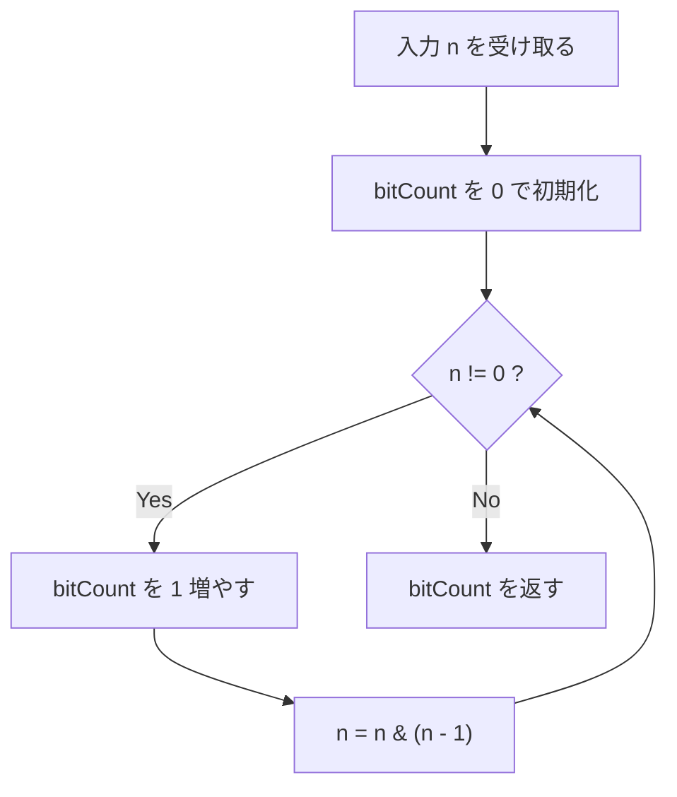
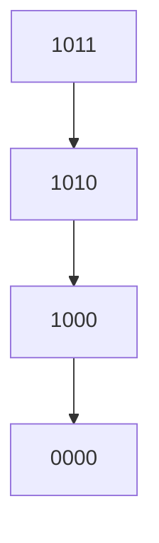

# 解説: 191. Number of 1 Bits

## 1. 問題の整理

- 入力は正の整数 `n` です。
- 返す値は、`n` を 2 進数で表したときに `1` が何個あるかです。
- つまり「2 進表現の中に set bit がいくつあるか」を数える問題です。

例えば `11` は 2 進数にすると `1011` です。

```text
1011
```

この中には `1` が 3 個あるので、答えは `3` です。

## 2. 素直に考えるとどうなるか

初見では、2 進数を右から 1 桁ずつ見ていく方法を思いつきやすいです。

- 一番右のビットを見る
- `1` ならカウントする
- 右シフトして次のビットを見る

この方法でも解けます。
ただし、`0` のビットも全部なめる必要があります。

例えば `128` は `10000000` なので `1` は 1 個しかありませんが、
素直な方法では 8 ビット分を見ることになります。

## 3. 採用するアプローチ

採用するのは **`n & (n - 1)`** を使う方法です。

この操作には有名な性質があります。

- `n & (n - 1)` をすると
- `n` の一番右にある `1` が 1 つ消える

つまり、1 回の操作で set bit を 1 個ずつ消せます。

そのため、

- `bitCount` を 0 で始める
- `n` が 0 になるまで `n & (n - 1)` を繰り返す
- 繰り返した回数を数える

とすれば、ちょうど `1` の個数が数えられます。

### なぜこれがうれしいのか

この方法では、`0` のビットを全部見る必要がありません。
`1` がある回数だけループが回ります。

## 4. 全体の流れ



## 5. 具体例トレース

### 例 1: `n = 11`

`11` の 2 進表現は `1011` です。

#### 1 回目

```text
n     = 1011
n - 1 = 1010
AND   = 1010
```

右端の `1` が 1 個消えています。

#### 2 回目

```text
n     = 1010
n - 1 = 1001
AND   = 1000
```

また右端の `1` が 1 個消えます。

#### 3 回目

```text
n     = 1000
n - 1 = 0111
AND   = 0000
```

最後の `1` も消えました。

なので合計 3 回操作されて、答えは `3` です。

| step | current state | action | result |
| --- | --- | --- | --- |
| 1 | `n = 1011`, `bitCount = 0` | `bitCount++`, `n = n & (n - 1)` | `n = 1010`, `bitCount = 1` |
| 2 | `n = 1010`, `bitCount = 1` | `bitCount++`, `n = n & (n - 1)` | `n = 1000`, `bitCount = 2` |
| 3 | `n = 1000`, `bitCount = 2` | `bitCount++`, `n = n & (n - 1)` | `n = 0000`, `bitCount = 3` |
| 4 | `n = 0000`, `bitCount = 3` | ループ終了 | `3` を返す |

### `n & (n - 1)` の形を図で見る



毎回、右端の `1` が 1 つずつ消えているのが分かります。

### 例 2: `n = 128`

`128` の 2 進表現は `10000000` です。

```text
n     = 10000000
n - 1 = 01111111
AND   = 00000000
```

1 回で `0` になるので、答えは `1` です。

## 6. コードの読み解き

### 初期化

```java
int bitCount = 0;
```

`1` の個数を数えるための変数です。

### ループ条件

```java
while (n != 0) {
```

まだ `1` が残っている限りループを続けます。
`n` が `0` になったら、もう set bit はありません。

### カウントを増やす

```java
bitCount++;
```

この 1 回のループで、右端の `1` を 1 個消すので、
そのぶんカウントを 1 増やします。

### 右端の `1` を消す

```java
n = n & (n - 1);
```

ここがこの問題の本体です。

`n - 1` をすると、右端の `1` が `0` になり、
それより右にある `0` は `1` に変わります。
そのあと元の `n` と AND を取ることで、
右端の `1` だけをきれいに消せます。

## 7. 計算量

- 時間計算量: `O(k)`
- 空間計算量: `O(1)`

ここで `k` は `n` に含まれる `1` ビットの個数です。

### なぜ `O(k)` なのか

ループは set bit を 1 個消すたびに 1 回回ります。
つまり、`1` の数だけ実行されます。

## 8. つまずきやすいポイント

### 1. `n & (n - 1)` の意味が直感的に分かりにくい

最初は丸暗記でも構いません。
ただし、`1011 -> 1010 -> 1000 -> 0000` の流れを実際に見ると理解しやすいです。

### 2. 全ビットをなめる方法との違いが曖昧になる

右シフトで 1 ビットずつ見る方法も正しいです。
今回の方法は、`1` の場所だけを効率よく処理できるのが利点です。

### 3. Java の `int` は符号付きだということを忘れる

LeetCode のこの問題では Java でもそのまま解けますが、
言語によっては unsigned と signed の違いが説明に出ることがあります。

### 4. Follow up の意味

何度も同じ関数を呼ぶなら、
あらかじめ小さい値の bit 数を前計算したり、テーブル化したりする最適化も考えられます。
