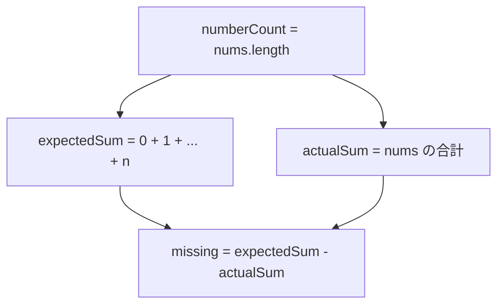
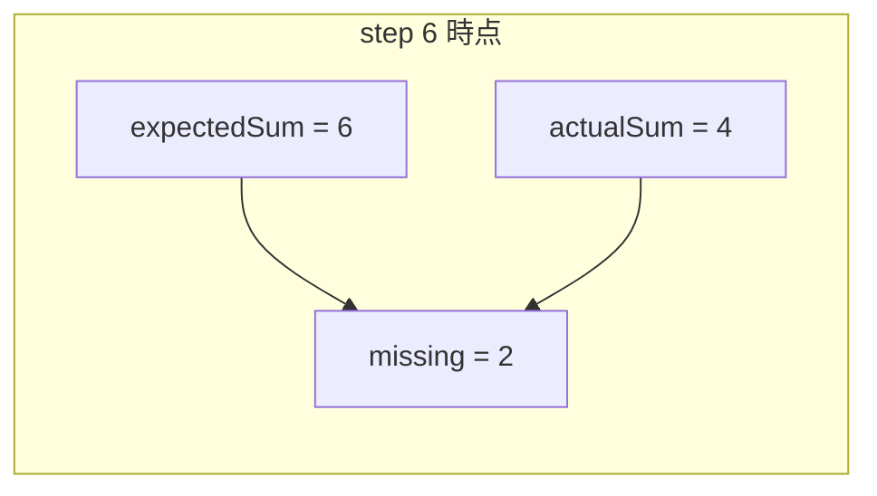

# 解説: 268. Missing Number

## 1. 問題の整理

- 入力は、`[0, n]` の範囲にある `n` 個の異なる整数を持つ配列 `nums` です。
- 本来は `0` から `n` までで合計 `n + 1` 個の数があるはずですが、1 個だけ配列に入っていません。
- ゴールは、その欠けている 1 個の数を返すことです。
- `nums` の長さは `n` なので、「配列の要素数」と「値の最大候補」が連動している点が重要です。
- 制約は `n <= 10^4` なので、`1 + 2 + ... + n` を `int` で計算しても安全です。

## 2. 素直に考えるとどうなるか

- まず思いつきやすいのは、`0` から `n` までを 1 つずつ見て、配列の中にあるか確認する方法です。
- しかしそのたびに配列を先頭から探すと、1 回の確認に `O(n)` かかります。
- それを `0` から `n` まで繰り返すと、全体で `O(n^2)` になってしまいます。
- `HashSet` に入れてから探せば `O(n)` にできますが、追加のメモリを使います。
- この問題には「追加の空間計算量を `O(1)` にできるか」という発展条件があるので、もっと軽い方法を考えたいです。

## 3. 採用するアプローチ

- 採用するのは、「本来あるはずの合計値」と「実際に配列にある合計値」の差を使う方法です。
- `0` から `n` までの合計は、公式 `n * (n + 1) / 2` で一度に求められます。
- 配列 `nums` の合計を求めれば、その差がちょうど欠けている数になります。
- 追加の配列や集合を作らないので、空間計算量は `O(1)` です。
- 配列を 1 回なめるだけなので、時間計算量は `O(n)` です。

## 4. 全体の流れ

- `numberCount = nums.length` を求める
- `0` から `numberCount` までの合計 `expectedSum` を公式で計算する
- `nums` を 1 回ループして `actualSum` を求める
- `expectedSum - actualSum` を返す

この方法で意識しているのは、余分なデータ構造を持たずに「あるべき総量」と「実際の総量」だけを比較する点です。



## 5. 具体例トレース

例 1 の `nums = [3,0,1]` を使います。

- `nums.length = 3` なので、あるはずの数は `0,1,2,3`
- その合計は `3 * 4 / 2 = 6`
- 実際の配列の合計は `3 + 0 + 1 = 4`
- 差は `6 - 4 = 2`

| step | current state | action | result |
| --- | --- | --- | --- |
| 1 | `nums = [3,0,1]` | `numberCount = nums.length` を求める | `numberCount = 3` |
| 2 | `numberCount = 3` | `expectedSum = 3 * 4 / 2` を計算する | `expectedSum = 6` |
| 3 | `actualSum = 0` | 1 個目の値 `3` を足す | `actualSum = 3` |
| 4 | `actualSum = 3` | 2 個目の値 `0` を足す | `actualSum = 3` |
| 5 | `actualSum = 3` | 3 個目の値 `1` を足す | `actualSum = 4` |
| 6 | `expectedSum = 6`, `actualSum = 4` | 差を取る | `missing = 2` |

各段階で見ている値は次の 2 つだけです。



## 6. コードの読み解き

`Solution.java` の流れを上から順に見ます。

```java
int numberCount = nums.length;
```

- 配列の長さを `n` として使います。
- この問題では、値の候補範囲が `[0, n]` なので、`nums.length` がそのまま重要な情報です。

```java
int expectedSum = numberCount * (numberCount + 1) / 2;
```

- `0` から `n` までの合計を公式で求めています。
- ループで足してもよいですが、公式なら 1 行で書けます。

```java
int actualSum = 0;
for (int number : nums) {
    actualSum += number;
}
```

- 配列の中に実際に入っている値を全部足しています。
- 拡張 `for` 文を使うことで、インデックスを管理せず素直に合計できます。

```java
return expectedSum - actualSum;
```

- 「本来あるはずの合計」から「実際にある合計」を引きます。
- すると、配列に入っていない数だけが差として残ります。

## 7. 計算量

- 時間計算量: `O(n)`
- 空間計算量: `O(1)`
- 支配的なのは、配列 `nums` を 1 回走査して `actualSum` を求める処理です。

## 8. つまずきやすいポイント

- `n` は「最大値」ではなく「配列長」と対応している点を取り違えないこと。
- 範囲は `[0, n]` なので、候補の個数は `n + 1` 個あります。
- `expectedSum` は `0` から `n - 1` までではなく、`0` から `n` までを足す必要があります。
- 配列の値はソートされていないので、並び順に意味はありません。
- 制約がもっと大きい問題では合計が `int` を超える可能性がありますが、この問題の制約では `int` で問題ありません。
