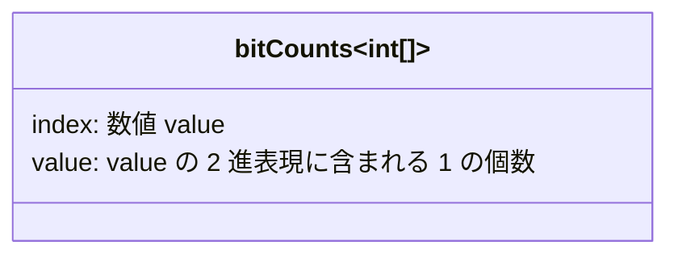
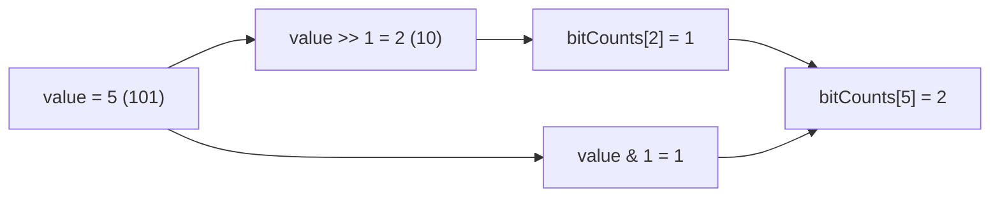
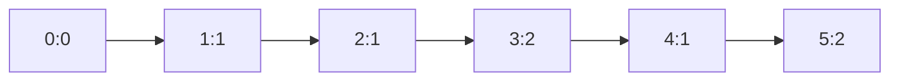

# 解説: 338. Counting Bits

## 1. 問題の整理

- 入力は整数 `n` です。
- 返す値は長さ `n + 1` の配列 `ans` です。
- `ans[i]` には、`i` を 2 進数で表したときの `1` の個数を入れます。
- `0` から `n` まで全部について答えを埋める必要があります。

たとえば `n = 5` なら、`0, 1, 2, 3, 4, 5` のそれぞれに対して `1` の個数を数えます。

## 2. 素直に考えるとどうなるか

最初に思いつきやすいのは、各数を 1 つずつ調べる方法です。

- `0` から `n` まで順番に見る
- それぞれの数について 2 進数の各ビットを調べる
- `1` が出るたびにカウントする

この方法でも正しく解けます。
ただし、各数ごとにビットを何回も調べるので、全体では `O(n log n)` になりやすいです。

この問題の発展では、もっと効率よく `O(n)` で解けるかが問われています。

## 3. 採用するアプローチ

採用するのは **動的計画法** です。

ポイントは、ある数の答えを、もっと小さい数の答えから再利用できることです。

- `i >> 1` は `i` を 1 ビット右にずらした値です
- これは 2 で割った値と同じ意味です
- `i & 1` は `i` が奇数なら `1`、偶数なら `0` になります

ここから次の式が成り立ちます。

```text
ans[i] = ans[i >> 1] + (i & 1)
```

意味はこうです。

- 右に 1 ビットずらすと、末尾の 1 桁が落ちる
- 落ちた末尾が `1` だったら 1 個足す
- `0` だったら足さない

この式なら、`1` から `n` まで順に埋めるだけで答えが作れます。

### なぜこの方法が良いのか

- 各 `i` について定数時間で求められる
- 前に計算した結果 `ans[i >> 1]` をそのまま使える
- 全体で 1 回ずつ埋めればいいので `O(n)` になる

## 4. 全体の流れ

- 長さ `n + 1` の配列 `bitCounts` を用意する
- `bitCounts[0]` は初期値の `0` のままでよい
- `value = 1` から `n` まで順番に見る
- `bitCounts[value] = bitCounts[value >> 1] + (value & 1)` を計算する
- 最後に配列を返す

このアプローチで利用する配列の意味は次の通りです。



`value >> 1` で「1 桁右にずらした小さい値」を参照し、そこに末尾ビット分だけ足します。



## 5. 具体例トレース

### 例: `n = 5`

最初は配列 `bitCounts` が全部 `0` です。

| step | current state | action | result |
| --- | --- | --- | --- |
| 1 | `value = 1`, `bitCounts = [0,0,0,0,0,0]` | `bitCounts[1] = bitCounts[0] + 1` | `[0,1,0,0,0,0]` |
| 2 | `value = 2`, `bitCounts = [0,1,0,0,0,0]` | `bitCounts[2] = bitCounts[1] + 0` | `[0,1,1,0,0,0]` |
| 3 | `value = 3`, `bitCounts = [0,1,1,0,0,0]` | `bitCounts[3] = bitCounts[1] + 1` | `[0,1,1,2,0,0]` |
| 4 | `value = 4`, `bitCounts = [0,1,1,2,0,0]` | `bitCounts[4] = bitCounts[2] + 0` | `[0,1,1,2,1,0]` |
| 5 | `value = 5`, `bitCounts = [0,1,1,2,1,0]` | `bitCounts[5] = bitCounts[2] + 1` | `[0,1,1,2,1,2]` |

`value = 5` のときだけ少し丁寧に見ると、

- `5` の 2 進数は `101`
- `5 >> 1 = 2` で、`2` の 2 進数は `10`
- `bitCounts[2] = 1`
- `5 & 1 = 1` なので末尾ビットは `1`

したがって `bitCounts[5] = 1 + 1 = 2` です。

step 5 時点の配列イメージはこうなります。



## 6. コードの読み解き

### 配列を用意する部分

```java
int[] bitCounts = new int[n + 1];
```

答えを入れる配列です。
`0` から `n` まで必要なので、長さは `n + 1` になります。

Java の `int[]` は初期値が `0` なので、`bitCounts[0]` はそのままで大丈夫です。

### ループ部分

```java
for (int value = 1; value <= n; value++) {
```

`1` から順番に答えを埋めます。
`value >> 1` は必ず `value` より小さいので、参照先はすでに計算済みです。

### 遷移式

```java
bitCounts[value] = bitCounts[value >> 1] + (value & 1);
```

この 1 行が中心です。

- `value >> 1` は右に 1 ビットずらした値
- `bitCounts[value >> 1]` はその小さい値の答え
- `(value & 1)` は末尾ビットが `1` なら `1`、そうでなければ `0`

この 2 つを足せば、`value` の `1` の個数になります。

### 返却部分

```java
return bitCounts;
```

`0` から `n` まで全部埋め終わった配列を返します。

## 7. 計算量

- 時間計算量: `O(n)`
- 空間計算量: `O(n)`

### なぜ時間計算量が `O(n)` なのか

ループは `1` から `n` まで 1 回ずつ回ります。
各回で行うことは、配列参照とビット演算と加算だけです。
どれも定数時間なので、全体で `O(n)` です。

## 8. つまずきやすいポイント

- `value >> 1` を「2 で割る」とだけ覚えると、なぜ式が成り立つか見えにくいです。2 進数の末尾 1 桁を落としている、と考えると理解しやすいです。
- `(value & 1)` は「奇数なら 1、偶数なら 0」です。ここを `1` の個数そのものと勘違いしないことが重要です。
- `bitCounts[0]` を特別に代入しなくても、Java の配列初期値が `0` なので成立します。
- `value` を 1 から順に進めることが大事です。先に小さい値が埋まっているからこそ `bitCounts[value >> 1]` を使えます。
