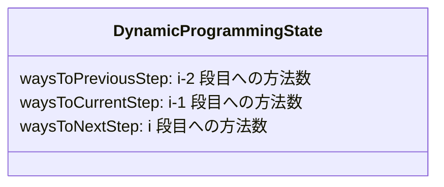
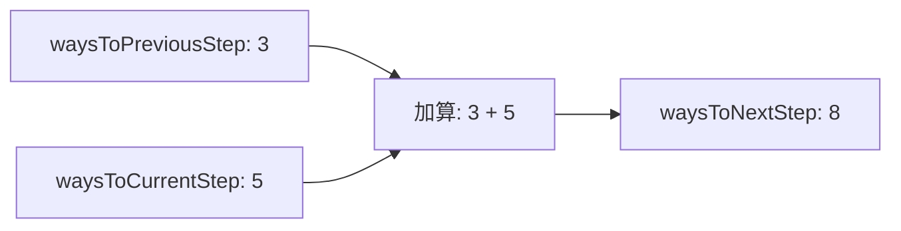

# 解説: 70. Climbing Stairs

> インタラクティブな図解: [explanation.html](./explanation.html)

## 1. 問題の整理

- 入力は、頂上までの段数 `n` です。
- 1 回の移動では 1 段または 2 段を上れます。
- 頂上である `n` 段目に着くまでの、異なる上り方の数を返します。

`n` は最大でも 45 なので答えは `int` に収まります。ただし、どの段数でも「最後に 1 段上ったか、2 段上ったか」で場合分けすることが重要です。

## 2. 素直に考えるとどうなるか

すべての上り方を列挙することを考えると、各段階で「1 段上る」「2 段上る」の 2 つに分岐します。`n` が大きくなるほど、同じ残り段数を何度も計算することになり、再帰だけで数える方法は非効率です。

例えば、3 段目への行き方を求める途中で 2 段目への行き方を計算します。4 段目への行き方を求めるときも、再び 2 段目や 3 段目への行き方が必要です。この重複を記録して再利用するのが動的計画法です。

## 3. 採用するアプローチ

`ways[i]` を「`i` 段目に到達する方法の数」とします。

- `i` 段目へ最後に 1 段上って到着するなら、その直前は `i - 1` 段目です。
- 最後に 2 段上って到着するなら、その直前は `i - 2` 段目です。

したがって、`ways[i] = ways[i - 1] + ways[i - 2]` になります。これはフィボナッチ数列と同じ形です。次の値を求めるために必要なのは直前の 2 値だけなので、配列全体を持たず 2 つの変数に圧縮します。

## 4. 全体の流れ

1. `n` が 1 または 2 なら、答えはそれぞれ 1 または 2 です。
2. 1 段目の方法数を `waysToPreviousStep`、2 段目の方法数を `waysToCurrentStep` に設定します。
3. 3 段目から `n` 段目まで、2 つの値の和を次の段の方法数として求めます。
4. 変数を 1 段ずつ前へずらします。
5. 最後に保持している方法数を返します。

## 5. 具体例トレース

`n = 5` のときを追います。

| step | current state | action | result |
| --- | --- | --- | --- |
| 初期 | previous = 1, current = 2 | 1 段目・2 段目の方法数を設定する | 3 段目を計算できる |
| 3 | previous = 1, current = 2 | next = 1 + 2 | next = 3 |
| 4 | previous = 2, current = 3 | next = 2 + 3 | next = 5 |
| 5 | previous = 3, current = 5 | next = 3 + 5 | next = 8 |

各段階で保持する値は次のように入れ替わります。

よって、5 段の階段を上る方法は 8 通りです。

## 6. コードの読み解き

`waysToPreviousStep` と `waysToCurrentStep` は、連続する 2 段についての方法数です。ループ内でまず和を `waysToNextStep` に保存してから、古い現在値を前の値へ、新しい和を現在値へ更新します。

この順序により、次の計算に必要な 2 値を失わずに進められます。Java と C# はメソッド名の慣例こそ異なりますが、同じ状態遷移を実装しています。

## 7. 計算量

- 時間計算量: `O(n)`。3 段目から `n` 段目まで 1 回ずつ計算します。
- 空間計算量: `O(1)`。段数にかかわらず整数変数を 3 個だけ使います。
- 支配的な処理は `n - 2` 回のループです。

## 8. つまずきやすいポイント

- `n = 1` と `n = 2` を先に処理しないと、初期値とループの範囲が分かりにくくなります。
- `waysToPreviousStep` を先に更新すると、和を作るための古い値を失うことがあります。必ず次の値を別の変数に保存します。
- 上り方の順序が異なれば別の方法です。例えば `1 + 2` と `2 + 1` は別々に数えます。
