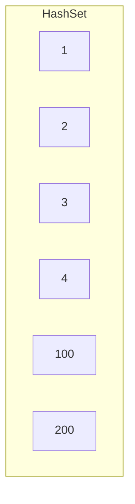
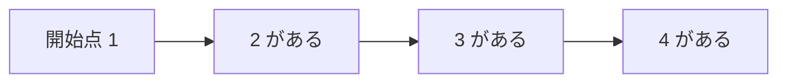
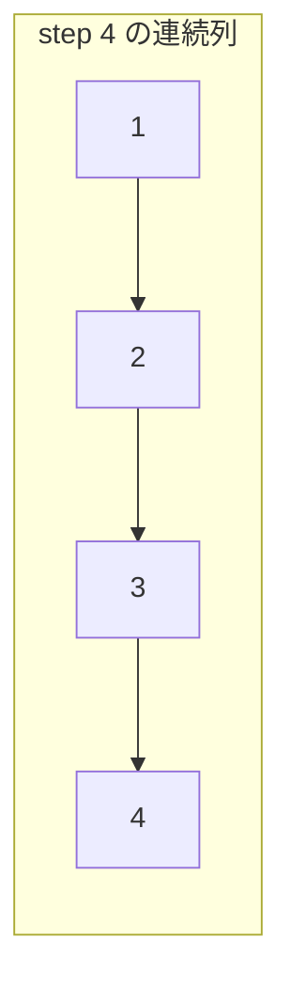

# 解説: 128. Longest Consecutive Sequence

## 1. 問題の整理

- 入力は未ソートの整数配列 `nums` です。
- その中に含まれる値を使って作れる「連続する整数列」のうち、最長の長さを返します。
- 重要な制約は **`O(n)` 時間で解く必要がある** ことです。

この問題でいう連続列は、配列内で隣り合っている必要はありません。  
値として `1,2,3,4` が存在していれば、それで長さ 4 の連続列です。

## 2. 素直に考えるとどうなるか

まず思いつきやすいのはソートです。

1. `nums` をソートする
2. 左から見ていき、連続していれば長さを伸ばす
3. 最大長を更新する

この考え方は分かりやすいですが、ソートに `O(n log n)` かかるので条件を満たせません。

## 3. 採用するアプローチ

- `HashSet`
- 連続列の開始点だけ調べる

全要素を `HashSet` に入れると、「ある数が存在するか」を `O(1)` で調べられます。

ここで重要な工夫は、**すべての数から右に伸ばし始めない**ことです。  
ある数 `x` について、

- `x - 1` が存在するなら、`x` は連続列の途中
- `x - 1` が存在しないなら、`x` は連続列の開始点

です。

したがって、開始点だけを見つけて、そこから `x+1`, `x+2`, ... があるだけ伸ばせば十分です。

## 4. 全体の流れ

1. `nums` の全要素を `HashSet` に入れる
2. `HashSet` の各数 `number` を見る
3. `number - 1` が存在するならスキップする
4. 存在しないなら、その数は連続列の開始点
5. `number + 1`, `number + 2`, ... をたどって長さを数える
6. 最大長を更新する





## 5. 具体例トレース

例 1 を使います。

```text
nums = [100,4,200,1,3,2]
```

`HashSet` にすると `{100, 4, 200, 1, 3, 2}` です。

| step | current state | action | result |
| --- | --- | --- | --- |
| 1 | `number = 100` | `99` がないので開始点 | 長さ 1 |
| 2 | `number = 4` | `3` があるので開始点ではない | スキップ |
| 3 | `number = 200` | `199` がないので開始点 | 長さ 1 |
| 4 | `number = 1` | `0` がないので開始点 | `2,3,4` まで伸びて長さ 4 |
| 5 | 以降の数 | 途中の数なのでスキップ | 最大は 4 のまま |



## 6. コードの読み解き

### `HashSet` の構築

```java
Set<Integer> numberSet = new HashSet<>();
for (int number : nums) {
  numberSet.add(number);
}
```

- 重複は自動で消えます。
- ある値が存在するかを高速に調べられるようにします。

### 開始点判定

```java
for (int number : numberSet) {
  if (numberSet.contains(number - 1)) {
    continue;
  }
```

- `number - 1` があるなら、その数は連続列の真ん中です。
- その場合は右に伸ばしても無駄なのでスキップします。

### 右へ伸ばす

```java
int currentNumber = number;
int currentLength = 1;

while (numberSet.contains(currentNumber + 1)) {
  currentNumber++;
  currentLength++;
}
```

- 開始点から、次の数がある限り伸ばします。
- これでその連続列の長さが求まります。

### 最大長更新

```java
longestLength = Math.max(longestLength, currentLength);
```

- 各開始点で得られた長さの最大値を保存します。

## 7. 計算量

- 時間計算量: `O(n)`
- 空間計算量: `O(n)`

`HashSet` への追加は全体で `O(n)`。  
また、各数は「開始点判定」で一度見られ、連続列を伸ばす処理でも全体として重複なく進むので、合計でも `O(n)` に収まります。

## 8. つまずきやすいポイント

- ソート解法を書いてしまい `O(n log n)` になる
- すべての数から右へ伸ばし始めて無駄な探索をする
- 重複値があることを忘れる
- `number - 1` がないときだけ開始点、という発想に気づけない
