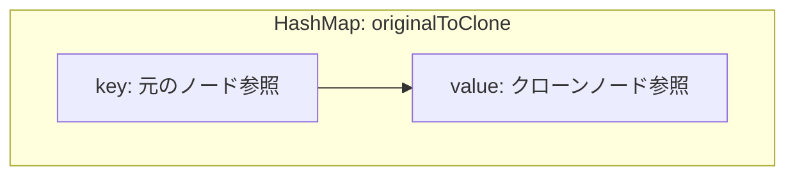
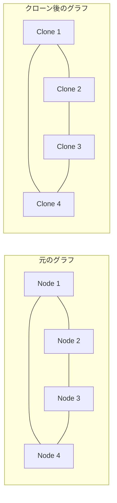
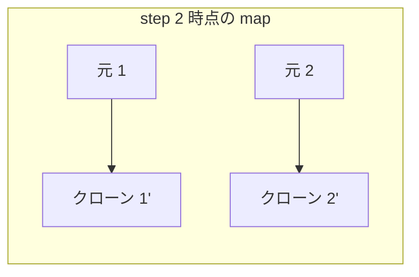
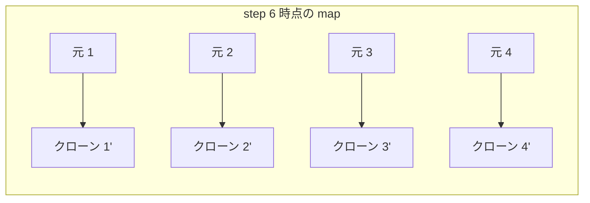

# 解説: 133. Clone Graph

## 1. 問題の整理

- 入力は、連結な無向グラフのある 1 ノードへの参照 `node` です。
- 返すべきものは、元のグラフと同じ形・同じ値を持つ **別インスタンスのグラフ** です。
- ただ値だけコピーしても不十分で、`neighbors` の参照先もすべて新しいノードに張り替える必要があります。
- `node == null` のときは空グラフなので `null` を返します。

## 2. 素直に考えるとどうなるか

- 各ノードを見つけるたびに新しい `Node` を作って、隣接ノードも再帰で複製したくなります。
- ただし、グラフにはサイクルがあります。
- そのため「訪れたノードを記録しない再帰」をすると、同じノードを何度も複製したり、無限再帰になったりします。

問題は「ある元ノードに対応するクローンノードを 1 回だけ作り、それ以降は再利用する」ことです。

## 3. 採用するアプローチ

- DFS
- `HashMap<Node, Node>`

この `HashMap` に、

- key: 元のノード
- value: そのクローンノード

を保存します。

こうすると、

- まだクローンしていないノードなら新しく作る
- すでにクローン済みなら `HashMap` から取り出す

という流れにできます。

グラフのクローンでは、この「元 -> コピー」の対応表が本体です。  
DFS 自体は、その対応表を埋めるための巡回手段です。

## 4. 全体の流れ

1. 入力 `node` が `null` なら `null` を返す
2. `originalToClone` という `HashMap<Node, Node>` を作る
3. DFS で現在ノードを処理する
4. そのノードが未コピーなら、まずクローンノードを作って `HashMap` に入れる
5. 隣接ノードを順に DFS でクローンし、返ってきたクローンを `neighbors` に追加する
6. 最初の `node` に対応するクローンを返す





## 5. 具体例トレース

例 1 を使います。

```text
adjList = [[2,4],[1,3],[2,4],[1,3]]
```

開始ノードは `1` です。

| step | current state | action | result |
| --- | --- | --- | --- |
| 1 | `map = {}` | `cloneNode(1)` を開始 | 1 のクローンを作る |
| 2 | `map = {1 -> 1'}` | 1 の隣接 2 を処理 | 2 のクローンを作る |
| 3 | `map = {1 -> 1', 2 -> 2'}` | 2 の隣接 1 を処理 | 1 は既出なので `1'` を再利用 |
| 4 | `map = {1 -> 1', 2 -> 2'}` | 2 の隣接 3 を処理 | 3 のクローンを作る |
| 5 | `map = {1 -> 1', 2 -> 2', 3 -> 3'}` | 3 の隣接 2 を処理 | 2 は既出なので `2'` を再利用 |
| 6 | `map = {1 -> 1', 2 -> 2', 3 -> 3'}` | 3 の隣接 4 を処理 | 4 のクローンを作る |
| 7 | `map = {1 -> 1', 2 -> 2', 3 -> 3', 4 -> 4'}` | 4 の隣接 1 を処理 | 1 は既出なので `1'` を再利用 |
| 8 | `map = {1 -> 1', 2 -> 2', 3 -> 3', 4 -> 4'}` | 4 の隣接 3 を処理 | 3 は既出なので `3'` を再利用 |
| 9 | DFS 終了 | 最初の `1'` を返す | 完全なクローングラフ完成 |





## 6. コードの読み解き

### `cloneGraph`

```java
public Node cloneGraph(Node node) {
  if (node == null) {
    return null;
  }

  Map<Node, Node> originalToClone = new HashMap<>();
  return cloneNode(node, originalToClone);
}
```

- 空グラフならそのまま `null`
- そうでなければ、元ノードとクローンノードの対応表を作る
- 実際の複製は `cloneNode` に任せる

### `cloneNode`

```java
private Node cloneNode(Node currentNode, Map<Node, Node> originalToClone) {
  if (originalToClone.containsKey(currentNode)) {
    return originalToClone.get(currentNode);
  }
```

- ここがサイクル対策です
- すでにクローン済みなら、新しく作らず既存のクローンを返します

```java
  Node clonedNode = new Node(currentNode.val);
  originalToClone.put(currentNode, clonedNode);
```

- まだクローンしていないなら、まずノード本体を作ります
- そして即座に `map` に登録します
- これを先にやることで、隣接先から元のノードに戻ってきても再利用できます

```java
  for (Node neighborNode : currentNode.neighbors) {
    clonedNode.neighbors.add(cloneNode(neighborNode, originalToClone));
  }
```

- 隣接ノードを 1 つずつ再帰でクローンします
- 返ってくるのは「その隣接ノードのクローン」なので、それを `neighbors` に追加します

```java
  return clonedNode;
}
```

- 現在ノードのクローンを返します

## 7. 計算量

- 時間計算量: `O(V + E)`
- 空間計算量: `O(V)`

各ノードを高々 1 回だけ新規作成し、各辺も隣接リスト走査で一度ずつたどるためです。  
`HashMap` と再帰スタックでノード数に比例した追加メモリを使います。

## 8. つまずきやすいポイント

- `HashMap` を使わずに再帰すると、サイクルで無限再帰になります。
- `neighbors` に元のノードを入れてしまうとディープコピーではなくなります。
- クローンノードを `map` に入れる前に隣接をたどると、循環参照で壊れます。
- `Node.val` が一意でも、対応表の key は `val` ではなく **元ノード参照そのもの** にするのが自然です。
