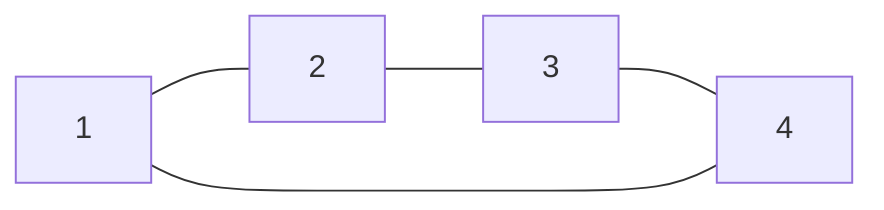
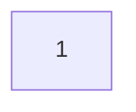

# 133. グラフのクローン

難易度: Medium

## 問題

**連結** な無向グラフのノードへの参照が 1 つ与えられます。

このグラフの **ディープコピー**（クローン）を返してください。

各ノードは値 (`int`) と、その隣接ノードのリスト (`List[Node]`) を持ちます。

```text
class Node {
    public int val;
    public List<Node> neighbors;
}
```

**テストケースの形式:**

簡単のため、各ノードの値はそのノードの 1 始まりのインデックスと同じです。たとえば、最初のノードは `val == 1`、2 番目のノードは `val == 2`、というようになります。グラフはテストケース中では隣接リストで表現されます。

隣接リストとは、有限グラフを表すための順不同のリストの集まりです。各リストは、そのノードの隣接ノード集合を表します。

与えられる `node` は常に `val = 1` の最初のノードです。クローンしたグラフにおける **与えられたノードのコピー** を参照として返してください。

## 例

**例 1:**

```text
入力: adjList = [[2,4],[1,3],[2,4],[1,3]]
出力: [[2,4],[1,3],[2,4],[1,3]]
説明: グラフには 4 つのノードがあります。
1 番目のノード (val = 1) の隣接ノードは、2 番目のノード (val = 2) と 4 番目のノード (val = 4) です。
2 番目のノード (val = 2) の隣接ノードは、1 番目のノード (val = 1) と 3 番目のノード (val = 3) です。
3 番目のノード (val = 3) の隣接ノードは、2 番目のノード (val = 2) と 4 番目のノード (val = 4) です。
4 番目のノード (val = 4) の隣接ノードは、1 番目のノード (val = 1) と 3 番目のノード (val = 3) です。
```



**例 2:**

```text
入力: adjList = [[]]
出力: [[]]
説明: 入力には 1 つの空リストだけが含まれます。このグラフは val = 1 のノード 1 つだけからなり、隣接ノードはありません。
```



**例 3:**

```text
入力: adjList = []
出力: []
説明: これは空グラフであり、ノードは存在しません。
```

## 制約

- グラフのノード数は `[0, 100]` の範囲です。
- `1 <= Node.val <= 100`
- 各ノードの `Node.val` は一意です。
- 重複する辺や自己ループは存在しません。
- グラフは連結であり、与えられたノードからすべてのノードへ到達できます。

## 備考

- 「ディープコピー」は、値だけ同じで参照先はすべて新しく作る必要があります。
- 元のノードをそのまま `neighbors` に入れてしまうとクローンになりません。
- グラフにはサイクルがあり得るので、すでにコピーしたノードを記録して再利用する必要があります。
