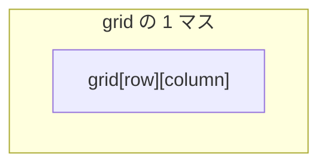
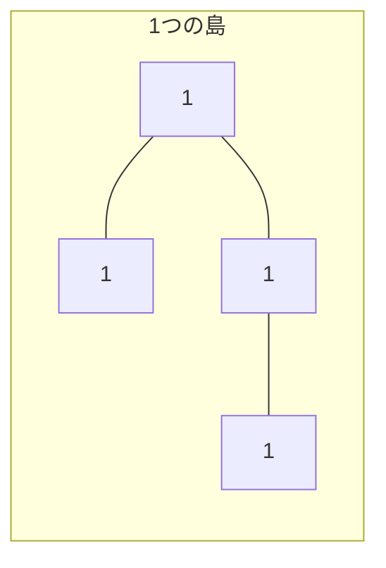
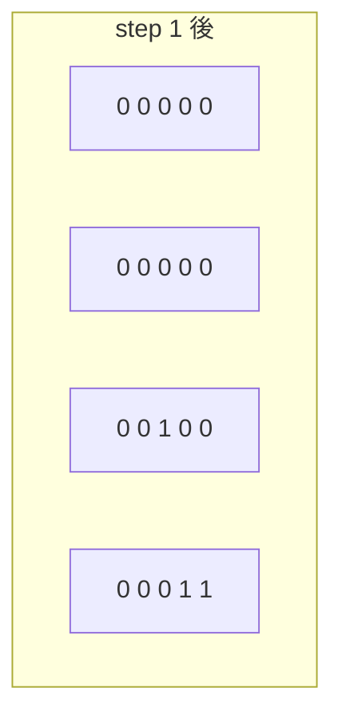
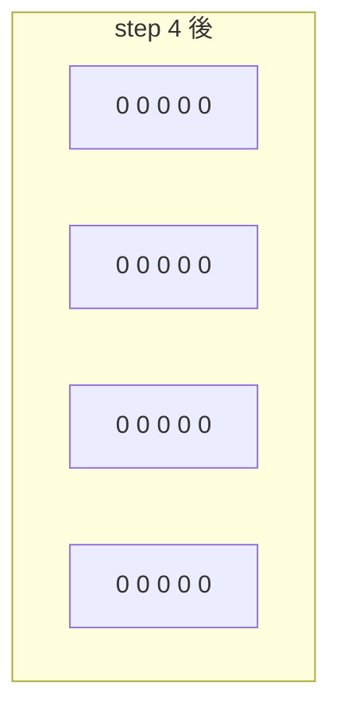

# 解説: 200. Number of Islands

## 1. 問題の整理

- 入力は `'1'`（陸）と `'0'`（水）からなる 2 次元グリッドです。
- 上下左右につながった `'1'` のかたまりを 1 つの島として数えます。
- 返すべきものは、その島の総数です。

見落としやすい点は、**斜めはつながりに含まれない**ことです。

## 2. 素直に考えるとどうなるか

- まず全マスを見ていって、陸 `'1'` を見つけたら「新しい島かもしれない」と考えます。
- ただ、その陸の隣にも陸があるなら同じ島です。
- そのままだと、同じ島の陸を何回も数えてしまいます。

なので必要なのは、

- ある陸を見つけたら
- その陸とつながっている島全体をまとめて訪問済みにする

という処理です。

## 3. 採用するアプローチ

- DFS
- 塗りつぶし

グリッド全体を走査して、未訪問の陸 `'1'` を見つけたら島数を 1 増やします。  
そのあと DFS で、その陸とつながる上下左右の陸を全部たどって `'0'` に変えます。

これで同じ島を二重に数えずに済みます。

## 4. 全体の流れ

1. グリッドを左上から右下まで順に走査する
2. `'1'` を見つけたら `islandCount` を 1 増やす
3. そのマスを起点に DFS をして、同じ島の陸を全部 `'0'` に変える
4. 走査が終わったら `islandCount` を返す





## 5. 具体例トレース

例 2 を使います。

```text
[
  ["1","1","0","0","0"],
  ["1","1","0","0","0"],
  ["0","0","1","0","0"],
  ["0","0","0","1","1"]
]
```

| step | current state | action | result |
| --- | --- | --- | --- |
| 1 | `(0,0)` が `'1'` | 島数を 1 増やし DFS | 左上の島全体を `'0'` にする |
| 2 | 走査継続 | すでに左上の島は `'0'` になっている | 二重カウントしない |
| 3 | `(2,2)` が `'1'` | 島数を 1 増やし DFS | 真ん中の 1 マス島を消す |
| 4 | `(3,3)` が `'1'` | 島数を 1 増やし DFS | 右下の 2 マス島を消す |
| 5 | 全走査終了 | `islandCount` を返す | `3` |





## 6. コードの読み解き

### 方向配列

```java
private static final int[][] DIRECTIONS = {
    {1, 0},
    {-1, 0},
    {0, 1},
    {0, -1}
};
```

- 下、上、右、左の 4 方向です。
- 同じ処理をまとめて書けます。

### `numIslands`

```java
int rowCount = grid.length;
int columnCount = grid[0].length;
int islandCount = 0;
```

- 行数、列数、答え用のカウンタを用意します。

```java
for (int row = 0; row < rowCount; row++) {
  for (int column = 0; column < columnCount; column++) {
    if (grid[row][column] == '1') {
      islandCount++;
      sinkIsland(grid, row, column);
    }
  }
}
```

- 全マスを見ます。
- 陸 `'1'` を見つけたら、それはまだ数えていない新しい島です。
- 島数を 1 増やし、その島全体を DFS で消します。

### `sinkIsland`

```java
if (isOutOfBounds(grid, row, column)) {
  return;
}

if (grid[row][column] == '0') {
  return;
}
```

- 盤面外なら終了
- 水なら終了

```java
grid[row][column] = '0';
```

- 現在の陸を訪問済みとして水に変えます。

```java
for (int[] direction : DIRECTIONS) {
  int nextRow = row + direction[0];
  int nextColumn = column + direction[1];
  sinkIsland(grid, nextRow, nextColumn);
}
```

- 上下左右へ再帰して、つながった陸を全部消します。

## 7. 計算量

- 時間計算量: `O(m * n)`
- 空間計算量: `O(m * n)` （再帰スタックを含む最悪ケース）

各マスは高々 1 回だけ `'1'` から `'0'` に変えられます。  
そのため全体で `O(m * n)` です。

## 8. つまずきやすいポイント

- 斜めもつながると勘違いする
- DFS 後に訪問済み処理をしないので二重カウントする
- `row` と `column` を取り違える
- `grid[row][column] = '0'` を忘れて無限再帰や重複探索になる
