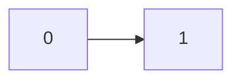
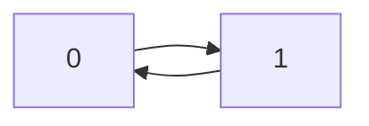
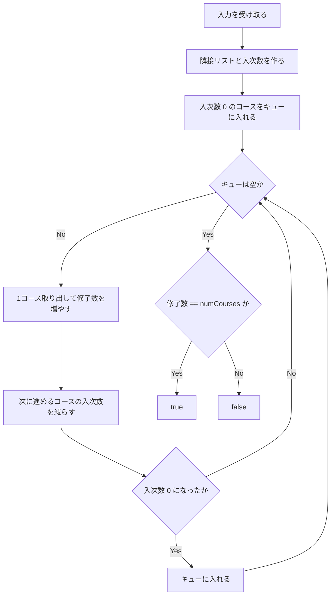
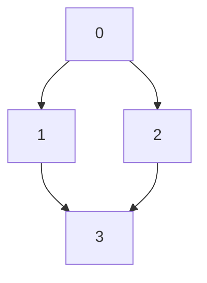
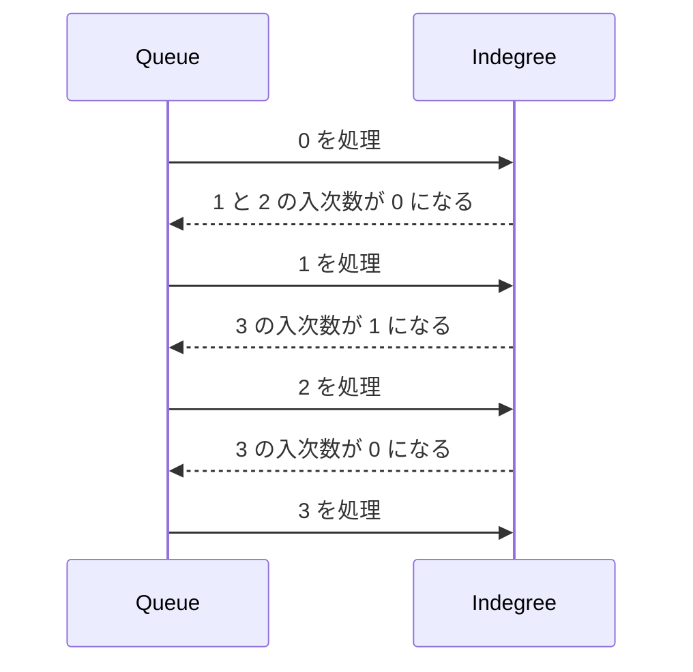

# 解説: 207. Course Schedule

## 1. 問題の整理

- 入力は `numCourses` と `prerequisites` です。
- `prerequisites[i] = [a, b]` は、「コース `a` を受ける前にコース `b` を終えておく必要がある」という意味です。
- 返す値は、すべてのコースを最後まで履修できるなら `true`、不可能なら `false` です。
- 本質は「依存関係の中に閉路があるかどうか」を判定することです。

### まず、問題文のどこを見てこの発想になるのか

この問題で最初に反応したいのは次の部分です。

- `must take course b first`
- `can finish all courses`

この 2 つを日本語で言い換えると、こうなります。

- 「先にやらないといけないものがある」
- 「その順番を全部守りながら最後まで終えられるか知りたい」

この時点で、ただの配列問題というより
**順序制約つきの依存関係問題** だと読めます。

この読み替えができると、次に考える候補はかなり絞られます。

- ノード = コース
- 辺 = 先に終える必要がある関係
- 全部終えられるか = 閉路がないか
- 順番を守って並べられるか = トポロジカルソートできるか

例えば `[1,0]` は、次のような依存です。



`0` を終えた後で `1` に進めます。

一方、`[1,0], [0,1]` はこうなります。



これはお互いに先に相手を終えろと言っているので不可能です。

## 1.5 先に全体像だけ言う

今回の解法のコアは次の 2 つです。

- 「このコースを終えたら、次にどのコースが解放されるか」を持つ
- 「各コースはあと何個の前提を満たしていないか」を持つ

コードではそれが次に対応しています。

- `nextCoursesByCourse`
- `indegree`

この 2 つの役割が腹落ちすると、実装全体がかなり読みやすくなります。

## 2. 素直に考えるとどうなるか

初見では、

- 依存関係を見て順番にコースを並べられそうか試す
- 何度も前提条件を満たしたコースを探す

という方法を思いつきやすいです。

ただし、毎回「今受けられるコースはどれか」を全コースに対して探すと無駄が多くなります。
また、閉路があるケースをきれいに判定しづらいです。

## 3. 採用するアプローチ

採用するのは **トポロジカルソート（Kahn's Algorithm）** です。

考え方は単純です。

- まず、各コースに「まだ何個の前提コースが残っているか」を数える
- 前提が 0 個のコースは今すぐ受けられる
- 受けられるコースを 1 つ終えるたびに、その先のコースの前提数を 1 減らす
- これを繰り返して、最後に全コースを処理できれば成功

### トポロジカルソートをかなり雑に言うと

**前提条件を守って並べること** です。

この問題では、

- `0` を先にやらないと `1` に進めない
- `1` と `2` を終えないと `3` に進めない

のような制約があります。
その制約を壊さない順番で並べられるなら、全コースを修了できます。

### なぜこれで閉路が分かるのか

閉路がないなら、どこかに必ず「前提 0 のコース」があります。
そこから順に消していけます。

逆に閉路があると、その輪の中のコースは全員が誰かを待っているので、
前提 0 のコースが現れません。

### 「次数 0 を取れば順番が守られる」の意味

ここがこの問題のいちばん大事な感覚です。

入次数 `0` というのは、

- そのコースに入ってくる依存が 0 本
- つまり、まだ残っている前提条件が 1 つもない

という意味です。

だから入次数 `0` のコースは、
**今この瞬間に取ってよいコース** です。

そして 1 つコースを終えると、
そのコースを前提にしていた後続コースたちの待ち条件が 1 つ減ります。

もしその結果として入次数が `0` になれば、
そのコースも次に取ってよい状態になります。

これを繰り返すと、
取り出された順番は自然に依存関係を守った順番になります。

つまり、

- 入次数 `0` のものしか取らない
- 取ったら、その影響先の入次数だけを減らす

というルールを守るだけで、
「前提条件を壊さない順番」ができあがります。

### 入次数はよく使う概念か

はい。特に **有向グラフで依存関係を扱うとき** はかなりよく使います。

- 入次数 = そのノードに入ってくる辺の本数
- この問題では「まだ残っている前提コース数」と読む

`Course Schedule` では、
数学的な定義をそのまま実用的な意味に置き換えられるのが強いところです。

## 3.5 データ構造の役割を先に整理する

### `nextCoursesByCourse` の役割

これは、

**「このコースを終えたら、次に誰が解放されるか」**

を持つためのコレクションです。

例えば `0 -> 1`, `0 -> 2` なら、
`0` を終えた瞬間に `1` と `2` の待ち条件を減らしたいです。

そのために、

```java
nextCoursesByCourse.get(0) = [1, 2]
```

のような情報を持ちます。

### `indegree` の役割

これは、

**「このコースはあと何個の前提を満たしていないか」**

を持つ配列です。

例えば `3` が `1` と `2` の両方を必要とするなら、

```text
indegree[3] = 2
```

です。

`1` だけ終わってもまだダメで、
`2` も終わって初めて `indegree[3] = 0` になります。

### この 2 つがどう噛み合うのか

流れはいつも同じです。

1. 入次数 `0` のコースを取る
2. そのコースの後続コースを `nextCoursesByCourse` で調べる
3. それらの `indegree` を 1 減らす
4. `0` になったものを次に取る

この繰り返しが、そのまま解法になっています。

## 4. 全体の流れ



## 5. 具体例トレース

### 例 1: `numCourses = 2`, `prerequisites = [[1,0]]`

グラフはこうです。


入次数はこうなります。

- `indegree[0] = 0`
- `indegree[1] = 1`

最初に受けられるのは `0` だけです。

| step | current state | action | result |
| --- | --- | --- | --- |
| 1 | queue = `[0]`, indegree = `[0,1]` | `0` を取り出す | completed = `1` |
| 2 | queue = `[]`, indegree = `[0,1]` | `0` の先の `1` の入次数を減らす | indegree = `[0,0]` |
| 3 | queue = `[]`, indegree = `[0,0]` | `1` をキューに入れる | queue = `[1]` |
| 4 | queue = `[1]`, indegree = `[0,0]` | `1` を取り出す | completed = `2` |
| 5 | queue = `[]`, completed = `2` | 全コース処理済みか確認 | `true` |

この例で大事なのは、

- 最初に取れたのは `0` だけ
- `0` を取ったから `1` の待ち条件がなくなった
- だから次に `1` が取れた

という順序です。

つまり「取れた順番」がそのまま依存関係を守った順番になっています。

### 例 2: `numCourses = 2`, `prerequisites = [[1,0],[0,1]]`


入次数はこうなります。

- `indegree[0] = 1`
- `indegree[1] = 1`

最初に受けられるコースが 1 つもありません。

| step | current state | action | result |
| --- | --- | --- | --- |
| 1 | queue = `[]`, indegree = `[1,1]` | 入次数 0 のコースを探す | 見つからない |
| 2 | queue = `[]`, completed = `0` | ループ終了 | 全コースを処理できない |
| 3 | completed = `0`, numCourses = `2` | `completed == numCourses` を確認 | `false` |

この例では、

- `0` は `1` を待つ
- `1` は `0` を待つ

ので、最初から誰も入次数 `0` になれません。

これが「閉路があるとトポロジカルソートできない」という意味です。

### 少し大きい例

`numCourses = 4`, `prerequisites = [[1,0],[2,0],[3,1],[3,2]]`



この場合は:

- `0` を終えると `1` と `2` に進める
- `1` と `2` の両方を終えると `3` に進める

順番の一例は `0 -> 1 -> 2 -> 3` です。
`0 -> 2 -> 1 -> 3` でも構いません。



### 3 階層の例で `indegree` を見る

次の図を見てください。


最初の `indegree` はこうです。

- `indegree[0] = 0`
- `indegree[1] = 1`
- `indegree[2] = 1`
- `indegree[3] = 2`

ここから起こることは次の通りです。

| step | queue | indegree | action | result |
| --- | --- | --- | --- | --- |
| 1 | `[0]` | `[0,1,1,2]` | `0` を取る | `1` と `2` の indegree を減らす |
| 2 | `[]` | `[0,0,0,2]` | `1` と `2` を queue に入れる | queue = `[1,2]` |
| 3 | `[1,2]` | `[0,0,0,2]` | `1` を取る | `3` の indegree が `1` になる |
| 4 | `[2]` | `[0,0,0,1]` | `2` を取る | `3` の indegree が `0` になる |
| 5 | `[]` | `[0,0,0,0]` | `3` を queue に入れる | queue = `[3]` |

この表の見方はかなり重要です。

- `3` は最初から取りたいけれど取れない
- なぜなら前提が 2 個残っているから
- `1` と `2` の両方が終わった瞬間にだけ取れる

これが `indegree` 配列で表現されていることです。

## 6. コードの読み解き

### 隣接リストの初期化

```java
List<List<Integer>> nextCoursesByCourse = new ArrayList<>();
for (int course = 0; course < numCourses; course++) {
    nextCoursesByCourse.add(new ArrayList<>());
}
```

`nextCoursesByCourse.get(course)` に、
「このコースを終えたら次に進めるコース一覧」を入れます。

ここでの発想は、

- `currentCourse` を終えた後に
- 誰の状態を更新すればよいか知りたい

というものです。

だから「前提となる側 -> その前提に依存している側」の向きで持っています。

### 入次数の構築

```java
int[] indegree = new int[numCourses];
for (int[] prerequisite : prerequisites) {
    int course = prerequisite[0];
    int requiredCourse = prerequisite[1];

    nextCoursesByCourse.get(requiredCourse).add(course);
    indegree[course]++;
}
```

`[a, b]` は「`b -> a`」という有向辺です。

そのため:

- `b` の隣接先に `a` を追加する
- `a` の入次数を 1 増やす

という処理になります。

この 2 行はセットで覚えると理解しやすいです。

- 隣接リスト: 「誰が次に解放されるか」
- 入次数: 「その相手はあといくつ前提が残っているか」

### 最初に受けられるコースをキューへ

```java
Queue<Integer> availableCourses = new ArrayDeque<>();
for (int course = 0; course < numCourses; course++) {
    if (indegree[course] == 0) {
        availableCourses.offer(course);
    }
}
```

入次数 0 は「前提条件がもう残っていない」ことを意味します。
つまり今すぐ受けられるコースです。

ここはかなり本質で、
キューに入るものはすべて「今取っても順番違反にならないコース」です。

### BFS のように順に処理

```java
int completedCourses = 0;
while (!availableCourses.isEmpty()) {
    int currentCourse = availableCourses.poll();
    completedCourses++;

    for (int nextCourse : nextCoursesByCourse.get(currentCourse)) {
        indegree[nextCourse]--;

        if (indegree[nextCourse] == 0) {
            availableCourses.offer(nextCourse);
        }
    }
}
```

1 コース終えるたびに、そのコースに依存していた次のコースの負担を減らします。

`indegree[nextCourse] == 0` になった瞬間、
そのコースはもう待つ必要がなくなるのでキューに入れます。

この if 文は、
「今までは受けられなかったけれど、前提条件が全部そろった瞬間」を捉えています。

### 最終判定

```java
return completedCourses == numCourses;
```

全コースを処理できたなら閉路はありません。
途中で止まったなら、どこかに閉路があって進めなくなっています。

## 7. 計算量

- 時間計算量: `O(V + E)`
- 空間計算量: `O(V + E)`

### 理由

- 各コースを 1 回ずつキューから取り出すので `O(V)`
- 各依存関係を 1 回ずつたどるので `O(E)`
- 隣接リストと入次数配列の保持にも `O(V + E)` かかる

## 8. つまずきやすいポイント

### 1. 辺の向きを逆にしてしまう

`[a, b]` は `b -> a` です。
`a` を受ける前に `b` が必要だからです。

### 2. 入次数の意味を混同する

入次数は「入ってくる辺の本数」ですが、この問題では
「まだ終えていない前提コースの数」と読むと分かりやすいです。

数学の用語として覚えるより、
この問題では「待ち人数」くらいに読む方が実感しやすいです。

### 3. DFS の閉路検出と混同する

この問題は DFS の訪問状態管理でも解けます。
ただ、今回は「今受けられるコースを順に消していく」流れが見やすい
トポロジカルソートを使っています。

### 4. すべてのノードが `prerequisites` に現れるとは限らない

依存関係に登場しないコースもあります。
そのようなコースは最初から入次数 0 なので、普通に受けられます。

## 9. 次に似た問題でどう気づくか

今後、問題文に次のような表現が出たら、この系統を疑うとよいです。

- `before`
- `after`
- `must take first`
- `depends on`
- `prerequisite`
- `schedule`
- `can finish all`
- `possible / impossible`

こういう文を見たら、頭の中で次のように変換します。

- タスクやコースをノードにする
- 依存関係を有向辺にする
- 先にできるものから処理できるか考える
- 閉路があると詰むのではないかを疑う

この変換に慣れると、
「トポロジカルソートという単語を知っているから解ける」ではなく、
「依存関係問題だからこの形になる」と自然に読めるようになります。
