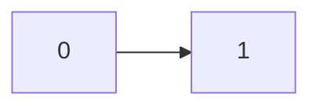
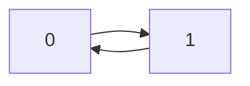

# 207. コーススケジュール

難易度: Medium

## 問題

あなたが履修しなければならないコースは全部で `numCourses` 個あり、番号は `0` から `numCourses - 1` まで振られています。配列 `prerequisites` が与えられ、`prerequisites[i] = [a_i, b_i]` は、コース `a_i` を受講したいなら、その前にコース `b_i` を **必ず** 履修しなければならないことを表します。

- 例えば、ペア `[0, 1]` は、コース `0` を受講するには先にコース `1` を履修しなければならないことを意味します。

すべてのコースを修了できるなら `true` を、そうでなければ `false` を返してください。

## 例

**例 1:**

```text
入力: numCourses = 2, prerequisites = [[1,0]]
出力: true
説明: 履修すべきコースは全部で 2 つあります。
コース 1 を受講するには、先にコース 0 を修了しておく必要があります。したがって可能です。
```



**例 2:**

```text
入力: numCourses = 2, prerequisites = [[1,0],[0,1]]
出力: false
説明: 履修すべきコースは全部で 2 つあります。
コース 1 を受講するには先にコース 0 を修了する必要があり、コース 0 を受講するにも先にコース 1 を修了する必要があります。したがって不可能です。
```



## 制約

- `1 <= numCourses <= 2000`
- `0 <= prerequisites.length <= 5000`
- `prerequisites[i].length == 2`
- `0 <= a_i, b_i < numCourses`
- `prerequisites` 内のすべてのペアは **一意** です

## 備考

- この問題は、コース間の依存関係を **有向グラフ** として考えると分かりやすいです。
- `[a, b]` は「`b` を終えた後で `a` に進める」という依存関係を表します。
- すべてのコースを修了できるかどうかは、依存関係の中に **閉路** があるかどうかで決まります。
- 例えば `0 -> 1 -> 0` のような閉路があると、どちらも先に相手を終える必要があり、履修できません。
