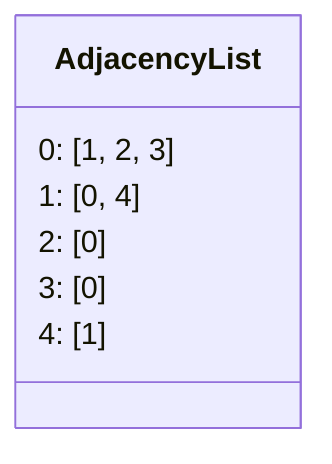
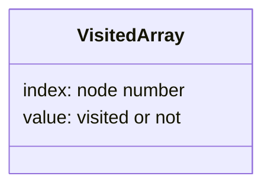
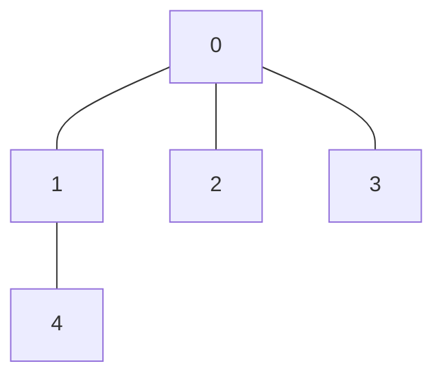
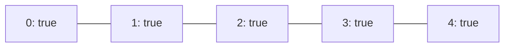

# 解説: 261. Graph Valid Tree

## 1. 問題の整理

- 入力はノード数 `n` と、無向辺の一覧 `edges` です。
- 返すべきものは、そのグラフが **木になっているかどうか** です。
- 木であるためには、次の 2 条件を同時に満たす必要があります。
  - 閉路がない
  - すべてのノードが 1 つにつながっている

見落としやすい点は、ただ閉路がないだけでは不十分だということです。  
例えば辺が少なすぎてグラフが分断されていたら、それは木ではありません。

ここでいう **無向辺** は、向きのない辺のことです。  
`[a, b]` があるなら、

- `a` から `b` へ行ける
- `b` から `a` へも行ける

という意味になります。

## 2. 隣接リストとは何か

この問題では、グラフをたどりやすくするために **隣接リスト** を作ります。

隣接リストは、

- 各ノードについて
- そのノードから直接つながっているノード一覧

を持つ構造です。

例えば

```text
1 <-> 2
1 <-> 3
```

なら、隣接リストは次のイメージです。

```text
1 -> [2, 3]
2 -> [1]
3 -> [1]
```

この問題の実装では `List<List<Integer>> adjacencyList` を使っているので、

- `adjacencyList.get(0)` は「0 番ノードの隣接ノード一覧」
- `adjacencyList.get(1)` は「1 番ノードの隣接ノード一覧」

を表します。

つまり `adjacencyList.get(0)` の中身が `[1, 2, 3]` なら、  
それは「0 は 1, 2, 3 と直接つながっている」という意味です。

## 3. 素直に考えるとどうなるか

- 各ノードから DFS や BFS をして、閉路があるかを調べる方法がまず思いつきます。
- ただし無向グラフなので、「1 つ前の親ノードへ戻る辺」を閉路と誤判定しない工夫が必要です。
- さらに、閉路がなかったとしても、全ノードが連結しているかを別途確認しなければいけません。

つまり素直にやると、

- 閉路判定
- 連結判定

の 2 つを丁寧に扱う必要があります。

## 4. 採用するアプローチ

- 辺数チェック
- 隣接リスト
- DFS

今回は先に **辺数が `n - 1` か** を確認します。

木には重要な性質があります。

- ノード数が `n` の木の辺数は必ず `n - 1`

この性質を使うと、

- 辺数が `n - 1` でないなら即 `false`
- 辺数が `n - 1` なら、あとは全ノードが 1 つにつながっているかだけ確認すればよい

となります。

ただし、ここで誤解しやすい点があります。  
**`edges.length == n - 1` だけでは、まだ木だとは確定しません。**

例えば

```text
n = 4
edges = [[0,1],[1,2],[2,0]]
```

だと、辺数は `3` なので `n - 1` を満たします。  
しかしグラフは次の状態です。

```text
0 - 1
 \ /
  2

3
```

- `0, 1, 2` で閉路がある
- `3` は孤立している

ので木ではありません。

なぜこれでよいかというと、無向グラフで辺数が `n - 1` 本のまま全ノード連結なら、そのグラフは自動的に閉路を持てないからです。

つまり今回の判定は、

- 辺数チェックだけで閉路なしを確定しているわけではない
- DFS で全ノード連結を確認して、そこで初めて木かどうかが確定する

という流れです。

## 5. 全体の流れ

1. `edges.length != n - 1` なら `false` を返す
2. `edges` から隣接リストを作る
3. ノード `0` から DFS を始める
4. 訪問できたノードを `visited` に記録する
5. 最後に `visited` を全部見て、未訪問ノードが 1 つでもあれば `false`
6. 全部訪問済みなら `true`





## 6. 具体例トレース

例 1 を使います。

```text
n = 5
edges = [[0,1],[0,2],[0,3],[1,4]]
```

まず隣接リストは次のようになります。



| step | current state | action | result |
| --- | --- | --- | --- |
| 1 | `edges.length = 4`, `n - 1 = 4` | 辺数チェック | 続行 |
| 2 | `visited = [false, false, false, false, false]` | `0` から DFS 開始 | `0` を訪問 |
| 3 | `visited = [true, false, false, false, false]` | `0` の隣 `1` へ進む | `1` を訪問 |
| 4 | `visited = [true, true, false, false, false]` | `1` の隣 `4` へ進む | `4` を訪問 |
| 5 | `visited = [true, true, false, false, true]` | `0` に戻って `2` へ進む | `2` を訪問 |
| 6 | `visited = [true, true, true, false, true]` | `0` に戻って `3` へ進む | `3` を訪問 |
| 7 | `visited = [true, true, true, true, true]` | 全要素を確認 | すべて訪問済みなので `true` |

DFS 完了後の `visited` は次の状態です。



逆に、もし未訪問ノードが残るなら、そのグラフは分断されているので木ではありません。

ここでの DFS は、**「木かどうかを直接判定する処理」ではありません。**  
DFS がやっているのは、あくまで

- ノード `0` から出発して
- たどれるノードを全部訪問し
- グラフ全体が 1 つにつながっているかを確認する

ことです。

つまり今回の実装は、

- `edges.length == n - 1` で木になりうる形かを見る
- DFS で本当に全体がつながっているかを見る

の組み合わせで判定しています。

## 7. コードの読み解き

### `validTree`

```java
if (edges.length != n - 1) {
  return false;
}
```

- 最初に最重要の性質を使います。
- 木なのに辺数が `n - 1` でない、ということはありません。
- ここでかなりのケースを早く落とせます。

```java
List<List<Integer>> adjacencyList = buildAdjacencyList(n, edges);
boolean[] visited = new boolean[n];
dfs(0, adjacencyList, visited);
```

- 無向グラフをたどりやすいように隣接リストを作ります。
- `visited[node]` は、そのノードに到達済みかどうかを表します。
- ノード `0` から DFS して、`0` とつながっている部分を全部訪問します。
- ここでは「閉路があるか」を直接調べているのではなく、「全部のノードに届くか」を調べています。

```java
for (boolean nodeVisited : visited) {
  if (!nodeVisited) {
    return false;
  }
}
```

- DFS 後に未訪問ノードが残っていたら、グラフは 1 つにつながっていません。
- その場合は木ではないので `false` を返します。

### `buildAdjacencyList`

```java
List<List<Integer>> adjacencyList = new ArrayList<>();
for (int node = 0; node < n; node++) {
  adjacencyList.add(new ArrayList<>());
}
```

- 各ノードごとに「隣のノード一覧」を入れる箱を作ります。
- `adjacencyList.get(0)` は 0 番ノードの隣接ノード一覧です。
- `adjacencyList.get(1)` は 1 番ノードの隣接ノード一覧です。

```java
for (int[] edge : edges) {
  int fromNode = edge[0];
  int toNode = edge[1];
  adjacencyList.get(fromNode).add(toNode);
  adjacencyList.get(toNode).add(fromNode);
}
```

- 無向グラフなので片方向だけでなく両方向に登録します。
- `0 - 1` の辺なら、`0` から見ても `1` が隣、`1` から見ても `0` が隣です。

### `dfs`

```java
if (visited[currentNode]) {
  return;
}
```

- すでに見たノードなら、そこで探索を止めます。
- これがないと同じノードを何度もたどってしまいます。

```java
visited[currentNode] = true;
```

- 今いるノードを訪問済みにします。

```java
for (int neighborNode : adjacencyList.get(currentNode)) {
  dfs(neighborNode, adjacencyList, visited);
}
```

- `currentNode` の隣接ノード一覧を取り出し、その 1 つ 1 つに再帰します。
- これを繰り返すと、`currentNode` から行ける範囲全体をたどれます。
- 最終的に未訪問ノードが残っていれば、そのノードは分断されていたことになります。

## 8. 計算量

- 時間計算量: `O(n + edges.length)`
- 空間計算量: `O(n + edges.length)`

支配的なのは次の 2 つです。

- 隣接リストを作る処理
- DFS で各ノードと各辺をたどる処理

各ノードと各辺は高々定数回しか扱わないため、全体で `O(n + edges.length)` です。

## 9. つまずきやすいポイント

- 木の条件を「閉路がないこと」だけだと思ってしまう
- `edges.length == n - 1` だけで木だと判断してしまう
- 無向グラフなのに隣接リストを片方向しか作らない
- `adjacencyList.get(0)` を「0そのもの」だと思ってしまう
- DFS が閉路判定まで全部やっていると誤解してしまう
- `visited` を使わずに DFS して無限に行き来してしまう
- `n = 1, edges = []` のケースを特殊扱いしすぎる

この実装では `edges.length == n - 1` が `0 == 0` になり、`0` から DFS してその 1 ノードだけ訪問するので自然に `true` になります。
