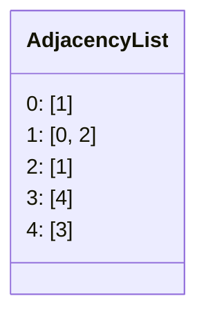
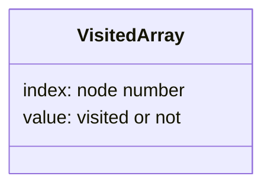
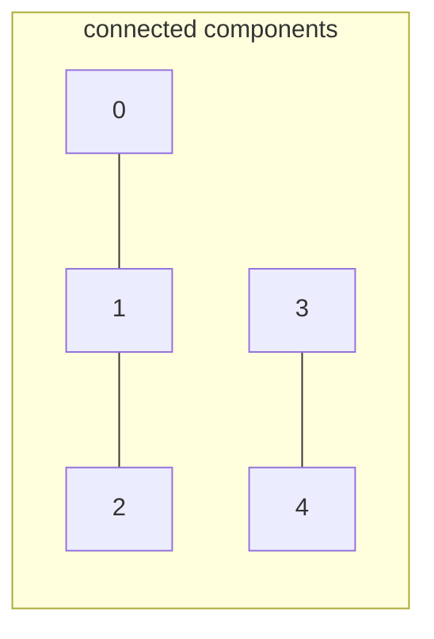
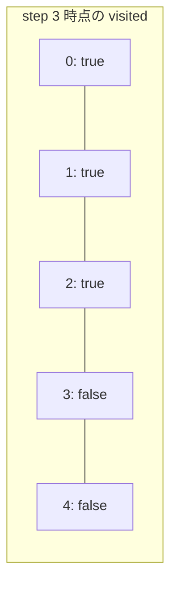
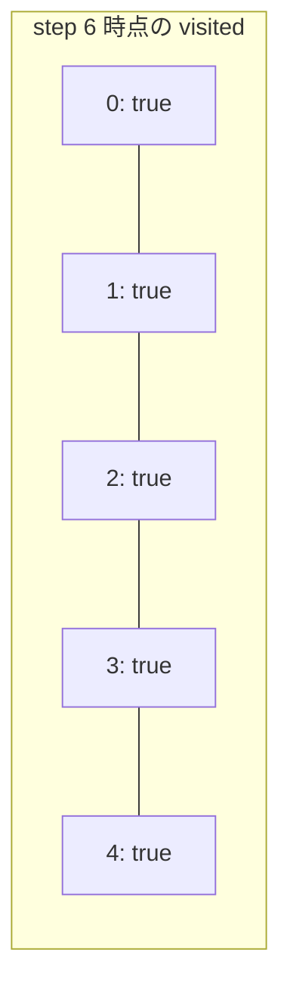

# 解説: 323. Number of Connected Components in an Undirected Graph

## 1. 問題の整理

- 入力はノード数 `n` と、無向辺の一覧 `edges` です。
- 返すべきものは、グラフの中にある **連結成分の個数** です。
- 連結成分とは、その中のどのノード同士もたどって行けるノード集合です。

見落としやすい点は、**辺につながっていない単独ノードも 1 つの連結成分** として数えることです。

## 2. 素直に考えるとどうなるか

- あるノードからたどれるノードを全部集めれば、それが 1 つの連結成分になります。
- ただし、それを 1 ノードずつ毎回最初から調べると、同じ辺や同じノードを何度もたどってしまいます。
- そのままでは無駄が多く、どこまでを同じ連結成分として数えたかも管理しにくいです。

なので必要なのは、

- まだ見ていないノードを 1 つ見つけたら
- そこから到達できるノードをまとめて訪問済みにし
- それを 1 つの連結成分として数える

という流れです。

## 3. 採用するアプローチ

- 隣接リスト
- DFS

まず `edges` から隣接リストを作ります。  
そのあと `0` から `n - 1` まで順にノードを見ていき、まだ訪問していないノードを見つけたら、

- そのノードは新しい連結成分の開始点
- 連結成分数を 1 増やす
- DFS でそこから到達できるノードを全部訪問済みにする

という処理を行います。

この方法がよい理由は、**各ノードを最初に見つかった 1 回だけ処理すれば十分** だからです。  
同じ連結成分のノードは 1 回の DFS でまとめて処理できます。

## 4. 全体の流れ

1. `edges` から隣接リストを作る
2. `visited` 配列を用意する
3. `0` から `n - 1` まで順にノードを見る
4. まだ訪問していないノードなら、連結成分数を 1 増やす
5. そのノードを起点に DFS を行い、同じ連結成分のノードを全部訪問済みにする
6. 走査が終わったら連結成分数を返す





## 5. 具体例トレース

例 1 を使います。

```text
n = 5
edges = [[0,1],[1,2],[3,4]]
```

このときグラフは、`0-1-2` と `3-4` の 2 グループに分かれています。



| step | current state | action | result |
| --- | --- | --- | --- |
| 1 | `visited = [false, false, false, false, false]`, `componentCount = 0` | ノード `0` を確認 | 未訪問なので `componentCount = 1`、DFS 開始 |
| 2 | `visited = [true, false, false, false, false]` | `0` から `1` へ進む | `1` を訪問 |
| 3 | `visited = [true, true, false, false, false]` | `1` から `2` へ進む | `2` を訪問 |
| 4 | `visited = [true, true, true, false, false]` | ノード `1`, `2` を順に確認 | どちらも訪問済みなのでスキップ |
| 5 | `visited = [true, true, true, false, false]`, `componentCount = 1` | ノード `3` を確認 | 未訪問なので `componentCount = 2`、DFS 開始 |
| 6 | `visited = [true, true, true, true, false]` | `3` から `4` へ進む | `4` を訪問 |
| 7 | `visited = [true, true, true, true, true]` | 全ノード確認終了 | `2` を返す |





## 6. コードの読み解き

### `countComponents`

```java
List<List<Integer>> adjacencyList = buildAdjacencyList(n, edges);
boolean[] visited = new boolean[n];
int componentCount = 0;
```

- まず、グラフをたどりやすいように隣接リストを作ります。
- `visited[node]` は、そのノードをすでに DFS で処理したかどうかを表します。
- `componentCount` が答えです。

```java
for (int node = 0; node < n; node++) {
  if (visited[node]) {
    continue;
  }

  componentCount++;
  dfs(node, adjacencyList, visited);
}
```

- 全ノードを順に見ます。
- すでに訪問済みのノードは、どこか別の DFS で同じ連結成分として処理済みです。
- 未訪問ノードを見つけたときだけ、新しい連結成分が 1 つ見つかったと判断して `componentCount` を増やします。
- その直後に DFS を行い、その連結成分に含まれるノードを全部訪問済みにします。

### `buildAdjacencyList`

```java
for (int node = 0; node < n; node++) {
  adjacencyList.add(new ArrayList<>());
}
```

- 各ノードごとに、隣接ノード一覧を入れる箱を用意します。

```java
for (int[] edge : edges) {
  int fromNode = edge[0];
  int toNode = edge[1];
  adjacencyList.get(fromNode).add(toNode);
  adjacencyList.get(toNode).add(fromNode);
}
```

- 無向グラフなので、`fromNode -> toNode` だけでなく `toNode -> fromNode` も追加します。
- これでどちらの側からもたどれます。

### `dfs`

```java
if (visited[currentNode]) {
  return;
}
```

- 同じノードを何度も処理しないためのガードです。

```java
visited[currentNode] = true;
```

- 現在ノードを訪問済みにします。

```java
for (int neighborNode : adjacencyList.get(currentNode)) {
  dfs(neighborNode, adjacencyList, visited);
}
```

- 現在ノードにつながっている隣接ノードをすべて再帰的にたどります。
- こうして、同じ連結成分に属するノードをまとめて処理できます。

## 7. 計算量

- 時間計算量: `O(n + edges.length)`
- 空間計算量: `O(n + edges.length)`

隣接リストの構築で各辺を 1 回ずつ見ます。  
DFS でも各ノードと各辺を高々定数回しかたどらないので、全体で `O(n + edges.length)` です。

## 8. つまずきやすいポイント

- 単独ノードを連結成分として数え忘れる
- 無向グラフなのに隣接リストへ片方向しか追加しない
- DFS の前に `componentCount` を増やす条件を `visited[node] == false` にしていない
- 訪問済みチェックを入れずに再帰して無限ループのような状態になる
