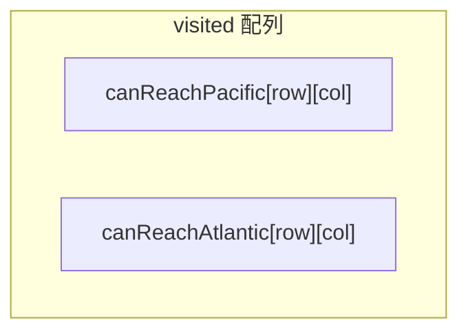
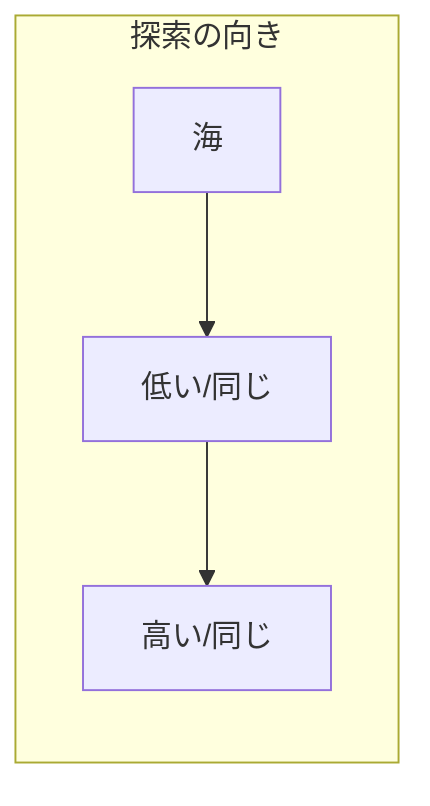
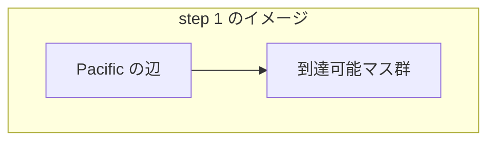
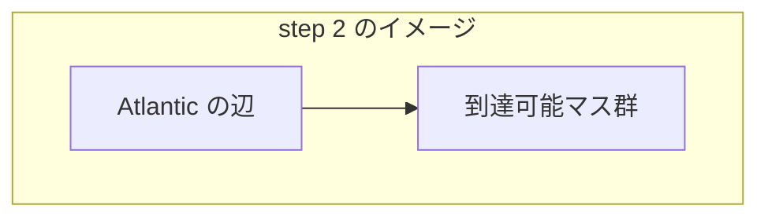

# 解説: 417. Pacific Atlantic Water Flow

## 1. 問題の整理

- 入力は高さを表す 2 次元配列 `heights` です。
- 各マスの水は、上下左右のうち **自分以下の高さ** のマスへ流れます。
- 左端・上端は太平洋、右端・下端は大西洋に接しています。
- ゴールは、「太平洋にも大西洋にも流れ込めるマス」の座標を全部返すことです。

見落としやすい点は、水の流れの条件が「高いところから低いところへ、または同じ高さへ」であることです。

## 2. 素直に考えるとどうなるか

素直には、各マスごとに

- 太平洋へ行けるか探索する
- 大西洋へ行けるか探索する

をやりたくなります。

ただしこれを全マスでやると、同じ経路を何度も探索することになります。  
行数を `m`、列数を `n` とすると、最悪では各マスからほぼ全体を探索して `O((m * n)^2)` に近くなります。

## 3. 採用するアプローチ

- DFS
- 逆向き探索
- 到達可能マスを記録する `boolean[][]`

この問題のコツは、発想を逆にすることです。

本来は

- マス -> 海

へ水が流れます。  
でも探索は

- 海から出発して、そこへ流れ込んでこられるマス

を逆向きにたどります。

逆向きに見ると、

- 現在地から **自分以上の高さ** のマスへ進める

ことになります。  
なぜなら、その高いマスから見れば、元の向きでは現在地へ水を流せるからです。

これを

- 太平洋側の辺から DFS
- 大西洋側の辺から DFS

の 2 回やり、両方で到達できたマスを答えにします。

## 4. 全体の流れ

1. `canReachPacific` と `canReachAtlantic` の 2 つの `boolean[][]` を作る
2. 左端と上端から DFS を始めて、太平洋へ流れ込めるマスを記録する
3. 右端と下端から DFS を始めて、大西洋へ流れ込めるマスを記録する
4. 全マスを走査し、両方の配列で `true` のマスを結果に入れる





## 5. 具体例トレース

例 2 の `heights = [[1]]` から入ると、考え方が見やすいです。

| step | current state | action | result |
| --- | --- | --- | --- |
| 1 | `canReachPacific = [[false]]` | `(0,0)` から太平洋 DFS | `[[true]]` になる |
| 2 | `canReachAtlantic = [[false]]` | `(0,0)` から大西洋 DFS | `[[true]]` になる |
| 3 | 両方 `true` | `(0,0)` を結果に追加 | `[[0,0]]` |

少し大きいイメージとして、例 1 ではまず海側の辺から広がっていきます。

| step | current state | action | result |
| --- | --- | --- | --- |
| 1 | 太平洋側は空 | 上端・左端から DFS | 太平洋へ届くマスが埋まる |
| 2 | 大西洋側は空 | 下端・右端から DFS | 大西洋へ届くマスが埋まる |
| 3 | 2 つの visited 配列あり | 両方 `true` のマスを抽出 | 答えの座標一覧ができる |





## 6. コードの読み解き

### 方向配列

```java
private static final int[][] DIRECTIONS = {
    {1, 0},
    {-1, 0},
    {0, 1},
    {0, -1}
};
```

- 下、上、右、左の 4 方向です。
- 毎回 if 文を 4 つ書かずに済みます。

### `pacificAtlantic`

```java
int rowCount = heights.length;
int columnCount = heights[0].length;

boolean[][] canReachPacific = new boolean[rowCount][columnCount];
boolean[][] canReachAtlantic = new boolean[rowCount][columnCount];
```

- 行数・列数を取り出します。
- 2 つの海について、到達可能かどうかを別々に管理します。

```java
for (int row = 0; row < rowCount; row++) {
  dfs(heights, row, 0, canReachPacific);
  dfs(heights, row, columnCount - 1, canReachAtlantic);
}
```

- 左端は太平洋に接しているので、各行の左端から DFS します。
- 右端は大西洋に接しているので、各行の右端から DFS します。

```java
for (int column = 0; column < columnCount; column++) {
  dfs(heights, 0, column, canReachPacific);
  dfs(heights, rowCount - 1, column, canReachAtlantic);
}
```

- 上端は太平洋、下端は大西洋です。
- これで両海のスタート地点をすべてカバーできます。

```java
for (int row = 0; row < rowCount; row++) {
  for (int column = 0; column < columnCount; column++) {
    if (canReachPacific[row][column] && canReachAtlantic[row][column]) {
      List<Integer> cell = new ArrayList<>();
      cell.add(row);
      cell.add(column);
      result.add(cell);
    }
  }
}
```

- 全マスを見て、両方の海から逆向きに到達できたマスだけを答えに入れます。

### `dfs`

```java
if (visited[row][column]) {
  return;
}

visited[row][column] = true;
```

- すでに訪問済みなら打ち切ります。
- 未訪問なら到達可能マスとして記録します。

```java
for (int[] direction : DIRECTIONS) {
  int nextRow = row + direction[0];
  int nextColumn = column + direction[1];
```

- 4 方向の隣接マスを順番に見ます。

```java
if (isOutOfBounds(heights, nextRow, nextColumn)) {
  continue;
}

if (visited[nextRow][nextColumn]) {
  continue;
}
```

- 盤面の外や、すでに訪問済みのマスには進みません。

```java
if (heights[nextRow][nextColumn] < heights[row][column]) {
  continue;
}
```

- ここが逆向き探索の核心です。
- 今いるマスより低いマスには逆向きには進めません。
- なぜなら、元の向きでは低いマスから高いマスへは水が流れないからです。

```java
dfs(heights, nextRow, nextColumn, visited);
```

- 条件を満たす隣接マスへ再帰的に広がります。

## 7. 計算量

- 時間計算量: `O(m * n)`
- 空間計算量: `O(m * n)`

各海ごとの DFS では、各マスを高々 1 回しか訪問しません。  
そのため、太平洋側と大西洋側を合わせても全体で `O(m * n)` に収まります。

## 8. つまずきやすいポイント

- 各マスから海へ探索しようとして重くする
- 「逆向きに進むときの高さ条件」を逆にしてしまう
- 太平洋と大西洋の開始辺を取り違える
- 角のマスが 2 回 DFS 開始点になっても、`visited` があるので問題ないことを見落とす
- 答えの順序は任意でも、問題文の例と完全一致する必要があると思い込む
