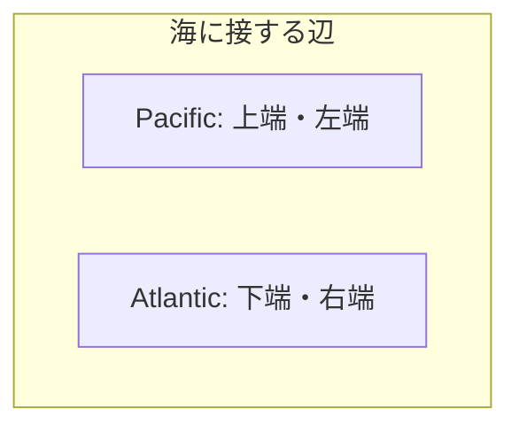

# 417. 太平洋大西洋水流問題

難易度: Medium

## 問題

`m x n` の長方形の島があり、その島は **Pacific Ocean（太平洋）** と **Atlantic Ocean（大西洋）** の両方に接しています。**Pacific Ocean** は島の左端と上端に接しており、**Atlantic Ocean** は島の右端と下端に接しています。

島は正方形のマス目に分割されています。`m x n` の整数行列 `heights` が与えられ、`heights[r][c]` は座標 `(r, c)` にあるマスの **海抜の高さ** を表します。

この島には大量の雨が降ります。雨水は、隣接するマスの高さが現在のマスの高さ以下である場合に、上下左右の隣接マスへ直接流れることができます。また、海に隣接しているマスの水はそのまま海へ流れ込むことができます。

`result[i] = [r_i, c_i]` が、マス `(r_i, c_i)` からの雨水が **Pacific Ocean** と **Atlantic Ocean** の **両方** に流れ込めることを表すような、座標の **2 次元リスト** `result` を返してください。

## 例

**例 1:**

```text
入力: heights = [[1,2,2,3,5],[3,2,3,4,4],[2,4,5,3,1],[6,7,1,4,5],[5,1,1,2,4]]
出力: [[0,4],[1,3],[1,4],[2,2],[3,0],[3,1],[4,0]]
説明: 以下のマスは、太平洋と大西洋の両方に水を流すことができます。
[0,4]: [0,4] -> Pacific Ocean
       [0,4] -> Atlantic Ocean
[1,3]: [1,3] -> [0,3] -> Pacific Ocean
       [1,3] -> [1,4] -> Atlantic Ocean
[1,4]: [1,4] -> [1,3] -> [0,3] -> Pacific Ocean
       [1,4] -> Atlantic Ocean
[2,2]: [2,2] -> [1,2] -> [0,2] -> Pacific Ocean
       [2,2] -> [2,3] -> [2,4] -> Atlantic Ocean
[3,0]: [3,0] -> Pacific Ocean
       [3,0] -> [4,0] -> Atlantic Ocean
[3,1]: [3,1] -> [3,0] -> Pacific Ocean
       [3,1] -> [4,1] -> Atlantic Ocean
[4,0]: [4,0] -> Pacific Ocean
       [4,0] -> Atlantic Ocean
太平洋と大西洋に流れ込める経路は、このほかにも存在し得ます。
```

`heights` を表にすると次のようになります。

| r\c | 0 | 1 | 2 | 3 | 4 |
| --- | --- | --- | --- | --- | --- |
| 0 | 1 | 2 | 2 | 3 | 5 |
| 1 | 3 | 2 | 3 | 4 | 4 |
| 2 | 2 | 4 | 5 | 3 | 1 |
| 3 | 6 | 7 | 1 | 4 | 5 |
| 4 | 5 | 1 | 1 | 2 | 4 |

- 例えば `(0,4)` の高さは `5`
- `(2,2)` の高さも `5`
- `(4,1)` の高さは `1`

座標 `(r, c)` は「上から `r` 行目、左から `c` 列目」を意味します。



**例 2:**

```text
入力: heights = [[1]]
出力: [[0,0]]
説明: 唯一のマスからの水は、太平洋と大西洋の両方に流れ込めます。
```

## 制約

- `m == heights.length`
- `n == heights[r].length`
- `1 <= m, n <= 200`
- `0 <= heights[r][c] <= 10^5`

## 備考

- 素直に各マスから両方の海へ行けるかを試すと、同じ探索を何度も繰り返して重くなります。
- 発想を逆にして、「海から逆向きに、流れ込んでこられるマス」を探すと効率よく解けます。
