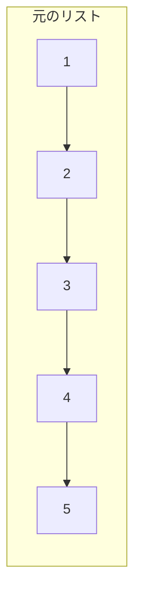
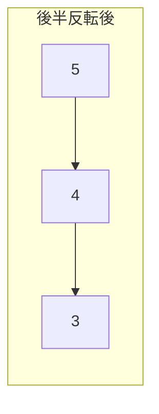
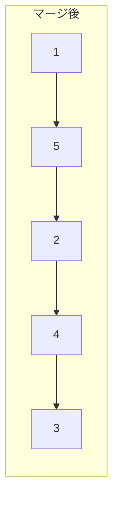

# 解説: 143. Reorder List

## 1. 問題の整理

- 入力として単方向連結リストの先頭 `head` を受け取り、`L0 -> Ln -> L1 -> Ln-1 -> ...` の形に並べ替えます。
- ゴールは、ノードの値を変えずに、ポインタのつなぎ替えだけでこの順番を作ることです。
- 見落としやすい点は、「配列に値を写して並べ替える」のではなく、ノード自体を並べ替える必要があることです。

## 2. 素直に考えるとどうなるか

- 初見では、すべてのノードを配列や `List` に入れて、先頭と末尾を交互につなぎ直したくなります。
- その方法でも実装できますが、追加で `O(n)` のメモリが必要になります。
- 連結リストの問題では、できればポインタ操作だけで `O(1)` 空間にしたいです。

## 3. 採用するアプローチ

- リストを 3 段階で処理します。
  1. 連結リストの中央を見つける
  2. 後半部分を反転する
  3. 前半と反転後の後半を交互にマージする
- こうすると、末尾から順に取り出したい要素を「反転後の後半」から前へ向かって順番に取れます。

## 4. 全体の流れ

- `slowPointer` と `fastPointer` で中央ノードを見つける。
- 中央の次から後半リストを取り出し、反転する。
- 前半リストの末尾を `null` にして前半と後半を切り離す。
- `firstHalfPointer` と `secondHalfPointer` を使って、1 ノードずつ交互に差し込む。
- 反転後の後半を使い切ったら完了する。

このアプローチで利用するデータ構造は単方向連結リストと複数のポインタです。

## 5. 具体例トレース

`head = [1,2,3,4,5]` を追います。

| step | current state | action | result |
| --- | --- | --- | --- |
| 1 | `1 -> 2 -> 3 -> 4 -> 5` | 中央を探す | `slowPointer = 3` |
| 2 | `3` の次から後半を取る | `4 -> 5` を反転 | `5 -> 4` |
| 3 | 前半を切り離す | `1 -> 2 -> 3` と `5 -> 4` に分かれる | 2本のリストになる |
| 4 | `1` の後ろに `5` を差し込む | `1 -> 5 -> 2 -> 3` | 前半に後半1個を挿入 |
| 5 | `2` の後ろに `4` を差し込む | `1 -> 5 -> 2 -> 4 -> 3` | 完成 |

## 6. コードの読み解き

- `head == null || head.next == null` のときは、並べ替える必要がないのでそのまま返します。
- `slowPointer` と `fastPointer` を使い、`fastPointer` が 2 歩ずつ進む間に `slowPointer` を 1 歩ずつ進めて中央を見つけます。
- `reverseList(slowPointer.next)` で後半部分を反転します。
- `slowPointer.next = null` として、前半と後半をきれいに分割します。
- その後は `firstHalfPointer` と `secondHalfPointer` を使って、後半の 1 ノードを前半の次へ差し込む操作を繰り返します。
- `reverseList` は通常の連結リスト反転で、`previousNode`, `currentNode`, `nextNode` を使って向きを逆にしています。

## 7. 計算量

- 時間計算量は `O(n)` です。
- 中央探索、後半反転、交互マージのそれぞれがリスト全体を高々 1 回ずつ見るだけだからです。
- 空間計算量は `O(1)` です。追加で使うのはポインタ変数だけです。

## 8. つまずきやすいポイント

- 中央を見つけたあと、`slowPointer.next = null` を忘れると前半と後半が切れず、ループや不正なつながりが起きやすいです。
- 後半をそのまま使うのではなく、反転してから交互に差し込む必要があります。
- マージ時は `next` を上書きする前に、元の次ノードを一時変数へ保存しないとリストが壊れます。
- 偶数長と奇数長で中央の位置が少し違っても、この実装なら同じ流れで処理できます。
