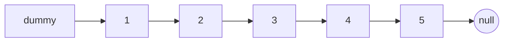
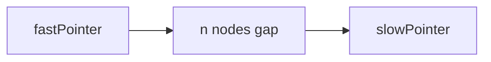
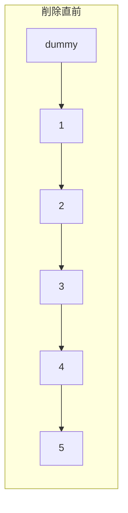

# 解説: 19. Remove Nth Node From End of List

## 1. 問題の整理

- 入力として連結リストの先頭 `head` と整数 `n` を受け取り、末尾から `n` 番目のノードを削除した後の `head` を返します。
- ゴールは、「後ろから数えて `n` 番目」のノードを特定し、その 1 つ手前のノードとつなぎ直すことです。
- 見落としやすい点は、削除対象が先頭ノードになる場合があることです。

## 2. 素直に考えるとどうなるか

- まず全体の長さを数え、`length - n` 番目の位置を前からたどれば削除できます。
- これは分かりやすいですが、リストを 2 回たどることになります。
- 問題文の発展では 1 回の走査でできるかを聞いているので、もう少し工夫したいです。

## 3. 採用するアプローチ

- 2 本のポインタ `fastPointer` と `slowPointer` を使います。
- 最初に `fastPointer` を `n + 1` 個だけ先へ進めると、2 本の間にちょうど `n` 個の差ができます。
- そのあと両方を同時に進めると、`fastPointer` が `null` になった時点で `slowPointer` は「削除したいノードの 1 つ手前」にいます。
- さらに、先頭削除のケースを簡単に扱うためにダミーノードを先頭に置きます。

## 4. 全体の流れ

- `dummyNode -> head` の形でダミーノードを作る。
- `fastPointer` と `slowPointer` をどちらも `dummyNode` から始める。
- `fastPointer` を `n + 1` 歩だけ進める。
- `fastPointer` が `null` になるまで、`fastPointer` と `slowPointer` を同時に 1 歩ずつ進める。
- この時点で `slowPointer.next` が削除対象なので、`slowPointer.next = slowPointer.next.next` として飛ばす。
- 最後に `dummyNode.next` を返す。

このアプローチで利用するデータ構造は単方向連結リストと 2 本のポインタです。

## 5. 具体例トレース

`head = [1,2,3,4,5], n = 2` を追います。

| step | current state | action | result |
| --- | --- | --- | --- |
| 1 | `dummy -> 1 -> 2 -> 3 -> 4 -> 5` | `fastPointer` と `slowPointer` を `dummy` に置く | 両方 `dummy` |
| 2 | `fastPointer = dummy` | `fastPointer` を 3 歩進める | `fastPointer = 3` |
| 3 | `fast=3, slow=dummy` | 両方を 1 歩進める | `fast=4, slow=1` |
| 4 | `fast=4, slow=1` | 両方を 1 歩進める | `fast=5, slow=2` |
| 5 | `fast=5, slow=2` | 両方を 1 歩進める | `fast=null, slow=3` |
| 6 | `slow=3` | `slow.next` を飛ばす | `4` を削除して `3 -> 5` |

step 6 で `slowPointer` は削除対象 `4` の 1 つ手前 `3` にいます。

## 6. コードの読み解き

- `dummyNode` は先頭削除を簡単に扱うための補助ノードです。
- `fastPointer` と `slowPointer` を両方 `dummyNode` から始めます。
- `for` ループで `fastPointer` を `n + 1` 回進めるのは、「削除対象の 1 つ手前」を `slowPointer` が指せるようにするためです。
- `while (fastPointer != null)` では 2 本を同時に進め、距離差を保ちます。
- ループ終了時、`slowPointer.next` が削除したいノードです。
- `slowPointer.next = slowPointer.next.next` によって、そのノードをリストから外します。
- 最後は、場合によっては先頭が変わっているので `dummyNode.next` を返します。

## 7. 計算量

- 時間計算量は `O(sz)` です。リスト全体を高々 1 回たどるだけです。
- 空間計算量は `O(1)` です。追加で使うのはダミーノードとポインタだけです。
- 支配的なのは、`fastPointer` と `slowPointer` の前進処理です。

## 8. つまずきやすいポイント

- `fastPointer` を `n` 歩ではなく `n + 1` 歩進めるのが重要です。これで `slowPointer` が削除対象の 1 つ手前に止まれます。
- 先頭ノードを削除するケースでは、ダミーノードがないと分岐が増えて実装が煩雑になります。
- `slowPointer.next = slowPointer.next.next` を行うので、`slowPointer` 自体ではなく「その次」が削除対象であることを意識する必要があります。
- 問題文では `1 <= n <= sz` が保証されているので、`fastPointer` を進めるときの不正入力は考えなくてよいです。
