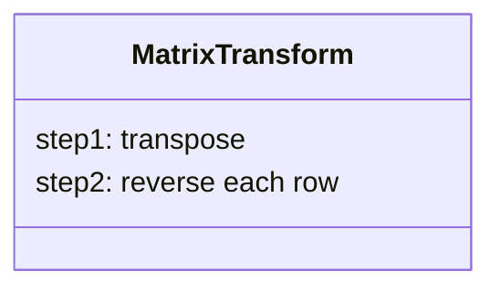
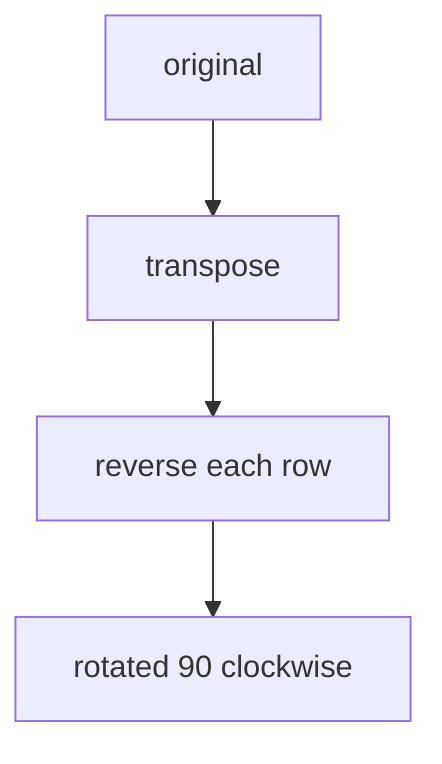
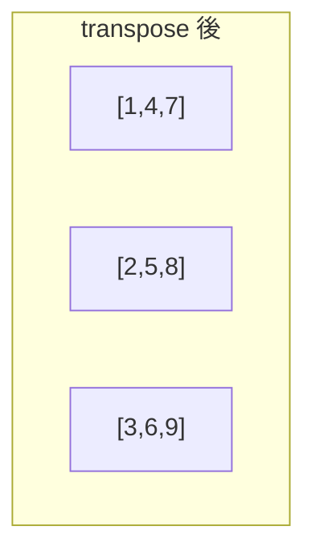
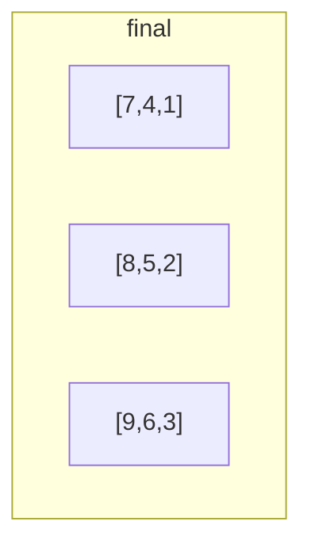

# 解説: 48. Rotate Image

## 1. 問題の整理

- 入力は `n x n` の正方行列 `matrix` です。
- 画像を時計回りに 90 度回転させた結果を、`matrix` 自体へ書き戻します。
- 別の 2 次元配列を作ってはいけません。

見落としやすい点は、**見た目としては位置を大きく動かす問題でも、追加配列なしでその場更新しなければいけない** ことです。

## 2. 素直に考えるとどうなるか

- 新しい `rotated` 行列を作る
- `matrix[row][column]` を回転後の位置へコピーする

この方法なら考えやすいです。  
たとえば `matrix[row][column]` は、時計回り 90 度回転後に `rotated[column][n - 1 - row]` へ移ります。

ただし今回は **in-place** が条件なので、この方法は使えません。

## 3. 採用するアプローチ

- 転置
- 各行の左右反転

時計回り 90 度回転は、次の 2 段階に分解できます。

1. 行列を転置する
2. 各行を左右反転する

転置とは、`matrix[row][column]` と `matrix[column][row]` を入れ替える操作です。  
これで「行の情報」と「列の情報」が入れ替わります。

そのあと各行を左右反転すると、ちょうど時計回り 90 度回転した形になります。

## 4. 全体の流れ

1. 対角線より上側の要素だけを見て、対応する左右対称位置と swap する
2. これで行列全体を転置する
3. 各行について、左端と右端から内側へ向かって swap して左右反転する
4. すべての行を処理したら回転完了





## 5. 具体例トレース

例 1 を使います。

```text
matrix = [
  [1,2,3],
  [4,5,6],
  [7,8,9]
]
```

### 転置後

```text
[
  [1,4,7],
  [2,5,8],
  [3,6,9]
]
```

### 各行を左右反転した後

```text
[
  [7,4,1],
  [8,5,2],
  [9,6,3]
]
```

| step | current state | action | result |
| --- | --- | --- | --- |
| 1 | 元の行列 | `(0,1)` と `(1,0)` を swap | `2` と `4` が入れ替わる |
| 2 | 転置途中 | `(0,2)` と `(2,0)` を swap | `3` と `7` が入れ替わる |
| 3 | 転置途中 | `(1,2)` と `(2,1)` を swap | `6` と `8` が入れ替わる |
| 4 | 転置完了 | 1 行目を左右反転 | `[1,4,7] -> [7,4,1]` |
| 5 | 転置完了 | 2 行目を左右反転 | `[2,5,8] -> [8,5,2]` |
| 6 | 転置完了 | 3 行目を左右反転 | `[3,6,9] -> [9,6,3]` |





## 6. コードの読み解き

### 転置

```java
for (int row = 0; row < size; row++) {
  for (int column = row + 1; column < size; column++) {
    int temporaryValue = matrix[row][column];
    matrix[row][column] = matrix[column][row];
    matrix[column][row] = temporaryValue;
  }
}
```

- `column = row + 1` から始めることで、対角線より上だけを処理します。
- もし全範囲を swap すると、同じ組を 2 回入れ替えて元に戻ってしまいます。
- これで行列が転置されます。

### 各行の左右反転

```java
for (int row = 0; row < size; row++) {
  int leftColumn = 0;
  int rightColumn = size - 1;

  while (leftColumn < rightColumn) {
    int temporaryValue = matrix[row][leftColumn];
    matrix[row][leftColumn] = matrix[row][rightColumn];
    matrix[row][rightColumn] = temporaryValue;
    leftColumn++;
    rightColumn--;
  }
}
```

- 各行を独立に左右反転します。
- 両端の要素を swap しながら中央へ寄せていきます。
- 転置後の行列へこの操作を加えることで、時計回り 90 度回転になります。

## 7. 計算量

- 時間計算量: `O(n^2)`
- 空間計算量: `O(1)`

転置も左右反転も、全体として正方行列の要素数に比例する回数だけ処理します。  
追加で使うのは swap 用の一時変数だけなので `O(1)` です。

## 8. つまずきやすいポイント

- 新しい 2 次元配列を作ってしまい、in-place 条件を満たさない
- 転置で全要素を swap してしまい、2 回交換して元に戻す
- 反時計回りとの違いを混同する
- 転置のあとに「各列」ではなく「各行」を反転する点を取り違える
