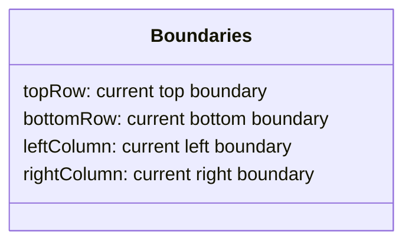
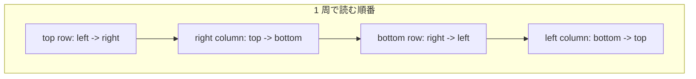
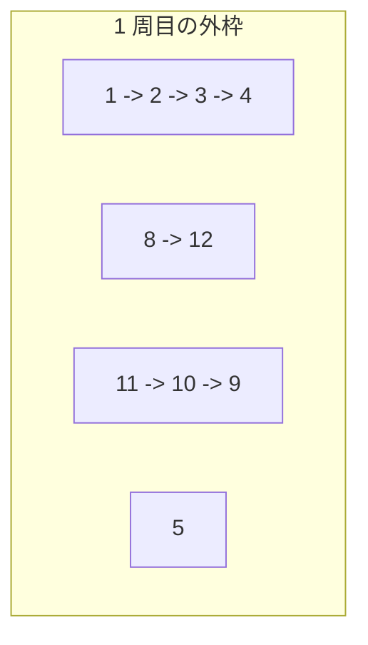
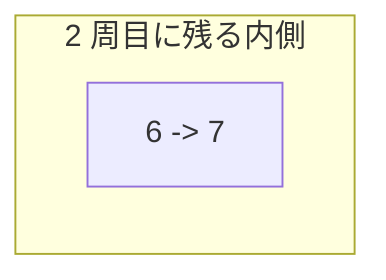

# 解説: 54. Spiral Matrix

## 1. 問題の整理

- 入力は 2 次元配列 `matrix` です。
- 返すべきものは、行列の要素を **らせん順** に読んだ結果の配列です。
- 行列を書き換える必要はなく、順番に値を取り出して並べればよいです。

見落としやすい点は、行数と列数が違う長方形の行列でも正しく動く必要があることです。  
また、最後に 1 行だけ残る場合や 1 列だけ残る場合に、同じマスを二重に読まないようにする必要があります。

## 2. 素直に考えるとどうなるか

- 方向を持ちながら 1 マスずつ進み、
- 壁に当たったり訪問済みマスにぶつかったら向きを変える

というシミュレーションは思いつきやすいです。

この方法でも解けますが、

- 訪問済み管理が必要になる
- 向き変更の条件が少し複雑になる

という点で、初学者にはやや追いにくいです。

## 3. 採用するアプローチ

- 上端 `topRow`
- 下端 `bottomRow`
- 左端 `leftColumn`
- 右端 `rightColumn`

の 4 つの境界を持ちます。

1 周ごとに、

- 上端を左から右へ読む
- 右端を上から下へ読む
- 下端を右から左へ読む
- 左端を下から上へ読む

という順で外枠を読み取り、読み終えた辺は境界を内側へ 1 つ縮めます。

この方法がよいのは、**訪問済み配列なしで、どこが未処理領域かを境界だけで表現できる** からです。

## 4. 全体の流れ

1. `topRow`, `bottomRow`, `leftColumn`, `rightColumn` を行列の外枠に合わせて初期化する
2. `topRow <= bottomRow` かつ `leftColumn <= rightColumn` の間、外枠を 1 周読む
3. 上端を左から右へ読んだら `topRow++`
4. 右端を上から下へ読んだら `rightColumn--`
5. まだ行が残っていれば、下端を右から左へ読んで `bottomRow--`
6. まだ列が残っていれば、左端を下から上へ読んで `leftColumn++`
7. すべて読み終えたら結果配列を返す





## 5. 具体例トレース

例 2 を使います。

```text
matrix = [
  [1, 2, 3, 4],
  [5, 6, 7, 8],
  [9, 10, 11, 12]
]
```

| step | current state | action | result |
| --- | --- | --- | --- |
| 1 | `top=0, bottom=2, left=0, right=3` | 上端を左から右へ読む | `[1,2,3,4]` |
| 2 | `top=1, bottom=2, left=0, right=3` | 右端を上から下へ読む | `[1,2,3,4,8,12]` |
| 3 | `top=1, bottom=2, left=0, right=2` | 下端を右から左へ読む | `[1,2,3,4,8,12,11,10,9]` |
| 4 | `top=1, bottom=1, left=0, right=2` | 左端を下から上へ読む | `[1,2,3,4,8,12,11,10,9,5]` |
| 5 | `top=1, bottom=1, left=1, right=2` | 上端を左から右へ読む | `[1,2,3,4,8,12,11,10,9,5,6,7]` |
| 6 | `top=2, bottom=1, left=1, right=2` | ループ終了 | 完了 |





## 6. コードの読み解き

### 境界の初期化

```java
int topRow = 0;
int bottomRow = rowCount - 1;
int leftColumn = 0;
int rightColumn = columnCount - 1;
```

- まだ読んでいない領域の外枠を 4 つの境界で表します。

### 外枠を 1 周読むループ

```java
while (topRow <= bottomRow && leftColumn <= rightColumn) {
```

- 未処理領域が残っている間だけ続けます。
- 行か列のどちらかが交差したら読み終えています。

### 上端を読む

```java
for (int column = leftColumn; column <= rightColumn; column++) {
  spiralOrder.add(matrix[topRow][column]);
}
topRow++;
```

- 今の上端を左から右へ読みます。
- 読み終えたら、その行はもう不要なので `topRow` を 1 つ下げます。

### 右端を読む

```java
for (int row = topRow; row <= bottomRow; row++) {
  spiralOrder.add(matrix[row][rightColumn]);
}
rightColumn--;
```

- 今の右端を上から下へ読みます。
- 読み終えたら、その列はもう不要なので `rightColumn` を 1 つ左へ縮めます。

### 下端を読む

```java
if (topRow <= bottomRow) {
  for (int column = rightColumn; column >= leftColumn; column--) {
    spiralOrder.add(matrix[bottomRow][column]);
  }
  bottomRow--;
}
```

- 行がまだ残っているときだけ、下端を右から左へ読みます。
- この `if` がないと、1 行だけ残ったケースで二重読みが起きます。

### 左端を読む

```java
if (leftColumn <= rightColumn) {
  for (int row = bottomRow; row >= topRow; row--) {
    spiralOrder.add(matrix[row][leftColumn]);
  }
  leftColumn++;
}
```

- 列がまだ残っているときだけ、左端を下から上へ読みます。
- この `if` がないと、1 列だけ残ったケースで二重読みが起きます。

## 7. 計算量

- 時間計算量: `O(m * n)`
- 空間計算量: `O(1)` （返り値を除く）

各マスはちょうど 1 回だけ結果配列へ追加されるので、全体で `O(m * n)` です。  
追加で使う作業用メモリは境界変数だけなので `O(1)` です。

## 8. つまずきやすいポイント

- `topRow`, `bottomRow`, `leftColumn`, `rightColumn` の更新タイミングを混同する
- 下端や左端を読む前の境界チェックを忘れて二重に読む
- 正方形の行列だけで考えてしまい、長方形ケースで崩れる
- 「今どの外枠を読んでいるか」を整理せずに実装して混乱する
