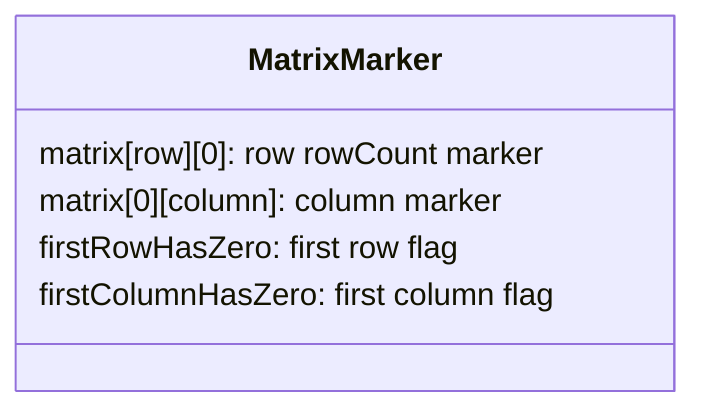
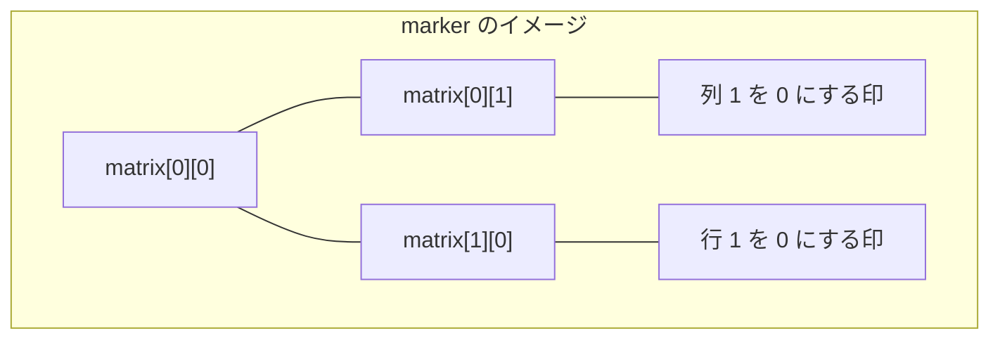
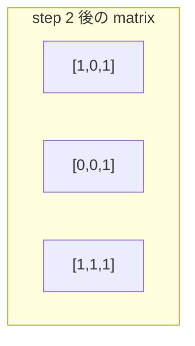
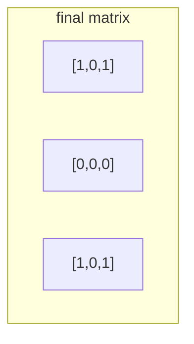

# 解説: 73. Set Matrix Zeroes

## 1. 問題の整理

- 入力は整数の 2 次元配列 `matrix` です。
- あるマスが `0` なら、そのマスが属する行と列をすべて `0` にします。
- 返り値はなく、`matrix` 自体を書き換えます。

見落としやすい点は、**その場で `0` に変えた結果を次の判定に使ってはいけない** ことです。  
元から `0` だった場所だけを基準に、最終的に 0 にする行と列を決める必要があります。

また、問題文は **in place** を要求しているので、大きな補助行列は使えません。

## 2. 素直に考えるとどうなるか

- まず全マスを見て、`0` があった行番号と列番号を別の配列に記録する
- そのあと、記録された行と列をまとめて `0` にする

この方法なら考えやすく、`O(m + n)` の追加領域で解けます。

ただし Follow up では、さらに進んで **定数追加領域** を考えてほしいと言っています。  
そこで、「行番号一覧」「列番号一覧」を別で持たずに済ませる工夫が必要です。

## 3. 採用するアプローチ

- 1 行目を列マーカーとして使う
- 1 列目を行マーカーとして使う
- ただし 1 行目自身と 1 列目自身の情報は別の boolean で保持する

ポイントは、`matrix[row][0]` を「row 行目はあとで全部 0 にする印」、`matrix[0][column]` を「column 列目はあとで全部 0 にする印」として再利用することです。

これなら追加の配列を作らずに、元の行列の中へ印を書き込めます。

ただし `matrix[0][0]` は、

- 1 行目の印
- 1 列目の印

の両方に関わってしまうので、それだけでは情報が足りません。  
そのため、

- `firstRowHasZero`
- `firstColumnHasZero`

の 2 つを別に持って、最初の行と列を最後に処理します。

## 4. 全体の流れ

1. 1 列目に元から `0` があるかを調べて `firstColumnHasZero` に保存する
2. 1 行目に元から `0` があるかを調べて `firstRowHasZero` に保存する
3. `matrix[1][1]` 以降を走査し、`0` を見つけたらその行先頭と列先頭に印を付ける
4. 行先頭に印がある行を 0 にする
5. 列先頭に印がある列を 0 にする
6. 最後に、最初の行と最初の列を boolean の情報を使って 0 にする





## 5. 具体例トレース

例 1 を使います。

```text
matrix = [
  [1,1,1],
  [1,0,1],
  [1,1,1]
]
```

| step | current state | action | result |
| --- | --- | --- | --- |
| 1 | 1 行目と 1 列目を確認 | 元から 0 があるか調べる | `firstRowHasZero = false`, `firstColumnHasZero = false` |
| 2 | `matrix[1][1] = 0` を発見 | 行 1 の先頭と列 1 の先頭に印を付ける | `matrix[1][0] = 0`, `matrix[0][1] = 0` |
| 3 | 行マーカーを見る | 行 1 をすべて 0 にする | 2 行目が `[0,0,0]` になる |
| 4 | 列マーカーを見る | 列 1 をすべて 0 にする | 真ん中の列が 0 になる |
| 5 | 最初の行と列を確認 | 今回は両方 false | そのまま終了 |

印を付けた直後の状態はこうです。



最終状態はこうなります。



## 6. コードの読み解き

### 最初の行と列の事前確認

```java
boolean firstRowHasZero = false;
boolean firstColumnHasZero = false;
```

- 1 行目と 1 列目はマーカー置き場として使うので、元の情報を先に退避します。

```java
for (int row = 0; row < rowCount; row++) {
  if (matrix[row][0] == 0) {
    firstColumnHasZero = true;
    break;
  }
}
```

- 1 列目に元から `0` があるかを確認します。

```java
for (int column = 0; column < columnCount; column++) {
  if (matrix[0][column] == 0) {
    firstRowHasZero = true;
    break;
  }
}
```

- 1 行目に元から `0` があるかを確認します。

### マーカー付け

```java
for (int row = 1; row < rowCount; row++) {
  for (int column = 1; column < columnCount; column++) {
    if (matrix[row][column] == 0) {
      matrix[row][0] = 0;
      matrix[0][column] = 0;
    }
  }
}
```

- 内側の領域だけを見ます。
- `0` を見つけたら、その行と列の先頭へ印を書き込みます。

### 行を 0 にする

```java
for (int row = 1; row < rowCount; row++) {
  if (matrix[row][0] != 0) {
    continue;
  }

  for (int column = 1; column < columnCount; column++) {
    matrix[row][column] = 0;
  }
}
```

- 行先頭に印があれば、その行の内側をすべて 0 にします。

### 列を 0 にする

```java
for (int column = 1; column < columnCount; column++) {
  if (matrix[0][column] != 0) {
    continue;
  }

  for (int row = 1; row < rowCount; row++) {
    matrix[row][column] = 0;
  }
}
```

- 列先頭に印があれば、その列の内側をすべて 0 にします。

### 最初の行と列を最後に処理する

```java
if (firstRowHasZero) {
  for (int column = 0; column < columnCount; column++) {
    matrix[0][column] = 0;
  }
}
```

- 最初の行は、マーカー利用が終わってからまとめて 0 にします。

```java
if (firstColumnHasZero) {
  for (int row = 0; row < rowCount; row++) {
    matrix[row][0] = 0;
  }
}
```

- 最初の列も同様です。

## 7. 計算量

- 時間計算量: `O(m * n)`
- 空間計算量: `O(1)`

行列全体を定数回なめるだけなので、時間は `O(m * n)` です。  
追加で使うのは boolean 2 つだけなので、空間は `O(1)` です。

## 8. つまずきやすいポイント

- 走査中に即座に 0 を広げてしまい、後続の判定を壊す
- 1 行目と 1 列目をマーカーに使うのに、元の情報を先に保存しない
- `matrix[0][0]` だけで 1 行目と 1 列目の両方を判定しようとして破綻する
- 行を 0 にする処理と列を 0 にする処理を、マーカー付けより前にやってしまう
