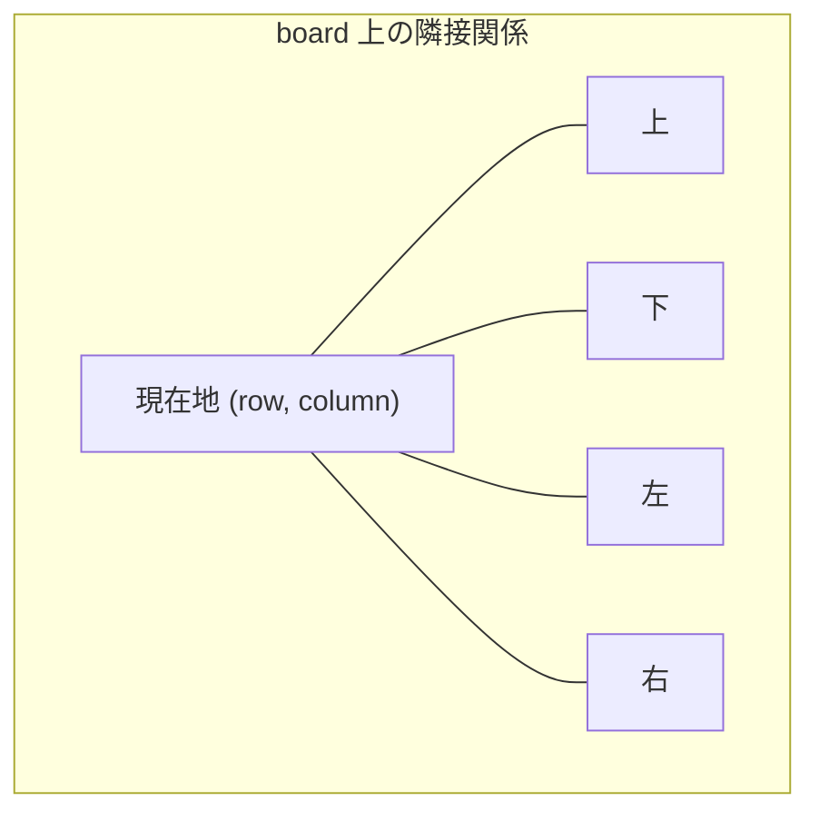
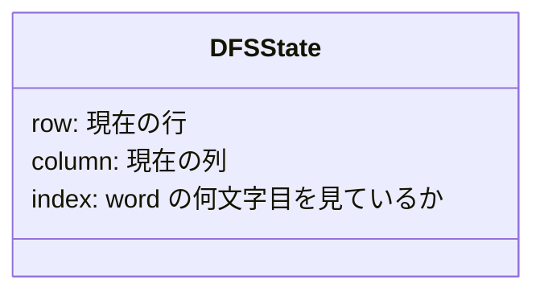
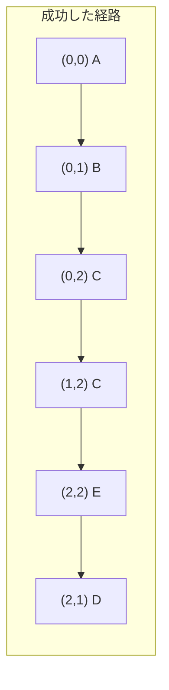
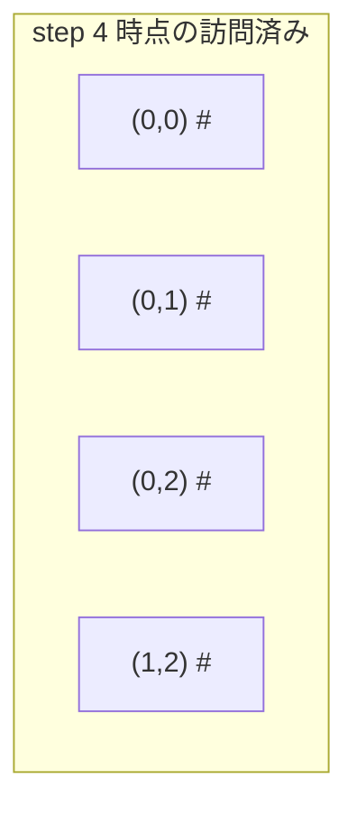

# 解説: 79. Word Search

## 1. 問題の整理

- 入力は文字の 2 次元配列 `board` と文字列 `word` です。
- `board` の中で、上下左右に隣接するマスをたどって `word` を順番どおりに作れれば `true` を返します。
- 同じマスは 1 回の探索経路の中で 2 回使えません。

問題のゴールは、`word` の 1 文字目から順にたどれる経路が 1 つでも存在するかを判定することです。

見落としやすい制約は次の 2 点です。

- 斜め移動はできません。使えるのは上下左右だけです。
- 一度使ったマスを、その同じ探索経路の途中で再利用してはいけません。

## 2. 素直に考えるとどうなるか

- まず `word` の 1 文字目と一致するマスを探す
- そこから次の文字、さらに次の文字へと進めるか試す

ここまでは自然です。問題は、途中で行き止まりになったときです。

例えば、あるマスから「右へ進む」ことを試して失敗したら、「下へ進む」「左へ進む」も試したくなります。  
つまり、1 つの場所から複数の候補を分岐して探索する必要があります。

そのため、単純な一直線の走査では足りず、**探索を試してダメなら戻る** 仕組みが必要です。

## 3. 採用するアプローチ

- 深さ優先探索（DFS）
- バックトラッキング

採用理由は、この問題が「ある地点から 4 方向へ分岐しながら、1 文字ずつ順番にたどる」構造だからです。

DFS は「今の候補を最後まで伸ばしてみる」方法なので、`word[index]` に対応するマスを順番に追うのに向いています。  
また、途中で失敗したときはその分岐を取り消して別の方向を試したいので、バックトラッキングと相性が良いです。

他案として「訪問済み配列を毎回作る」方法もありますが、今回は `board` 自体を一時的に書き換えて元に戻すほうが実装が簡潔です。

## 4. 全体の流れ

1. `board` の全マスを開始候補として順番に見る
2. そのマスを `word` の `index = 0` の文字に対応させて DFS を始める
3. 範囲外なら失敗にする
4. 現在のマスの文字が `word.charAt(index)` と違えば失敗にする
5. 一致したら、そのマスを一時的に訪問済みとして印付けする
6. 上下左右の 4 方向に対して、`index + 1` を探す
7. どこか 1 方向でも最後まで成功したら `true`
8. 4 方向とも失敗したら、印を元に戻して `false`





## 5. 具体例トレース

例 1 を使います。

```text
board = [
  ['A','B','C','E'],
  ['S','F','C','S'],
  ['A','D','E','E']
]
word = "ABCCED"
```

開始位置は `(0, 0)` の `'A'` です。

| step | current state | action | result |
| --- | --- | --- | --- |
| 1 | `(0,0)`, `index=0`, 必要文字は `'A'` | `'A'` が一致するので訪問済みにして次へ進む | 継続 |
| 2 | `(0,1)`, `index=1`, 必要文字は `'B'` | 右へ進むと `'B'` が一致する | 継続 |
| 3 | `(0,2)`, `index=2`, 必要文字は `'C'` | 右へ進むと `'C'` が一致する | 継続 |
| 4 | `(1,2)`, `index=3`, 必要文字は `'C'` | 下へ進むと `'C'` が一致する | 継続 |
| 5 | `(2,2)`, `index=4`, 必要文字は `'E'` | 下へ進むと `'E'` が一致する | 継続 |
| 6 | `(2,1)`, `index=5`, 必要文字は `'D'` | 左へ進むと `'D'` が一致する | 継続 |
| 7 | `index=6` | `word.length()` に到達 | `true` |

途中で訪問済みにしたマスは、他の方向へ戻る可能性があるため一時的にだけ使います。



ある時点での探索中イメージは次のようになります。



`#` は「この経路ではもう使えない」という一時的な印です。  
この探索が終わったら元の文字に戻します。

## 6. コードの読み解き

### 全マスを開始点として試す部分

```java
for (int row = 0; row < rowCount; row++) {
  for (int column = 0; column < columnCount; column++) {
    if (search(board, word, row, column, 0)) {
      return true;
    }
  }
}
```

- どのマスが正しい開始点か事前には分かりません。
- そのため、すべてのマスから `index = 0` で DFS を始めます。
- 1 つでも成功すれば答えは `true` です。

### 終了条件

```java
if (index == word.length()) {
  return true;
}
```

- `index` が `word` の長さに達したということは、0 文字目から最後の文字まで全部一致し終わったという意味です。
- ここで成功判定を返します。

### 範囲外チェックと文字不一致チェック

```java
if (row < 0 || row >= rowCount || column < 0 || column >= columnCount) {
  return false;
}

if (board[row][column] != word.charAt(index)) {
  return false;
}
```

- 盤面の外へ出た探索は失敗です。
- 今いるマスの文字が欲しい文字と違っていても失敗です。
- ここで早めに落とすことで、無駄な探索を減らしています。

### 訪問済みの印付け

```java
char originalCharacter = board[row][column];
board[row][column] = '#';
```

- このマスを今の探索経路で使ったことを記録します。
- 別の `visited` 配列を作らず、`board` 自体に一時的な印を書きます。
- 元の文字は `originalCharacter` に退避しておきます。

### 4 方向への再帰探索

```java
boolean found =
    search(board, word, row + 1, column, index + 1)
        || search(board, word, row - 1, column, index + 1)
        || search(board, word, row, column + 1, index + 1)
        || search(board, word, row, column - 1, index + 1);
```

- 次に探すべきなのは `word` の次の文字なので、`index + 1` を渡します。
- 下、上、右、左のどれか 1 つでも成功すれば、その時点で `found` は `true` になります。
- `||` を使っているため、途中で成功すれば残りは評価されません。

### 元に戻す処理

```java
board[row][column] = originalCharacter;
return found;
```

- 今の探索が成功でも失敗でも、呼び出し元に戻る前に盤面を元へ戻します。
- これがバックトラッキングです。
- 元に戻さないと、別の開始点や別の分岐が正しく探索できなくなります。

## 7. 計算量

- 時間計算量: `O(m * n * 4^L)`
- 空間計算量: `O(L)`

ここで `L` は `word.length()` です。

各マスを開始点として最大 `m * n` 個試します。  
各開始点では、各文字ごとに最大 4 方向へ分岐しうるため、最悪では `4^L` に近い探索になります。

再帰の深さは `word` の長さまでなので、追加の呼び出しスタックは `O(L)` です。

## 8. つまずきやすいポイント

- 同じマスを同じ探索経路で 2 回使ってしまう
- 探索後に文字を元へ戻し忘れて、次の分岐が壊れる
- `index == word.length()` の成功条件を遅すぎる場所で判定してしまう
- 斜め方向まで探索してしまう
- 1 文字目が合わない開始点を早めに切らず、無駄に再帰を深くしてしまう
