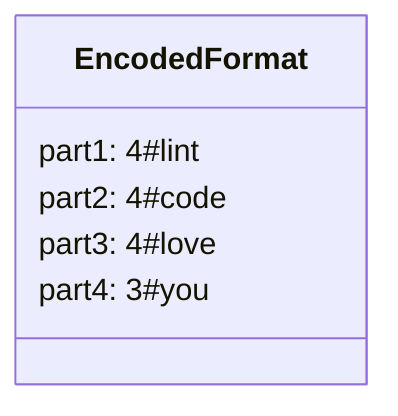

# 解説: 271. Encode and Decode Strings

## 1. 問題の整理

- 入力として文字列リストを受け取り、それを 1 つの文字列に変換する `encode` と、その文字列から元のリストを復元する `decode` を実装します。
- ゴールは、「どんな文字列が来ても情報が壊れず、`decode(encode(strs)) == strs` を満たす」ことです。
- 見落としやすい点は、文字列の中に区切り文字らしい文字が含まれていても壊れてはいけないことです。

## 2. 素直に考えるとどうなるか

- 初見では、たとえば `","` などの区切り文字で文字列をつなげたくなります。
- しかし入力文字列そのものに `","` や `"#"` のような記号が入っていると、どこが区切りか分からなくなります。
- エスケープ処理を自前で増やす方法もありますが、仕様が複雑になりやすいです。

## 3. 採用するアプローチ

- 各文字列を `長さ#本体` の形式で連結します。
- たとえば `"lint"` は `4#lint` にします。
- こうすると、文字列本体の中に `#` が含まれていても問題ありません。なぜなら、まず `#` までを「長さ」として読み、その長さぶんだけ本体を切り出せばよいからです。
- つまり、区切り文字に依存するのではなく、「長さ情報」で境界を決めます。

## 4. 全体の流れ

- `encode` では、各文字列について `length + '#' + string` を順番につなげる。
- `decode` では、現在位置から `#` まで読んで長さを取得する。
- 取得した長さぶんだけ次の文字列を切り出す。
- 文字列全体を読み終わるまでこれを繰り返す。

このアプローチで利用するデータ構造は「連結用の `StringBuilder`」と「復元結果を入れる `List<String>`」です。

## 5. 具体例トレース

`["we","say",":","yes"]` を追います。

### encode

| step | current state | action | result |
| --- | --- | --- | --- |
| 1 | `[]` | `"we"` を `2#we` にする | `2#we` |
| 2 | `2#we` | `"say"` を `3#say` にする | `2#we3#say` |
| 3 | `2#we3#say` | `":"` を `1#:` にする | `2#we3#say1#:` |
| 4 | `2#we3#say1#:` | `"yes"` を `3#yes` にする | `2#we3#say1#:3#yes` |

### decode

| step | current state | action | result |
| --- | --- | --- | --- |
| 1 | `index=0` | `#` まで読んで長さ `2` を得る | `"we"` を復元 |
| 2 | `index=4` | 次の長さ `3` を読む | `"say"` を復元 |
| 3 | `index=9` | 次の長さ `1` を読む | `":"` を復元 |
| 4 | `index=12` | 次の長さ `3` を読む | `"yes"` を復元 |

## 6. コードの読み解き

- `encode` では `StringBuilder` を使い、毎回文字列結合を効率よく行っています。
- `currentString.length()` で文字列長を先に書き、そのあと `'#'`、最後に本体を追加します。
- `decode` では `currentIndex` が「今どこを読んでいるか」を表します。
- `delimiterIndex` を進めて `'#'` の位置を見つけ、その手前を長さ文字列として `Integer.parseInt` で整数化します。
- `stringStartIndex` と `stringEndIndex` を使って、本体をちょうどその長さぶんだけ切り出します。
- 1 個復元したら `currentIndex` を次の開始位置まで進め、同じ処理を繰り返します。

## 7. 計算量

- 時間計算量は `O(totalLength)` です。
- `totalLength` は、入力全体の文字数と、それに付く長さ情報を含めた合計サイズです。
- `encode` でも `decode` でも、文字列全体を前から後ろへ 1 回なめる形になります。
- 空間計算量は `O(totalLength)` です。エンコード結果やデコード結果を保持するためです。

## 8. つまずきやすいポイント

- 区切り文字だけで分割しようとすると、入力文字列の中に同じ文字が含まれた場合に壊れます。
- 文字列の境界は `#` の位置ではなく、「長さ情報」によって決めていることが本質です。
- 空文字列 `""` も `0#` として自然に扱えます。
- `decode` では、長さ部分が 1 桁とは限らないので、`#` まで読み続ける必要があります。
