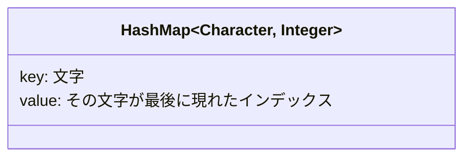
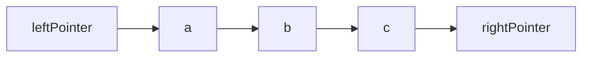
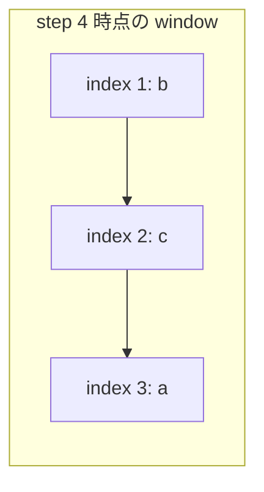
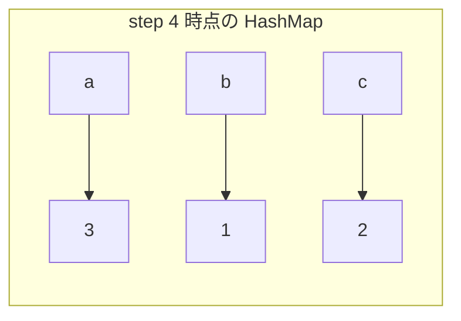

# 解説: 3. Longest Substring Without Repeating Characters

## 1. 問題の整理

- 入力として文字列 `s` を受け取り、重複文字を含まない部分文字列のうち最長の長さを返します。
- ゴールは「連続した区間」の中で、同じ文字が 2 回以上現れない最大長を見つけることです。
- 見落としやすいのは、求めるのが `substring` であって `subsequence` ではない点です。文字を飛ばして選ぶことはできません。

## 2. 素直に考えるとどうなるか

- まず思いつきやすいのは、すべての開始位置から部分文字列を伸ばしていき、重複が出たら止める方法です。
- たとえば各開始位置 `start` について、`end` を右へ伸ばしながら「この区間に重複があるか」を確認します。
- しかしこの方法は、似た区間を何度も調べ直すため効率が悪く、最悪では `O(n^2)` 以上になります。
- `s.length` は最大 `5 * 10^4` なので、毎回ほぼ全体を見直す方法は重くなりやすいです。

## 3. 採用するアプローチ

- スライディングウィンドウを使います。
- `leftPointer` と `rightPointer` で「今見ている重複なし区間」を表します。
- さらに `HashMap<Character, Integer>` で「各文字を最後に見た位置」を持ちます。
- 右端を 1 文字ずつ進めながら、もし同じ文字が現在の区間内に再登場したら、左端をその重複位置の次まで一気に進めます。
- こうすると各文字を無駄に何度も見直さずに済み、全体を 1 回なめる形で解けます。

## 4. 全体の流れ

- `leftPointer = 0` から始める。
- `rightPointer` を左から右へ 1 つずつ進める。
- 現在文字 `currentChar` がすでに `HashMap` にあり、その位置が今のウィンドウ内に含まれるなら、`leftPointer` をその次へ進める。
- `currentChar` の最新位置を `HashMap` に更新する。
- 現在のウィンドウ長 `rightPointer - leftPointer + 1` を使って最長長さを更新する。
- 最後まで終えたら最長長さを返す。

このアプローチで利用するデータ構造は「文字ごとの最新位置を持つ HashMap」と「現在の有効区間」です。

## 5. 具体例トレース

`s = "abcabcbb"` を追います。

| step | current state | action | result |
| --- | --- | --- | --- |
| 1 | `left=0, right=0, char='a', map={}` | `'a'` を追加 | `map={a:0}, longest=1` |
| 2 | `left=0, right=1, char='b', map={a:0}` | `'b'` を追加 | `map={a:0,b:1}, longest=2` |
| 3 | `left=0, right=2, char='c', map={a:0,b:1}` | `'c'` を追加 | `map={a:0,b:1,c:2}, longest=3` |
| 4 | `left=0, right=3, char='a', map={a:0,b:1,c:2}` | `'a'` が重複したので `left=1` へ移動 | `map={a:3,b:1,c:2}, longest=3` |
| 5 | `left=1, right=4, char='b', map={a:3,b:1,c:2}` | `'b'` が重複したので `left=2` へ移動 | `map={a:3,b:4,c:2}, longest=3` |
| 6 | `left=2, right=5, char='c', map={a:3,b:4,c:2}` | `'c'` が重複したので `left=3` へ移動 | `map={a:3,b:4,c:5}, longest=3` |
| 7 | `left=3, right=6, char='b', map={a:3,b:4,c:5}` | `'b'` が重複したので `left=5` へ移動 | `map={a:3,b:6,c:5}, longest=3` |
| 8 | `left=5, right=7, char='b', map={a:3,b:6,c:5}` | `'b'` が重複したので `left=7` へ移動 | `map={a:3,b:7,c:5}, longest=3` |

step 4 時点のウィンドウは `"bca"` に変わります。重複文字が出たときは、左端を少しずつではなく一気に飛ばすのがポイントです。

## 6. コードの読み解き

- `latestIndexByChar` は、各文字を最後に見たインデックスを記録する `HashMap` です。
- `leftPointer` は現在のウィンドウの左端です。
- `longestLength` はこれまでに見つかった最長長さです。
- `for` ループで `rightPointer` を 0 から `s.length() - 1` まで動かします。
- `currentChar = s.charAt(rightPointer)` で今追加しようとしている文字を取得します。
- `containsKey(currentChar)` で同じ文字を以前に見たか確認します。
- その文字を以前に見ていても、その位置が今のウィンドウより左なら重複とはみなしません。そのため `Math.max(leftPointer, latestIndexByChar.get(currentChar) + 1)` として、左端が後ろに戻らないようにしています。
- `latestIndexByChar.put(currentChar, rightPointer)` で、その文字の最新位置を現在位置に更新します。
- `currentWindowLength = rightPointer - leftPointer + 1` で今の区間長を計算します。
- `longestLength = Math.max(longestLength, currentWindowLength)` で答え候補を更新します。

## 7. 計算量

- 時間計算量は `O(n)` です。`rightPointer` は 1 回ずつ右へ進み、`leftPointer` も後ろに戻らないためです。
- 空間計算量は `O(min(n, 文字種数))` です。`HashMap` に入る文字数ぶんだけ追加メモリを使います。
- 支配的なのは、各文字について行う `HashMap` の参照・更新です。

## 8. つまずきやすいポイント

- `substring` と `subsequence` を混同しないこと。連続区間だけが対象です。
- 重複文字を見つけたとき、`leftPointer = latestIndex + 1` と単純に代入すると左端が後ろに戻る場合があります。必ず `Math.max` が必要です。
- 文字を消しながら 1 文字ずつ左を進める実装もありますが、この問題では「最新位置」を持ったほうが考えやすいことが多いです。
- 空文字列 `""` のときはループが 1 回も回らず、`0` がそのまま返るので問題ありません。
