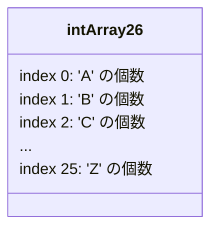
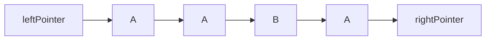
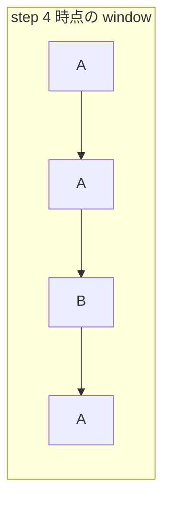
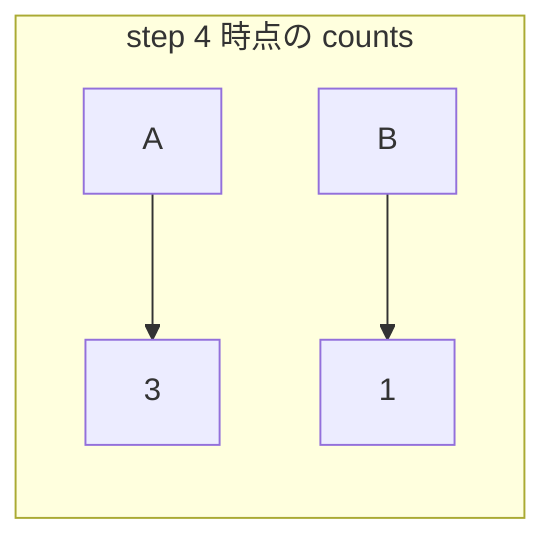

# 解説: 424. Longest Repeating Character Replacement

## 1. 問題の整理

- 入力として文字列 `s` と整数 `k` を受け取り、最大 `k` 回まで文字を置き換えて作れる「同じ文字だけからなる最長部分文字列」の長さを返します。
- ゴールは、ある連続区間の中で「最頻文字以外を全部その文字に置き換える」と考えたとき、その置換回数が `k` 以下になる最長区間を見つけることです。
- 見落としやすい点は、どの文字に揃えるかを毎回明示的に決める必要はなく、「区間内で一番多い文字」を基準に考えれば十分だということです。

## 2. 素直に考えるとどうなるか

- 初見では、すべての部分文字列について「何文字置き換えれば同じ文字だけにできるか」を調べたくなります。
- しかし部分文字列は大量にあり、各区間ごとに文字数を数え直すと非常に遅くなります。
- `s.length` は最大 `10^5` なので、`O(n^2)` の方法は現実的ではありません。

## 3. 採用するアプローチ

- スライディングウィンドウを使います。
- 現在のウィンドウ `[leftPointer, rightPointer]` に含まれる各文字数を `int[26]` で持ちます。
- さらに、ウィンドウ内で最も多い文字数 `maxFrequencyInWindow` を追跡します。
- ある区間を全部同じ文字にするには、「区間長 - 最頻文字数」回だけ置き換えればよいです。
- これが `k` 以下ならその区間は有効、超えたら左端を縮めます。

## 4. 全体の流れ

- `rightPointer` を 1 文字ずつ右へ進める。
- その文字の出現回数を `charCounts` に加算する。
- `maxFrequencyInWindow` を更新する。
- `windowLength - maxFrequencyInWindow > k` なら、置換回数が足りないので `leftPointer` を右へ進めながらウィンドウを縮める。
- 条件を満たしたウィンドウ長で `longestLength` を更新する。
- 最後に最長長さを返す。

このアプローチで利用するデータ構造は「英大文字 26 個の頻度配列」と「現在の有効ウィンドウ」です。

## 5. 具体例トレース

`s = "AABABBA", k = 1` を追います。

| step | current state | action | result |
| --- | --- | --- | --- |
| 1 | `window="A"` | `'A'` を追加 | `counts={A:1}, maxFreq=1, longest=1` |
| 2 | `window="AA"` | `'A'` を追加 | `counts={A:2}, maxFreq=2, longest=2` |
| 3 | `window="AAB"` | `'B'` を追加 | `counts={A:2,B:1}, maxFreq=2, longest=3` |
| 4 | `window="AABA"` | `'A'` を追加 | `counts={A:3,B:1}, maxFreq=3, longest=4` |
| 5 | `window="AABAB"` | `'B'` を追加 | `windowLength=5, 5-3=2 > 1` なので左を縮める |
| 6 | `window="ABAB"` | 左端の `'A'` を外す | `counts={A:2,B:2}, longest=4` |
| 7 | `window="ABABB"` | `'B'` を追加 | `counts={A:2,B:3}, maxFreq=3, longest=4` |
| 8 | `window="ABABBA"` | `'A'` を追加 | `windowLength=6, 6-3=3 > 1` なので左を縮める |
| 9 | `window="BABBA"` | 左端を進める | 条件を満たすまで縮め、`longest=4` のまま |

step 4 の `"AABA"` は、`'B'` を 1 回だけ置き換えれば `"AAAA"` にできるので有効です。

## 6. コードの読み解き

- `charCounts` は各大文字英字の出現回数を記録する配列です。`'A'` を 0、`'B'` を 1 のように添字へ変換しています。
- `leftPointer` はウィンドウの左端です。
- `maxFrequencyInWindow` は、その時点までにウィンドウ内で観測した最大頻度です。
- `for` ループで `rightPointer` を右へ伸ばし、新しい文字をウィンドウに加えます。
- `charCounts[currentCharIndex]++` で新しい文字の個数を増やします。
- `maxFrequencyInWindow = Math.max(...)` で、最頻文字数を更新します。
- `while (rightPointer - leftPointer + 1 - maxFrequencyInWindow > k)` は、「このウィンドウを全部同じ文字にするのに必要な置換回数が `k` を超えたら縮める」という条件です。
- 縮めるときは左端の文字数を 1 つ減らし、`leftPointer` を 1 つ右へ進めます。
- 条件を満たした時点のウィンドウ長で `longestLength` を更新します。

ここで大事なのは、`charCounts` は「前のウィンドウの結果を引きずる配列」ではなく、「今のウィンドウに含まれている文字数」を常に表していることです。

- 右端を広げるときは、その文字の個数を `+1` します。
- 左端を縮めるときは、ウィンドウから外れる文字の個数を `-1` します。

たとえばウィンドウが `"AABBC"` なら、`charCounts` は `A:2, B:2, C:1` を表します。そのあと左端の `A` を 1 つ外してウィンドウが `"ABBC"` になれば、`A` の個数も `1` に減ります。したがって、`A` `B` `C` の 3 種類以上の文字が入っていても問題ありません。

一方で、`maxFrequencyInWindow` はウィンドウを縮めたときに毎回厳密には下げていません。これは少し古い最大値を持つことがありますが、この問題では最終答えを壊しません。つまり、「現在のウィンドウと完全に同期しているのは `charCounts` のほう」であり、そこがまず重要です。

## 7. 計算量

- 時間計算量は `O(n)` です。`rightPointer` は 1 回ずつ進み、`leftPointer` も全体を通して高々 `n` 回しか進まないためです。
- 空間計算量は `O(1)` です。使う配列の大きさは 26 で固定だからです。
- 支配的なのは、各文字について行う頻度更新とウィンドウの伸縮です。

`for` の中に `while` があるので、一見すると `O(n^2)` に見えるかもしれません。しかしこの `while` は毎回 0 から長く回るわけではありません。

- `rightPointer` は `0` から `s.length() - 1` まで 1 回ずつ右へ進むだけです。
- `leftPointer` も左へ戻ることはなく、全体を通して右へ高々 `n` 回しか進みません。
- つまり 2 つのポインタはどちらも「配列全体を 1 回なめる」だけです。

そのため、見た目は二重ループでも、実際のポインタ移動回数の合計は高々 `2n` 回程度に収まり、時間計算量は `O(n)` になります。

## 8. つまずきやすいポイント

- 「どの文字に揃えるか」を毎回総当たりで決めなくてよい点がやや見えにくいです。最頻文字を残して他を置換すれば最小回数になります。
- 判定式は `windowLength - maxFrequencyInWindow > k` です。ここが腹落ちすると実装しやすくなります。
- `maxFrequencyInWindow` を毎回厳密に下げなくても、この問題では正しく解けます。ウィンドウが少し縮んでも、過去の最大頻度を保持したままで最終答えは壊れません。
- 大文字英字だけなので `HashMap` ではなく `int[26]` を使うと実装が簡潔です。
- `for` と `while` がネストしていても、`leftPointer` が後ろに戻らない以上、毎回フルスキャンしているわけではありません。見た目だけで `O(n^2)` と判断しないことが重要です。
