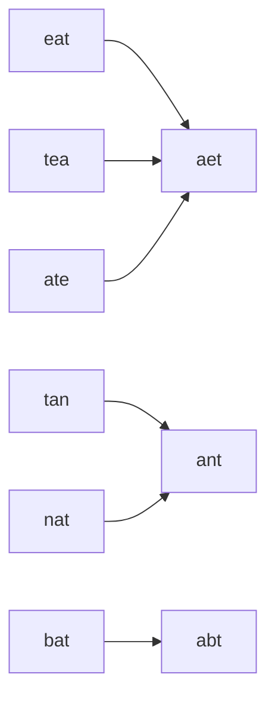
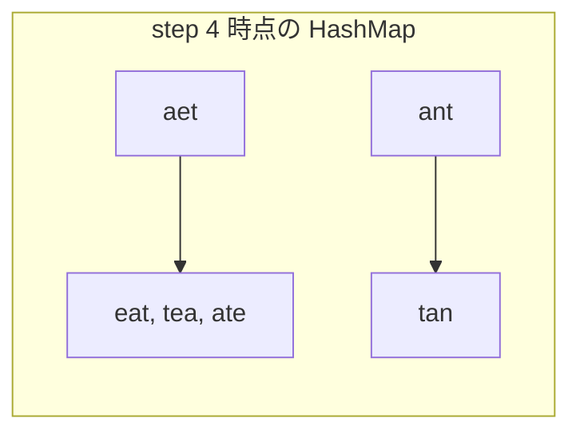

# 解説: 49. Group Anagrams

## 1. 問題の整理

- 入力として文字列配列 `strs` を受け取り、アナグラム同士を同じグループにまとめた `List<List<String>>` を返します。
- ゴールは、「並べ替えると同じ文字列になる単語たち」を同じ箱に入れることです。
- 見落としやすい点は、グループや全体の返却順は問われないことです。

## 2. 素直に考えるとどうなるか

- 初見では、各文字列どうしを 1 組ずつ比較してアナグラムかどうかを判定したくなります。
- しかしこの方法だと、比較する組み合わせが多くなります。
- 文字列数が `n` 個あると、単純比較はおおむね `O(n^2)` 組必要になり、各比較でも文字の並びを調べるコストがかかります。
- `strs.length` は最大 `10^4` なので、この方針は重くなりやすいです。

## 3. 採用するアプローチ

- 「アナグラムなら、文字をソートした結果が同じになる」ことを使います。
- たとえば `"eat"`、`"tea"`、`"ate"` をソートすると、どれも `"aet"` になります。
- そこで各文字列から「ソート済み文字列」をキーとして作り、`HashMap<String, List<String>>` にまとめます。
- 同じキーに入る文字列は同じアナグラムグループです。

## 4. 全体の流れ

- 空の `HashMap` を用意する。
- `strs` を 1 つずつ見る。
- 各文字列を `char[]` にしてソートし、`sortedKey` を作る。
- `HashMap` の `sortedKey` に対応するリストへ、元の文字列を追加する。
- 最後に `HashMap` の `values()` をまとめて返す。

このアプローチで利用するデータ構造は「ソート済み文字列をキーにした HashMap」です。

```mermaid
classDiagram
    class HashMap~String, List~String~~ {
        key: ソート済み文字列
        value: 同じアナグラムの文字列一覧
    }
```



## 5. 具体例トレース

`strs = ["eat","tea","tan","ate","nat","bat"]` を追います。

| step | current state | action | result |
| --- | --- | --- | --- |
| 1 | `currentString = "eat"` | ソートして `"aet"` を作る | `{"aet": ["eat"]}` |
| 2 | `currentString = "tea"` | ソートして `"aet"` を作る | `{"aet": ["eat", "tea"]}` |
| 3 | `currentString = "tan"` | ソートして `"ant"` を作る | `{"aet": ["eat", "tea"], "ant": ["tan"]}` |
| 4 | `currentString = "ate"` | ソートして `"aet"` を作る | `{"aet": ["eat", "tea", "ate"], "ant": ["tan"]}` |
| 5 | `currentString = "nat"` | ソートして `"ant"` を作る | `{"aet": ["eat", "tea", "ate"], "ant": ["tan", "nat"]}` |
| 6 | `currentString = "bat"` | ソートして `"abt"` を作る | `{"aet": ["eat", "tea", "ate"], "ant": ["tan", "nat"], "abt": ["bat"]}` |

step 4 時点では、`"eat"`、`"tea"`、`"ate"` がすべて `"aet"` にまとまっています。



## 6. コードの読み解き

- `groupedStringsBySortedKey` は、ソート済み文字列をキーにして、同じアナグラムの元文字列一覧を持つ `HashMap` です。
- `for (String currentString : strs)` で入力配列を順に処理します。
- `currentString.toCharArray()` で文字列をソートしやすい `char[]` に変換します。
- `Arrays.sort(sortedChars)` で文字を辞書順に並べます。
- `new String(sortedChars)` で、`HashMap` のキーに使う `sortedKey` を作ります。
- `computeIfAbsent` は、そのキーがまだなければ空の `ArrayList` を作り、すでにあれば既存のリストを返します。
- 最後の `.add(currentString)` で、元の文字列を該当グループへ追加します。
- `new ArrayList<>(groupedStringsBySortedKey.values())` で、`HashMap` に入っている全グループをまとめて返します。

## 7. 計算量

- 時間計算量は `O(n * k log k)` です。
- `n` は文字列数、`k` は各文字列の最大長です。
- 各文字列についてソートを 1 回行うので、1 文字列あたり `O(k log k)` かかります。
- 空間計算量は `O(n * k)` です。`HashMap` に各文字列を保持し、さらにキー文字列も作るためです。

## 8. つまずきやすいポイント

- グループ化の判定には「元の文字列」ではなく「ソートした結果」をキーに使う必要があります。
- 返却順は問われないので、`HashMap` の `values()` をそのまま使って問題ありません。
- 空文字列 `""` をソートしても `""` のままなので、そのケースも自然に処理できます。
- `computeIfAbsent` が見慣れなければ、`containsKey` で分岐して `put` する書き方でも構いません。
