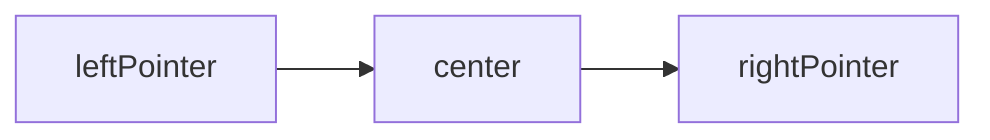
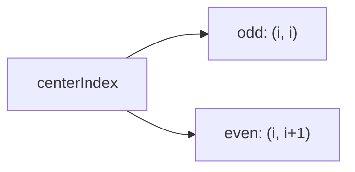
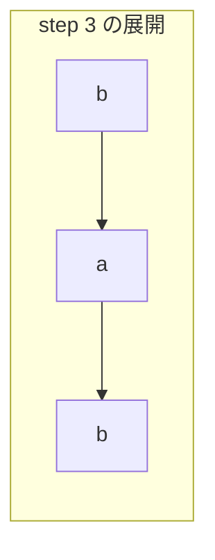

# 解説: 5. Longest Palindromic Substring

## 1. 問題の整理

- 入力として文字列 `s` を受け取り、その中に含まれる最長の回文部分文字列を返します。
- ゴールは、「左右対称になっている連続部分文字列」のうち、最も長いものを見つけることです。
- 見落としやすい点は、求めるのが `substring` であって `subsequence` ではないこと、また最長解が複数あっても 1 つ返せばよいことです。

## 2. 素直に考えるとどうなるか

- 初見では、すべての部分文字列を作って、それぞれが回文かどうかを判定したくなります。
- しかし部分文字列は `O(n^2)` 個あり、そのたびに回文判定をするとさらに `O(n)` かかるので、全体では `O(n^3)` になります。
- `s.length` は最大 `1000` なので、もっと効率の良い方法が欲しいです。

## 3. 採用するアプローチ

- 回文は「中心から左右へ広げる」と見つけやすいです。
- 各位置を中心にして、左右の文字が一致する限り外側へ広げます。
- 回文には奇数長と偶数長があるので、各位置について 2 種類の中心を調べます。
  - 奇数長: `(centerIndex, centerIndex)`
  - 偶数長: `(centerIndex, centerIndex + 1)`
- 各中心から得られる回文長のうち、最長のものを記録します。

## 4. 全体の流れ

- `bestStartIndex` と `bestLength` で現在の最長回文を記録する。
- 各 `centerIndex` について、奇数長回文を中心展開で調べる。
- 同じ `centerIndex` について、偶数長回文も調べる。
- より長い回文が見つかったら、開始位置と長さを更新する。
- 最後に `substring(bestStartIndex, bestStartIndex + bestLength)` を返す。

このアプローチで利用する考え方は「回文の中心」と「左右へ伸ばす 2 本のポインタ」です。

## 5. 具体例トレース

`s = "babad"` を追います。

| step | current state | action | result |
| --- | --- | --- | --- |
| 1 | `centerIndex = 0` | 奇数長で `"b"` を調べる | 長さ `1` |
| 2 | `centerIndex = 0` | 偶数長で `"ba"` を調べる | 長さ `0` |
| 3 | `centerIndex = 1` | 奇数長で中心 `"a"` から広げる | `"bab"`、長さ `3` |
| 4 | `centerIndex = 1` | 偶数長で `"ab"` を調べる | 長さ `0` |
| 5 | `centerIndex = 2` | 奇数長で中心 `"b"` から広げる | `"aba"`、長さ `3` |
| 6 | `centerIndex = 3` | 奇数長と偶数長を調べる | 既存最長を超えない |

step 3 では index 1 の `"a"` を中心として、左右の `"b"` と `"b"` が一致するので `"bab"` が見つかります。

## 6. コードの読み解き

- `bestStartIndex` は現在の最長回文の開始位置です。
- `bestLength` は現在の最長回文の長さです。最初は 1 文字だけでも回文なので `1` にしています。
- `for` ループで各 `centerIndex` を候補中心として順に見ます。
- `expandAroundCenter(s, centerIndex, centerIndex)` は奇数長回文の長さを返します。
- その長さが現在の `bestLength` より大きければ、開始位置を `centerIndex - oddLength / 2` で計算して更新します。
- `expandAroundCenter(s, centerIndex, centerIndex + 1)` は偶数長回文の長さを返します。
- 偶数長では開始位置の式が少し異なり、`centerIndex - evenLength / 2 + 1` になります。
- `expandAroundCenter` では、左右のポインタが範囲内にあり、かつ文字が一致する間だけ広げ続けます。
- ループを抜けた時点では 1 回広げすぎているので、長さは `rightPointer - leftPointer - 1` で求めます。

## 7. 計算量

- 時間計算量は `O(n^2)` です。
- 各 `centerIndex` について最大 `O(n)` 回まで左右に広がる可能性があり、それを `n` 個の中心に対して行うためです。
- 空間計算量は `O(1)` です。追加で使うのは添字や長さを表す定数個の変数だけです。

## 8. つまずきやすいポイント

- 回文には奇数長と偶数長の 2 種類があるので、両方を調べないと `"bb"` のようなケースを取りこぼします。
- `expandAroundCenter` の戻り値は「最後に一致していた回文の長さ」です。ループを抜けた時点では 1 文字分はみ出していることに注意が必要です。
- `substring(begin, end)` の `end` は含まれないので、`bestStartIndex + bestLength` を使います。
- 最長回文が複数ある場合、この実装は最初に見つけたものの 1 つを返します。それで問題ありません。
