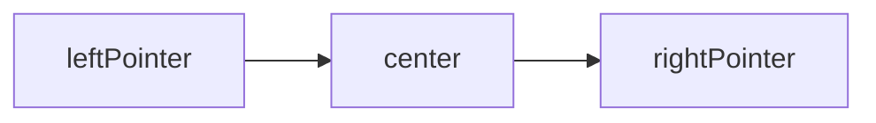
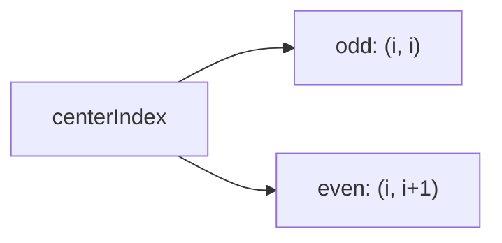
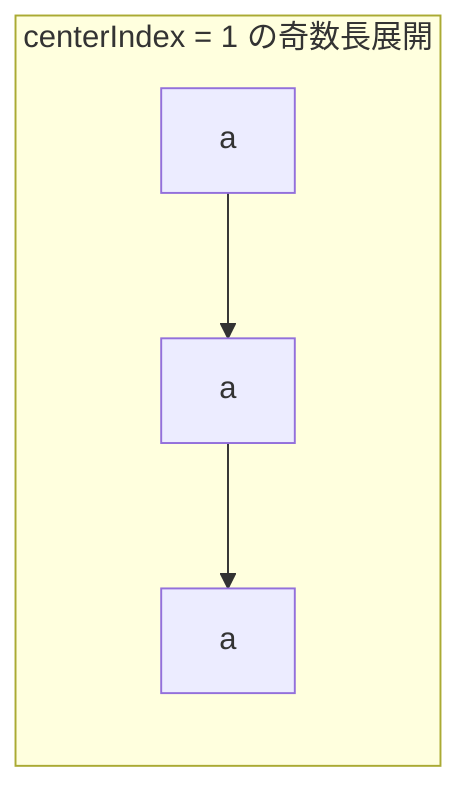

# 解説: 647. Palindromic Substrings

## 1. 問題の整理

- 入力として文字列 `s` を受け取り、その中に含まれる回文部分文字列の総数を返します。
- ゴールは、「連続した部分文字列」であって、前から読んでも後ろから読んでも同じになるものをすべて数えることです。
- 見落としやすい点は、同じ文字列でも位置が違えば別の部分文字列として数えることです。たとえば `"aaa"` の中の 3 つの `"a"` はそれぞれ別に数えます。

## 2. 素直に考えるとどうなるか

- 初見では、すべての部分文字列を列挙して、それぞれが回文かどうかを調べたくなります。
- しかし部分文字列は `O(n^2)` 個あり、各部分文字列の回文判定に `O(n)` かけると全体で `O(n^3)` になります。
- `s.length` は最大 `1000` なので、もっと効率の良い方法を使いたいです。

## 3. 採用するアプローチ

- 回文は「中心から左右へ広げる」と自然に見つかります。
- 各位置を中心にして広げると、その中心から作れるすべての回文を数えられます。
- さらに、回文には奇数長と偶数長があるので、各位置について 2 種類の中心を試します。
  - 奇数長: `(centerIndex, centerIndex)`
  - 偶数長: `(centerIndex, centerIndex + 1)`
- 左右の文字が一致するたびに 1 個の回文が見つかったと数えればよいです。

## 4. 全体の流れ

- `palindromeCount` を 0 で初期化する。
- 各 `centerIndex` について、奇数長回文の個数を数える。
- 同じ `centerIndex` について、偶数長回文の個数も数える。
- それぞれの個数を `palindromeCount` に足す。
- 最後に合計を返す。

このアプローチで利用する考え方は「回文の中心」と「左右へ広げる 2 本のポインタ」です。

## 5. 具体例トレース

`s = "aaa"` を追います。

| step | current state | action | result |
| --- | --- | --- | --- |
| 1 | `centerIndex = 0` | 奇数長 `(0,0)` を広げる | `"a"` が見つかり `+1` |
| 2 | `centerIndex = 0` | 偶数長 `(0,1)` を広げる | `"aa"` が見つかり `+1` |
| 3 | `centerIndex = 1` | 奇数長 `(1,1)` を広げる | `"a"`, `"aaa"` が見つかり `+2` |
| 4 | `centerIndex = 1` | 偶数長 `(1,2)` を広げる | `"aa"` が見つかり `+1` |
| 5 | `centerIndex = 2` | 奇数長 `(2,2)` を広げる | `"a"` が見つかり `+1` |
| 6 | `centerIndex = 2` | 偶数長 `(2,3)` を広げる | 範囲外なので `+0` |

合計は `1 + 1 + 2 + 1 + 1 = 6` です。

## 6. コードの読み解き

- `palindromeCount` は見つけた回文部分文字列の総数です。
- `for` ループで各 `centerIndex` を回文の中心候補として順に見ます。
- `countPalindromesFromCenter(s, centerIndex, centerIndex)` は奇数長回文の個数を返します。
- `countPalindromesFromCenter(s, centerIndex, centerIndex + 1)` は偶数長回文の個数を返します。
- `countPalindromesFromCenter` の中では、左右の文字が一致している限り回文なので、そのたびに `count++` します。
- 一致しなくなったらそれ以上外へ広げても回文にはならないので、ループを止めます。
- 呼び出し元では、各中心から見つかった個数を合計に加えるだけです。

## 7. 計算量

- 時間計算量は `O(n^2)` です。
- 各中心について最大 `O(n)` 回まで広がる可能性があり、中心候補は `n` 個あるためです。
- 空間計算量は `O(1)` です。追加で使うのは定数個の変数だけです。

## 8. つまずきやすいポイント

- 最長回文を求める問題ではなく、「見つかった回文の個数」を数える問題です。
- 奇数長と偶数長の両方を数えないと `"aa"` のような偶数長回文を見落とします。
- `"aaa"` では `"a"` が 3 個、`"aa"` が 2 個、`"aaa"` が 1 個あり、合計 6 個になることを確認すると数え方の感覚が掴みやすいです。
- `substring` を毎回作らなくても、中心展開しながら個数だけ数えれば十分です。
