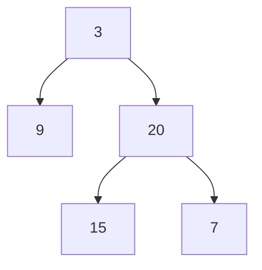
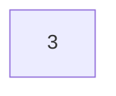
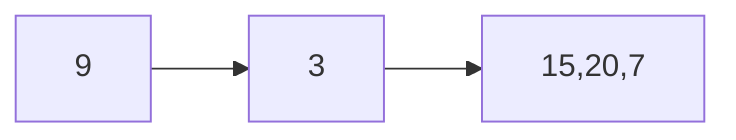
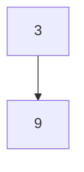
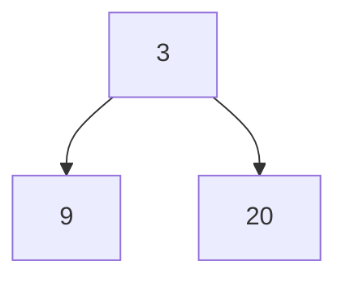
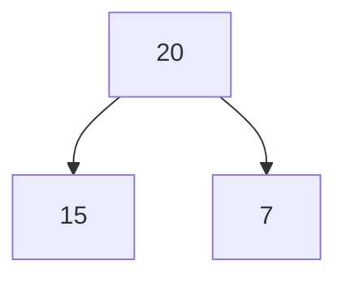
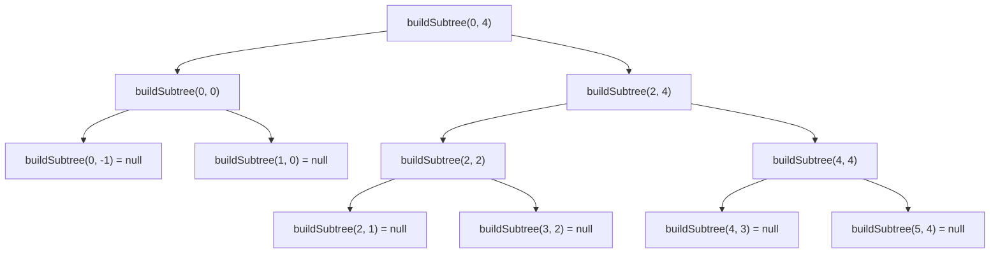
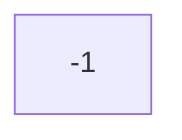

# 105. Construct Binary Tree from Preorder and Inorder Traversal 解説

この問題は、`preorder` と `inorder` という 2 つの走査結果から、元の二分木を復元する問題です。

最初は難しく見えますが、見るべきルールは次の 2 つだけです。

- `preorder` では、各部分木の **根が最初に出てくる**
- `inorder` では、根を境に **左側が左部分木、右側が右部分木** になる

この 2 つを繰り返し使うと、木を 1 ノードずつ復元できます。

## まずは走査の意味を確認する

### preorder（前順走査）

- 順番は `根 -> 左 -> 右`
- つまり、部分木を見るたびに「最初の値が根」です

例:



この木の preorder は次の順になります。

```text
3 -> 9 -> 20 -> 15 -> 7
```

### inorder（中順走査）

- 順番は `左 -> 根 -> 右`
- 根の位置が分かると、左部分木と右部分木の境界が分かります

同じ木の inorder は次の順です。

```text
9 -> 3 -> 15 -> 20 -> 7
```

`3` を見ると:

- `3` の左側: `9` なので左部分木
- `3` の右側: `15, 20, 7` なので右部分木

## この問題の核心

例 1:

```text
preorder = [3,9,20,15,7]
inorder  = [9,3,15,20,7]
```

### 手順 1: preorder の先頭を見る

`preorder` の先頭は `3` です。

- したがって、木全体の根は `3`



### 手順 2: inorder で `3` の位置を見る

```text
inorder = [9, 3, 15, 20, 7]
              ^
             root
```

`3` を境に分けると:

- 左部分木の inorder: `[9]`
- 右部分木の inorder: `[15,20,7]`

図にするとこうです。



これは「`3` の左には `9` がいる」「`3` の右には `15,20,7` の部分木がある」という意味です。

### 手順 3: 次の preorder 要素で左部分木の根を作る

`preorder` は先頭から順に根を取り出していきます。

すでに `3` を使ったので、次は `9` です。

- 左部分木の根は `9`



`inorder` で `[9]` は 1 要素だけなので、`9` の左右の子はありません。

### 手順 4: さらに preorder を進めて右部分木を作る

次の値は `20` です。

- 右部分木の根は `20`



右部分木に対応する inorder は `[15,20,7]` です。

```text
[15, 20, 7]
      ^
     root
```

`20` を境に分けると:

- 左部分木: `[15]`
- 右部分木: `[7]`



### 手順 5: 残りを同じように作る

`preorder` の残りは `[15,7]` です。

- `15` は `20` の左の子
- `7` は `20` の右の子

最終的な木はこうなります。


## トレースを表で見る

再帰で何が起きているかを、`preorderIndex` と `inorder` の範囲で追うと分かりやすいです。
ここでの `preorderIndex` は、「そのステップに入る時点で次に読む位置」を表します。

| Step | 開始時の `preorderIndex` | 読む値 | 対応する `inorder` 範囲 | 何を作るか |
| --- | --- | --- | --- | --- |
| 1 | `0` | `3` | `[9,3,15,20,7]` | 木全体の根 |
| 2 | `1` | `9` | `[9]` | `3` の左部分木の根 |
| 3 | `2` | なし | 空範囲 | `9.left = null` |
| 4 | `2` | なし | 空範囲 | `9.right = null` |
| 5 | `2` | `20` | `[15,20,7]` | `3` の右部分木の根 |
| 6 | `3` | `15` | `[15]` | `20` の左部分木の根 |
| 7 | `4` | なし | 空範囲 | `15.left = null` |
| 8 | `4` | なし | 空範囲 | `15.right = null` |
| 9 | `4` | `7` | `[7]` | `20` の右部分木の根 |
| 10 | `5` | なし | 空範囲 | `7.left = null` |
| 11 | `5` | なし | 空範囲 | `7.right = null` |

## 再帰の形を木として見る

`buildSubtree(preorder, inorderLeft, inorderRight)` は、
「`inorder` のこの範囲に対応する部分木を作って返す」関数です。

例 1 では、おおまかに次のように呼ばれます。



空範囲になったら `null` を返す、というのが再帰の終了条件です。

## なぜ inorder の添字マップが必要なのか

素直に実装すると、根の値が `inorder` のどこにあるか毎回探したくなります。

例えば `20` の位置を探すたびに配列を左から順に見ていくと、1 回の探索に O(n) かかります。
これを全ノードで繰り返すと、最悪で O(n^2) になります。

そこで最初に:

```java
Map<Integer, Integer> inorderIndexByValue = new HashMap<>();
```

を作って、

- キー: ノードの値
- 値: `inorder` 内の添字

を保存しておきます。

すると `20` の位置も `3` の位置もすぐに取れるので、全体で O(n) にできます。

## コードと処理の対応

今回の `AISolution/Solution.java` の中心部分は次の考え方です。

### 1. inorder の位置表を作る

```java
for (int index = 0; index < inorder.length; index++) {
    inorderIndexByValue.put(inorder[index], index);
}
```

これで「ある値が inorder のどこにあるか」を O(1) で取得できます。

### 2. preorderIndex が常に次の根を指す

```java
int rootValue = preorder[preorderIndex];
preorderIndex++;
```

preorder は `根 -> 左 -> 右` の順です。
そのため、再帰のたびにこの値を読むと「今から作る部分木の根」が取れます。

### 3. inorder の範囲で左右部分木を分ける

```java
int inorderRootIndex = inorderIndexByValue.get(rootValue);
root.left = buildSubtree(preorder, inorderLeft, inorderRootIndex - 1);
root.right = buildSubtree(preorder, inorderRootIndex + 1, inorderRight);
```

`inorderRootIndex` より:

- 左側の範囲が左部分木
- 右側の範囲が右部分木

になります。

## 初心者がつまずきやすいポイント

### 1. 「なぜ preorder だけで根が分かるのか」

preorder は必ず `根 -> 左 -> 右` の順だからです。
部分木を見ても、その部分木の根は最初に現れます。

### 2. 「なぜ inorder で左右が分かれるのか」

inorder は `左 -> 根 -> 右` の順だからです。
根の位置より左にあるものは左部分木、右にあるものは右部分木です。

### 3. 「なぜ左部分木を先に作るのか」

preorder が `根 -> 左 -> 右` なので、根の次には左部分木の情報が続いています。
その順番に合わせて再帰する必要があります。

もし先に右部分木を作ると、`preorderIndex` がずれて壊れます。

## 例 2 はなぜ簡単か

```text
preorder = [-1]
inorder  = [-1]
```

- 根は `-1`
- `inorder` にも `-1` しかない
- 左右に分ける範囲が空になる

したがって、木は 1 ノードだけです。



## まとめ

- `preorder` の先頭から根を 1 つずつ決める
- `inorder` でその根の位置を見つける
- 左右の範囲に分けて再帰する
- `inorder` の位置はマップで高速に引く

この 4 点が分かれば、この問題の実装は追えるようになります。
