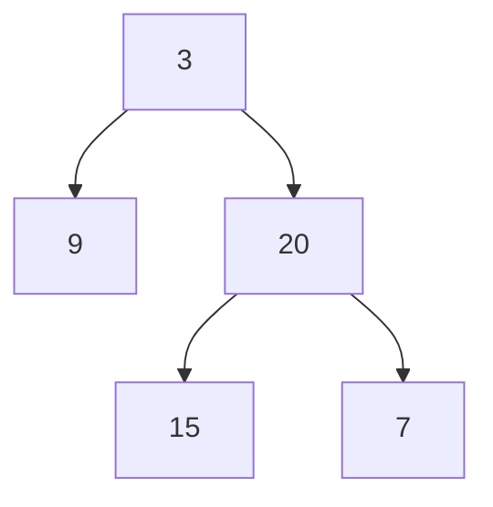
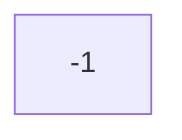

# 105. 前順走査と中順走査から二分木を構築する

難易度: Medium

## 問題

整数配列 `preorder` と `inorder` が与えられます。`preorder` は二分木の前順走査、`inorder` は同じ二分木の中順走査です。*その二分木* を構築して返してください。

## 例

**例 1:**

```text
入力: preorder = [3,9,20,15,7], inorder = [9,3,15,20,7]
出力: [3,9,20,null,null,15,7]
```



**例 2:**

```text
入力: preorder = [-1], inorder = [-1]
出力: [-1]
```



## 制約

- `1 <= preorder.length <= 3000`
- `inorder.length == preorder.length`
- `-3000 <= preorder[i], inorder[i] <= 3000`
- `preorder` と `inorder` は **一意な** 値で構成される
- `inorder` の各値は `preorder` にも現れる
- `preorder` はその木の前順走査であることが **保証** されている
- `inorder` はその木の中順走査であることが **保証** されている

## 備考

- 前順走査（preorder）は `根 -> 左部分木 -> 右部分木` の順でノードをたどる走査方法です。
- 中順走査（inorder）は `左部分木 -> 根 -> 右部分木` の順でノードをたどる走査方法です。
- この問題では、`preorder` の先頭要素が現在の部分木の根になります。
- その根の値を `inorder` 内で探すと、左側が左部分木、右側が右部分木に対応します。
