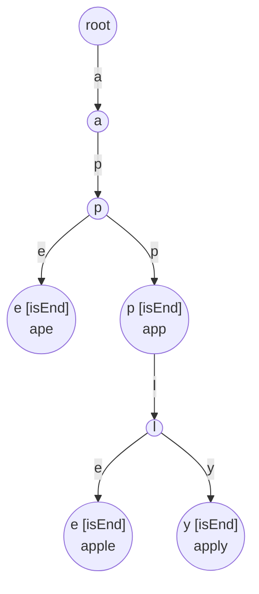
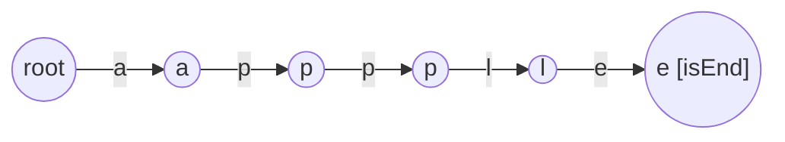
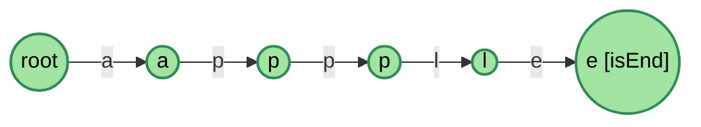
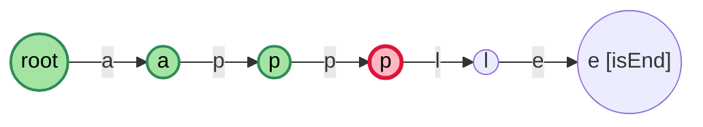
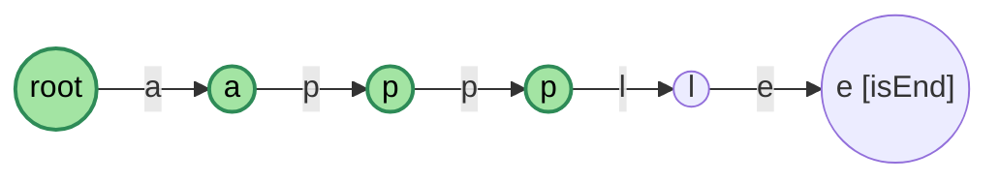
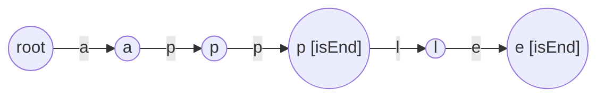
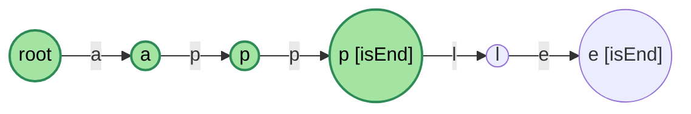

# 解説: 208. Implement Trie (Prefix Tree)

## 1. 問題の整理

- 入力: 一連の操作列 (`insert`, `search`, `startsWith`)。各操作は英小文字のみからなる文字列を引数に取る。
- 出力: `search` / `startsWith` の各呼び出しに対して `true` / `false` を返す。
- ゴール: trie (プレフィックスツリー) クラスを自分で実装する。
- 見落としやすい点:
  - `search("app")` は **完全一致した単語が挿入されているか** を聞いている。`apple` が挿入済みでも `app` が単語として挿入されていなければ `false` になる。
  - `startsWith("app")` は **そのプレフィックスを持つ単語があるか** を聞いている。`apple` が挿入済みなら `true`。
  - 挿入総数 3*10^4、各文字列は最大 2000 文字。十分高速なデータ構造が必要。

## 2. 素直に考えるとどうなるか

挿入された単語を `List<String>` や `HashSet<String>` で持つ案がまず思いつく。

- `search`: `HashSet#contains` で O(L) 平均、これは十分速い。
- `startsWith`: 全単語を線形に走査して `startsWith` を呼ぶ → O(N * L)。挿入数が多くなると遅い。

`startsWith` を高速化するために、文字を 1 文字ずつ辿る木構造である **trie** を使う。

## 3. 採用するアプローチ

trie の特徴:

- ルートから始まり、各エッジが 1 文字を表す。
- 同じプレフィックスを持つ単語は途中まで同じ経路を共有する。
- 各ノードに「ここで終わる単語があるか」のフラグを持たせれば `search` と `startsWith` を区別できる。

例として、`apple`, `app`, `apply`, `ape` の 4 単語を挿入した trie を可視化すると、共通の prefix `ap` がきれいに 1 本の経路に統合される:

- `ape` と `app/apple/apply` は `ap` まで同じ経路を共有する (= ストレージ削減)。
- `apple` と `apply` は `appl` まで同じ経路を共有する。
- `[isEnd]` はそのノードで終わる単語が挿入済みであることを示すフラグ。これがあるおかげで「`app` は単語として挿入されているか」と「`app` で始まる単語はあるか」を区別できる。
- どんな操作も「ルートから順に文字を辿る」だけで完結し、長さ `L` の文字列に対し `O(L)` で済む。

子ノードの保持方法は 2 通り:

- `Map<Character, Node>` を使う方法 (「文字 → ノード」の対応関係がコード上に直接現れるため読みやすい。少しだけオーバーヘッドあり)
- 長さ 26 の `Node[]` 配列 (英小文字限定なら添字 `c - 'a'` で直接アクセスできて最速)

本実装ではまず素直に **HashMap 方式** を採用する。本問題の制約 (操作数最大 3*10^4、各単語最大 2000 文字) では HashMap でも十分高速で、コードも「children に c があれば降りる、なければ作る」と読み下せる。
さらに性能を絞りたい場合や、英小文字限定が保証された競技用途では配列方式に切り替える価値がある。

## 4. 操作の概要

3 つの操作はいずれも「ルートから 1 文字ずつ trie を辿る」という共通動作に集約できる。違いは末尾での扱いだけ:

- **insert(word)**: 子が無ければ作成しながら降りる。最後のノードに `isEnd = true` を立てる。
- **search(word)**: 子が途中で無ければ `false`。最後まで辿れた上で `isEnd == true` なら `true`、そうでなければ `false`。
- **startsWith(prefix)**: 子が途中で無ければ `false`。最後まで辿れたら `isEnd` を見ずに `true`。

つまり「文字を辿るループ本体は共通。末尾の判定が違うだけ」と捉えると実装も短くまとまる。
実際の動きは次の節で具体例とともに見る。

## 5. 具体例トレース

操作列: `insert("apple")` → `search("apple")` → `search("app")` → `startsWith("app")` → `insert("app")` → `search("app")`

### 5.1 insert("apple") 後の trie

| step | 現在ノード | 入力文字 | アクション |
| --- | --- | --- | --- |
| 1 | root | a | 子 a を作成、降りる |
| 2 | a | p | 子 p を作成、降りる |
| 3 | p | p | 子 p を作成、降りる |
| 4 | p | l | 子 l を作成、降りる |
| 5 | l | e | 子 e を作成、降りる |
| 6 | e | (終了) | `isEnd = true` を設定 |

### 5.2 search("apple")

文字 `a → p → p → l → e` を順に辿る。すべての子ノードが存在し、最後の `e` ノードの `isEnd` は `true`。
→ **true** を返す。

緑色のノードが辿った経路。終端 `e` が `isEnd=true` なので一致。

### 5.3 search("app")

`a → p → p` まで辿れる。しかし 2 番目の `p` ノードの `isEnd` は `false` (まだ "app" は挿入していない)。
→ **false** を返す。

ピンクのノードが「最後に到達したが `isEnd=false` のため失敗した位置」。`p2` までは到達できているが、ここで終わる単語は登録されていない。

### 5.4 startsWith("app")

`a → p → p` まで辿れる。`isEnd` は見ない。最後まで辿れたので
→ **true** を返す。

5.3 と同じ位置 `p2` で終わるが、`startsWith` は `isEnd` を見ないため成功 (= プレフィックスとして経路が存在すれば十分)。
**`search` と `startsWith` の違いはこの 1 行 (`isEnd` を見るか) だけ** だと視覚的に分かる。

### 5.5 insert("app")

`a → p → p` の経路は既に存在するため新規ノード作成はゼロ。最後の `p` ノードに `isEnd = true` を設定するだけ。

ノードを 1 つも増やさず、フラグ 1 つで「app という単語の存在」を表現できているのが trie の効率性。

### 5.6 search("app") (再度)

再度 `a → p → p` を辿る。今度は 2 番目の `p` の `isEnd` が `true`。
→ **true** を返す。

5.3 と全く同じ経路を辿るが、`p2.isEnd` が今回は `true` なので結果が逆転する。trie の状態 (= isEnd フラグ) だけで動作が変わる、という構造が一目で見える。

## 6. コードの読み解き

- `Node` クラス: 「次の文字 → 子ノード」の `Map<Character, Node>` と終端フラグ `isEnd` を持つ。HashMap にキーが無いことが「未挿入の枝」を意味する。
- コンストラクタ `Trie()`: ルートノードを 1 つ用意するだけ。ルートは文字に対応しない空ノード。
- `insert`: ルートから 1 文字ずつ降りる。`children.containsKey(c)` が `false` なら新しいノードを作って `put`。次に `children.get(c)` で降りる。最後に `isEnd = true`。
- `search`: 共通ヘルパ `traverse` で末尾ノードを取得し、`isEnd` が `true` のときだけ一致と判定。
- `startsWith`: `traverse` の戻りが非 `null` なら、その経路は存在するので `true`。
- `traverse`: 共通の文字列辿り処理。`children.get(c)` が `null` を返した時点で枝が切れているので即 `null` を返す。コード重複を避ける小さな工夫。

## 7. 計算量

- `insert(word)`: O(L)。L は `word.length()`。最悪でも各文字につき 1 ノード作成。HashMap の `containsKey`/`put`/`get` はいずれも平均 O(1)。
- `search(word)` / `startsWith(prefix)`: O(L)。HashMap の `get` も平均 O(1)。
- 空間計算量: 全挿入文字数を S とすると最悪 O(S)。各ノードは「実際に登場した文字の分」だけ HashMap エントリを持つので、配列方式 (常に 26 スロット確保) より省メモリになりやすい。
- 支配的な処理: 文字列の長さに比例した木の辿り処理。

## 8. つまずきやすいポイント

- **`search` と `startsWith` の違い**: `isEnd` を確認するかしないかが唯一の差。混同すると `search("app")` で誤って `true` を返してしまう。5.3 と 5.4 の図を見比べると差が明確。
- **`children` の初期化**: フィールド宣言時に `new HashMap<>()` で空マップを 1 つ用意しておけば良い。null チェックは不要。
- **大文字や記号のサポート**: HashMap 方式なら任意の文字をキーにできるため、英小文字以外 (大文字、記号、Unicode) が混ざっても改修不要。配列方式に切り替える際はこの柔軟性を捨てる選択になる。
- **空文字列の扱い**: 制約上 `1 <= word.length`なので空文字列は来ないが、来た場合は `traverse` がルートを返し、`isEnd` の値で結果が決まる。
- **`isEnd` を立て忘れる**: `insert` の最後に `isEnd = true` を設定し忘れると、すべての `search` が失敗する典型バグ。
