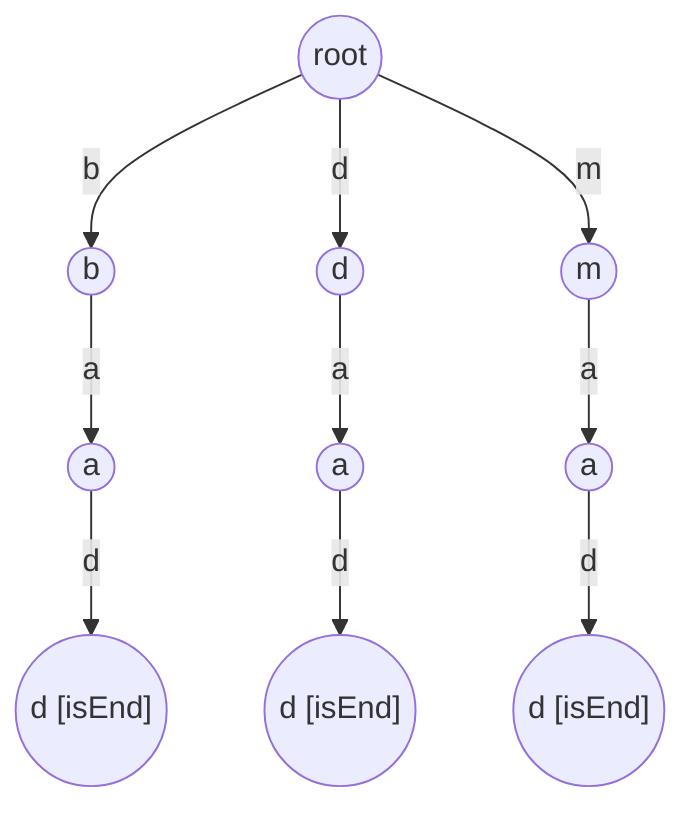
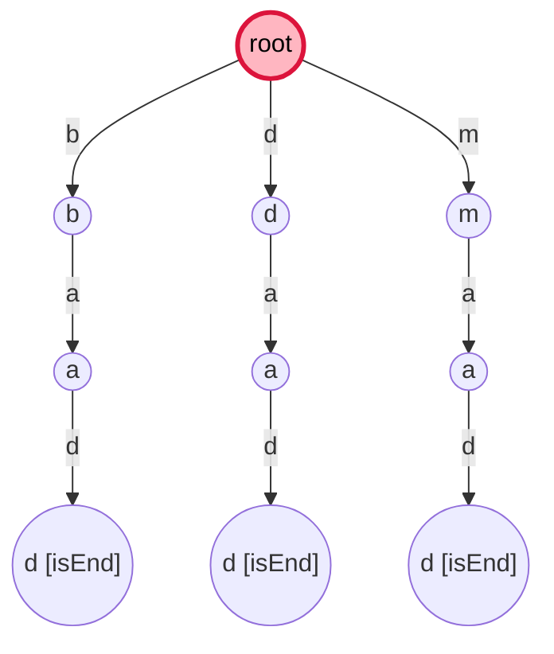
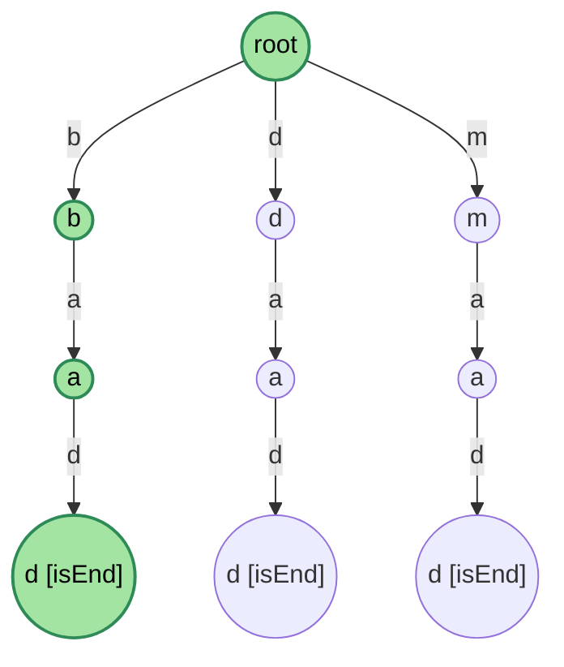
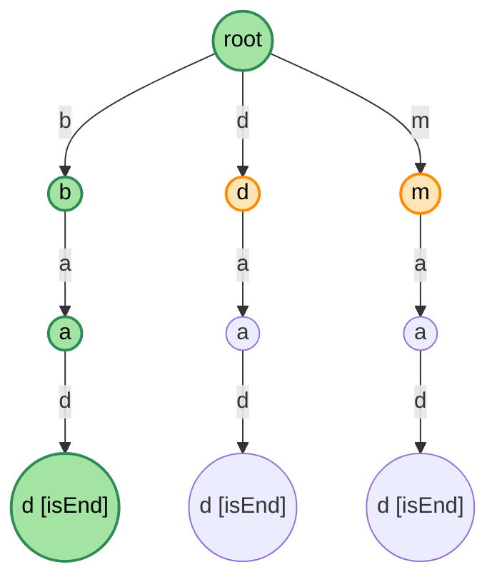

# 解説: 211. Design Add and Search Words Data Structure

## 1. 問題の整理

- **入力**: `WordDictionary` クラスに対する一連の操作
  - `addWord(word)`: 単語を辞書に追加。`word` は英小文字のみ。
  - `search(word)`: 辞書のいずれかの単語と完全一致するかを判定。`word` には **ワイルドカード `.`** を含めることができ、`.` は **任意の英小文字 1 文字** にマッチする。
- **出力**: 各 `search` 呼び出しに対する `true`/`false`。
- **重要な制約**:
  - 単語長は最大 25 文字。
  - 各 `search` クエリの `.` は **最大 2 個**。
  - 操作回数は合計最大 `10^4`。
- **見落としやすい点**:
  - `.` は「任意の 1 文字」であり、「0 文字以上」ではない (正規表現の `.` と同じ)。長さは固定で消費される。
  - 完全一致が必要 (`isEnd == true` のノードに到達しないと `true` にならない)。
  - `addWord` は通常の文字列のみ。`.` が含まれることはない (制約より)。

## 2. 素直に考えるとどうなるか

最初に思いつく案 = **全単語を `List<String>` に保存して、`search` のたびに線形走査**:

- 各単語と `word` を 1 文字ずつ比較し、`.` 位置はスキップ
- マッチがあれば `true`

計算量は 1 回の `search` あたり **O(N × L)** (N = 登録単語数、L = 単語長)。
本問題の制約 (10^4 操作、L ≤ 25) でも最悪 `10^4 × 10^4 × 25 = 2.5 × 10^9` と TLE のリスクあり。

→ trie を使うと **共通プレフィックスを共有して比較対象が一気に減る**。

## 3. 採用するアプローチ

208 で構築した **trie をそのまま再利用** + **`.` の場合だけ DFS で全子ノードを試す** という拡張を加える。

ポイント:

- `addWord` は **完全に 208 と同じ** (通常の trie 挿入)
- `search` は word を 1 文字ずつ辿るが:
  - **通常の文字 `c`**: 1 つの子ノード `children.get(c)` だけ辿る (= 208 と同じ)
  - **ワイルドカード `.`**: その時点の **全ての子ノード** に対して、残りの suffix を再帰的に試す
- 末尾まで到達したら **`isEnd == true`** をチェック

trie の上で「文字列の各位置と現在ノードを引数に持ち回る再帰 DFS」が自然な実装。

### なぜこれが速いか

- ドット無しの場合: 通常の trie 検索と同じ O(L)
- ドット 1 個の場合: 1 回 DFS 分岐。各分岐は O(L)、最悪で 26 分岐
- ドット d 個の場合: 最悪 O(26^d × L)。本問題は d ≤ 2 なので最悪でも `26^2 × 25 ≈ 1.7 × 10^4` で 1 回の search が完結
- 辞書全件比較に比べて、trie の存在する枝にしか降りない (= 早期に枝刈りされる) ため平均は遥かに速い

## 4. 操作の概要

2 つの操作はどちらも「ルートから 1 文字ずつ trie を辿る」共通動作。違いは:

- **addWord(word)**: 子が無ければ作成しながら降りる。最後のノードに `isEnd = true` を立てる。
- **search(word)**: 通常文字なら 1 子だけ降りる。`.` ならその時点の全子に対して残りを再帰。最終位置で `isEnd` をチェック。

`search` を再帰関数にする理由: `.` で **複数ブランチに分岐する可能性** があるため、ループだけでは表現しにくい。「現在ノード + 読んでいる index」を引数に持つヘルパで自然に書ける。

## 5. 具体例トレース

操作列 (問題例):

```
addWord("bad")
addWord("dad")
addWord("mad")
search("pad")  → false
search("bad")  → true
search(".ad")  → true
search("b..")  → true
```

### 5.1 3 単語追加後の trie



3 単語が `bad`, `dad`, `mad` と末尾だけ共通せず、最初の文字で分岐している (= 共通プレフィックスがゼロなので、ルートから 3 本の枝が出る)。

### 5.2 search("pad") → false

`p` を root の子で探す → **`children.get('p')` が `null`** → 即 false。



ピンクのノードで「次の文字 'p' が無くて失敗」。trie に `p` で始まる単語が無いので 1 ステップで終わる。

### 5.3 search("bad") → true

通常文字のみ。`root → b → a → d` を辿り、最後の `d` ノードの `isEnd == true` なので true。



(208 の `search` と完全に同じ動き)

### 5.4 search(".ad") → true

最初の文字が `.` なので、root の **全ての子** (= `b`, `d`, `m` の 3 つ) に対して残り `"ad"` を再帰的に試す。

| 試行ブランチ | 経路 | 結果 |
| --- | --- | --- |
| root → `b` で `"ad"` を search | b → a → d (isEnd) | **true** |
| root → `d` で `"ad"` を search | d → a → d (isEnd) | true (探索済まず) |
| root → `m` で `"ad"` を search | m → a → d (isEnd) | true (探索済まず) |

実装上は **最初の `b` 分岐で true が返ってきた時点で短絡評価** され、残りの分岐は試されない。
ただし「ワイルドカードはどの子にも分岐し得る」という構造を理解するために、3 ブランチが候補として開かれた様子を可視化:



緑 = 実際に最後まで降りて成功した経路 (`b → a → d`)。橙 = `.` 分岐により候補として開かれたが、短絡評価で実際には降りなかった経路。

### 5.5 search("b..") → true

最初の文字 `b` は通常文字 → `root.children.get('b')` で `b` ノードへ。
2 文字目 `.` → `b` ノードの全子 (この場合は `a` の 1 つだけ)。
3 文字目 `.` → `ba` ノードの全子 (この場合は `d` の 1 つだけ)。
最後 `bad` ノードに到達、`isEnd == true` → **true**。


`b` で始まる単語が `bad` の 1 個しかないため、`.` で分岐しても実質 1 ブランチのみ。
**ワイルドカードがあっても trie の構造に存在しない枝には降りない** (= 自動的に枝刈りされる) のがこのアプローチの強み。

## 6. コードの読み解き

### 6.1 `Node` クラスとフィールド

```java
private static class Node {
    Map<Character, Node> children = new HashMap<>();
    boolean isEnd = false;
}
```

208 と完全に同じ。HashMap で「次の文字 → 子ノード」、`isEnd` で「ここで終わる単語があるか」。

### 6.2 `addWord`

208 の `insert` と同一:

```java
for (int i = 0; i < word.length(); i++) {
    char c = word.charAt(i);
    if (!current.children.containsKey(c)) {
        current.children.put(c, new Node());
    }
    current = current.children.get(c);
}
current.isEnd = true;
```

「無ければ作る → 子に降りる」を繰り返す通常の trie 挿入。

### 6.3 `search` (公開 API) とヘルパ `searchFrom`

公開 API はシンプルに保ち、再帰用の内部メソッドに「現在ノード + 読み位置」を渡す:

```java
public boolean search(String word) {
    return searchFrom(root, word, 0);
}
```

`searchFrom` が本体。base case + 通常文字 + ワイルドカード の 3 ケース:

```java
if (index == word.length()) {
    return node.isEnd;
}
```

→ word を最後まで読み終えたら、現在ノードに「単語の終端マーク」が立っていれば成功。

```java
if (currentChar == '.') {
    for (Node child : node.children.values()) {
        if (searchFrom(child, word, index + 1)) {
            return true;
        }
    }
    return false;
}
```

→ ワイルドカード: **全子**で残りを再帰。1 つでも true で短絡。`children.values()` は HashMap の値コレクション (= 存在する子ノードだけ) を返すので、無駄なブランチに降りずに済む。

```java
Node next = node.children.get(currentChar);
if (next == null) {
    return false;
}
return searchFrom(next, word, index + 1);
```

→ 通常文字: 1 子だけ辿る。無ければ即 false。

## 7. 計算量

- **`addWord(word)`**: O(L) (L = `word.length`)
- **`search(word)`**:
  - ドット 0 個: O(L) (通常 trie 検索)
  - ドット d 個: 最悪 O(26^d × L)。本問題では d ≤ 2 なので最悪でも `26^2 × 25 ≈ 1.7 × 10^4` で 1 クエリ完結
  - 実際は trie の枝に存在する子だけ降りるため、平均は遥かに小さい
- **空間計算量**: O(全挿入文字数)。HashMap なので各ノードは「実際に登場した文字分」だけエントリを持つ
- **支配的な処理**: ワイルドカードの分岐数が増えると指数的に膨らむ部分

## 8. つまずきやすいポイント

- **完全一致を忘れる**: word を最後まで読み終えた時点で `isEnd` を確認しないと、「途中の prefix にマッチしただけ」で true を返してしまう。`searchFrom` の base case で `return node.isEnd;` がこれを担保している。
- **`.` を「0 文字以上」と誤解する**: `.` は **常に 1 文字を消費** する。`search("a.b")` は長さ 3 の単語にしかマッチしない。
- **`.` の分岐で「全子」と「全 26 文字」を混同する**: `for (char c = 'a'; c <= 'z'; c++)` で全 26 文字を試すと、HashMap に無いキーで `null` チェックが走るだけで結果は同じだが無駄。`children.values()` を使えば「実在する子だけ」を試せる (配列方式の場合は `for (int i = 0; i < 26; i++)` で `null` 判定を入れる必要がある)。
- **再帰の引数を間違える**: `searchFrom(child, word, index + 1)` の `index + 1` を `index` のままにすると無限再帰。
- **早期 return を忘れる**: ワイルドカードの分岐で 1 つでも true なら即 return しないと、無駄な分岐で計算量が増える。
- **大文字や記号への拡張**: 制約上 `addWord` は英小文字のみだが、HashMap 方式なので任意の文字をキーにできる。配列方式 (208 AISolution2) で実装すると拡張時に困る。
