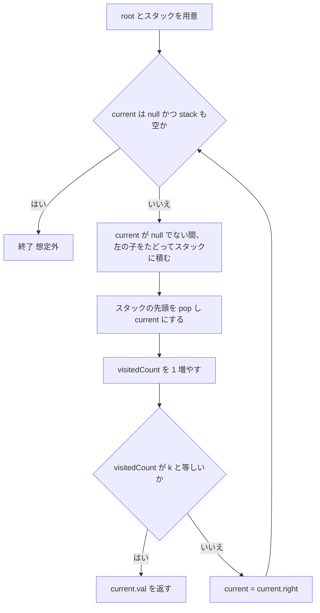
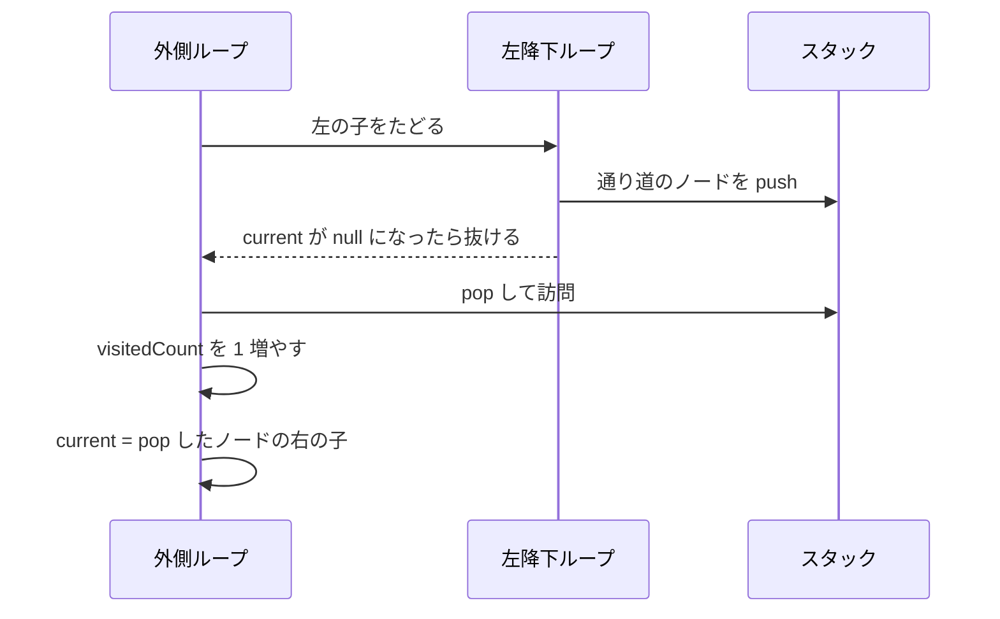

# 解説: 230. Kth Smallest Element in a BST

## 1. 問題の整理

- **入力**: 二分探索木 (BST) の `root` ノードと、整数 `k` (1-indexed)
- **出力**: BST に含まれる全ノードの値のうち、小さい方から数えて `k` 番目の値
- **ゴール**: BST という性質をうまく使って、効率的に「k 番目に小さい値」を取り出す
- **見落としやすい制約**:
  - `k` は 1-indexed（最小値が 1 番目）
  - ノード値は重複しない (BST の前提)
  - ツリーのサイズは最大 10^4 なので、最悪でも全ノードを走査する解法で十分間に合う

## 2. 素直に考えるとどうなるか

最初に思いつきやすいのは、以下のようなアプローチです。

1. ツリー全体をどんな順序でも良いので走査して、全ノードの値をリストに集める
2. リストをソートして、`k - 1` 番目の要素を返す

これでも答えは出ますが、

- 全ノードを集めて並べるので、時間 O(N log N)、空間 O(N) かかる
- BST の「左部分木 < ノード < 右部分木」という性質を全く使っていない

BST 特有の構造を活かすともっと早く解けます。

## 3. 採用するアプローチ

**中順走査 (In-order Traversal) を反復で行う方法を採用します。**

### なぜ中順走査か

BST を「左 → 自分 → 右」の順に訪れる中順走査をすると、**ノードの値が必ず昇順に並びます**。
つまり、`k` 番目に訪れたノードの値がそのまま答えです。

```
   3
  / \
 1   4
  \
   2
```

この BST を中順走査すると `1 → 2 → 3 → 4` の順で訪問するので、

- `k = 1` → 1
- `k = 2` → 2
- `k = 3` → 3
- `k = 4` → 4

となります。

### なぜ反復版か

中順走査は再帰でも書けますが、反復版を採用する理由は次の通りです。

- **早期終了がしやすい**: `k` 個目に到達したらループを抜けるだけで終われる
- **スタックオーバーフローを避けられる**: 偏った木 (例: 左に長く伸びる木) でも、再帰呼び出しの深さに制限される心配がない

### 他案との比較

| 方法 | 時間 | 空間 | コメント |
| --- | --- | --- | --- |
| 全ノードを集めてソート | O(N log N) | O(N) | BST の性質を使っていない |
| 再帰の中順走査 (全部走査) | O(N) | O(H) | k 個目で止められず無駄 |
| 反復の中順走査 (今回採用) | **O(H + k)** | **O(H)** | k 個目で打ち切れる |

`H` はツリーの高さ。バランスが取れていれば `H ≈ log N`。

## 4. 全体の流れ



ポイントは「左に降りられるだけ降りる → 一番下に着いたら pop して訪問する → 右に進む」というサイクルを繰り返すことです。

## 5. 具体例トレース

例 2 を使って動きを追います。

入力: `root = [5,3,6,2,4,null,null,1]`, `k = 3`

ツリーの形は以下のようになります。

```
        5
       / \
      3   6
     / \
    2   4
   /
  1
```

中順走査の順序は `1 → 2 → 3 → 4 → 5 → 6` なので、`k = 3` の答えは `3` です。

これを反復版でトレースします。

| step | 操作 | stack (top→bottom) | current | visitedCount | メモ |
| --- | --- | --- | --- | --- | --- |
| 1 | 開始 | [] | 5 | 0 | |
| 2 | 左へ降りつつ push | [5] | 3 | 0 | |
| 3 | さらに左へ | [3, 5] | 2 | 0 | |
| 4 | さらに左へ | [2, 3, 5] | 1 | 0 | |
| 5 | さらに左へ (1.left は null) | [1, 2, 3, 5] | null | 0 | |
| 6 | pop して訪問 | [2, 3, 5] | 1 | 1 | k=3 ではないので継続 |
| 7 | current = 1.right (null) | [2, 3, 5] | null | 1 | |
| 8 | pop して訪問 | [3, 5] | 2 | 2 | k=3 ではないので継続 |
| 9 | current = 2.right (null) | [3, 5] | null | 2 | |
| 10 | pop して訪問 | [5] | 3 | 3 | **k=3 に到達 → 3 を返す** |

途中でループを抜けられるため、ノード `4`, `5`, `6` には触れずに済みます。これが「k 個目で打ち切れる」効果です。



## 6. コードの読み解き

```java
Deque<TreeNode> stack = new ArrayDeque<>();
TreeNode currentNode = root;
int visitedCount = 0;
```

- 走査の途中で「あとで戻ってくる必要のあるノード」を覚えておくためのスタック
- `currentNode` は今これから処理しようとしているノード
- `visitedCount` は今までに何個のノードを訪問したか (= 今訪問したノードが何番目か)

```java
while (currentNode != null || !stack.isEmpty()) {
```

- `currentNode` が null でも、スタックに戻る先が残っていればまだ続ける
- 両方空になったらツリーを完全に走査し終わったということ

```java
while (currentNode != null) {
  stack.push(currentNode);
  currentNode = currentNode.left;
}
```

- 「左の子をたどれるだけたどる」フェーズ
- 通った各ノードはスタックに積んでおき、後で「自分」と「右の子」を処理するために戻ってこられるようにする

```java
currentNode = stack.pop();
visitedCount++;
if (visitedCount == k) {
  return currentNode.val;
}
```

- 左をたどり切ったので、最後に積んだノード (= 今いる場所からたどれる最小値) を取り出す
- これが「次に訪問する番のノード」なので `visitedCount` を 1 増やす
- ちょうど `k` 番目ならその値を返して終了

```java
currentNode = currentNode.right;
```

- 自分を訪問したので、次は右部分木を同じ手順で処理する
- 右の子が null でも while のもう一方の条件 (`!stack.isEmpty()`) で救われる

## 7. 計算量

- **時間計算量**: `O(H + k)`
  - 最初の左降下で高さ `H` 分の push を行う
  - その後は最大で `k` 回 pop して訪問を繰り返す
  - 最悪ケース (`k = N` かつ偏ったツリー) でも `O(N)` で抑えられる
- **空間計算量**: `O(H)`
  - スタックに同時に乗るのは「現在いるパス上のノード」だけ
  - バランスの取れた木なら `O(log N)`、一直線に偏った木なら `O(N)`

## 8. つまずきやすいポイント

- **1-indexed であることを忘れない**: `k = 1` が最小値。`k - 1` ではなく「`visitedCount == k` のとき返す」と書く
- **左降下のループで `null` チェックを忘れない**: 葉ノードまで降りた後の `node.left` は null なので、必ず内側の while で守る
- **右の子が null でもループを終わらせない**: `currentNode = currentNode.right` の結果が null でも、スタックに戻り先があるならまだ続ける必要がある (外側 while の `||` 条件が効く)
- **再帰版で書く場合**: `k` 個目で本当に止めるためには、見つかった値を保持しつつ早期 return する仕組み (例: フィールドに保存して `if (found) return;` を入れる) が必要。普通に左→自分→右と再帰しているだけだと最後まで走ってしまう
- **フォローアップ**: BST が頻繁に変更されるなら、各ノードに「自分の左部分木のサイズ」を持たせると、k 番目を `O(H)` で求めつつ、挿入・削除も `O(H)` で行えるようになる
