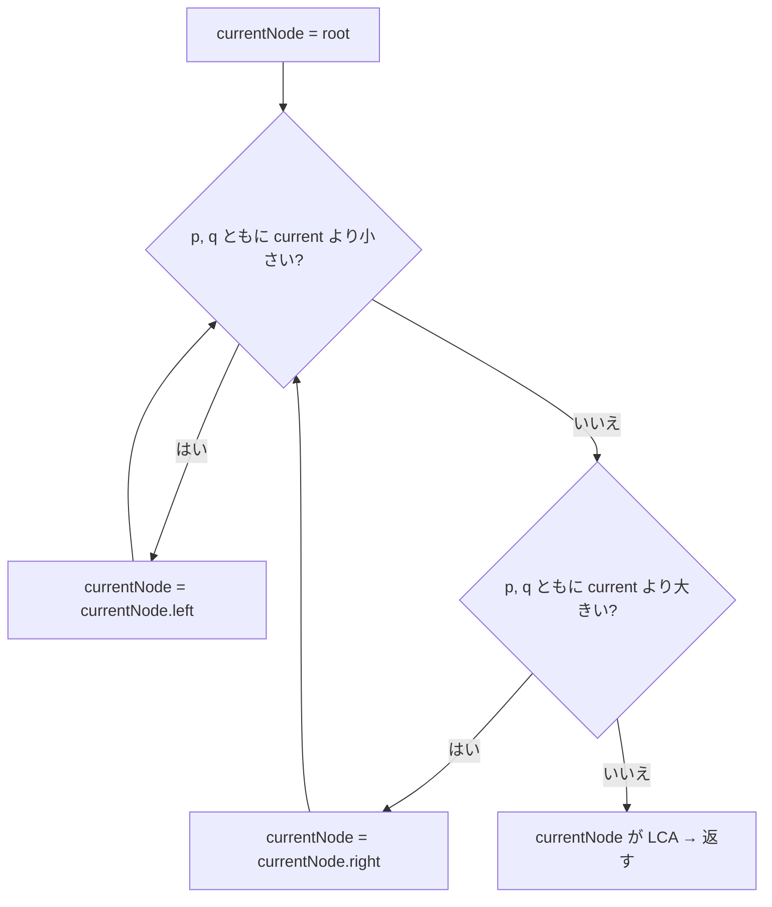

# 解説: 235. Lowest Common Ancestor of a Binary Search Tree

## 1. 問題の整理

- **入力**: 二分探索木 (BST) の `root` と、その BST に存在する 2 つのノード `p`, `q`
- **出力**: `p` と `q` の最小共通祖先 (LCA) のノード
- **LCA の定義**: `p` と `q` の両方を子孫として持つ、**最も深い** ノード
  - **重要**: ノードは「自分自身の子孫」ともみなす  
    → `p` が `q` の祖先なら、LCA は `p` 自身
- **見落としやすい制約**:
  - 入力が **BST** であること (普通の二分木ではない！)
  - `p` と `q` は必ず BST に存在する → 「見つからない」ケースを考えなくてよい
  - 値は全て一意

## 2. 素直に考えるとどうなるか

普通の二分木の LCA 問題 (#236) のつもりで解こうとすると、

1. ルートから DFS で `p` と `q` をそれぞれ探し、ルートからのパスを 2 本作る
2. 2 本のパスを先頭から比較し、共通するノードのうち最も深いものを返す

これでも答えは出ますが、

- パスを 2 本作るのにメモリ O(N)
- ノードを再帰的に全部見る可能性があり時間 O(N)
- **BST の "値の大小" という強力な情報を全く使っていない**

BST なら値を見ただけで「左に行くべきか右に行くべきか」が判断できるので、それを活用した方が断然速いです。

## 3. 採用するアプローチ

**現在のノードの値と `p`, `q` の値を比較しながら、行くべき方向に降りていくだけ** で済みます。

### キーアイデア

BST の性質: 任意のノード `currentNode` に対して

```
左部分木の全ノードの値 < currentNode.val < 右部分木の全ノードの値
```

この性質を使うと、`p` と `q` が `currentNode` から見てどこにいるかが値の比較だけで分かります。

| `p`, `q` の位置 | 言い換え | LCA はどこ？ |
| --- | --- | --- |
| 両方とも `currentNode` より小さい | 両方とも左部分木にいる | 左部分木の中にある → 左に降りる |
| 両方とも `currentNode` より大きい | 両方とも右部分木にいる | 右部分木の中にある → 右に降りる |
| `p` と `q` が `currentNode` を挟む | 一方が左、もう一方が右 | **`currentNode` 自身が LCA** |
| `currentNode` が `p` または `q` | 片方が今のノード | **`currentNode` 自身が LCA** (もう一方は子孫) |

最後の 2 行は同じ `else` 節で扱えます。「左でも右でもないなら、ここが分岐点」というだけの判定で済むからです。

### なぜ反復で書くか

- 「次に進む方向が確定したら今のノードに用はない」型の処理 (= 末尾再帰相当) なので、ループにすると素直
- スタック消費が O(1) になり、ノード数 10^5 でも安心
- 再帰版でも書けるが、`return lowestCommonAncestor(node.left, p, q);` のような書き方になり、ループと中身は同じ

## 4. 全体の流れ



## 5. 具体例トレース

例 1 を使います。

入力: `root = [6,2,8,0,4,7,9,null,null,3,5]`, `p = 2`, `q = 8`

ツリーの形:

```
          6
        /   \
       2     8
      / \   / \
     0   4 7   9
        / \
       3   5
```

| step | currentNode.val | pValue | qValue | 判定 | 次のアクション |
| --- | --- | --- | --- | --- | --- |
| 1 | 6 | 2 | 8 | `2 < 6 < 8` → 分岐 | **6 を返す** |

1 ステップで終わります。BST の性質をフル活用した結果です。

例 2 も追ってみます。

入力: `root = [6,2,8,0,4,7,9,null,null,3,5]`, `p = 2`, `q = 4`

| step | currentNode.val | pValue | qValue | 判定 | 次のアクション |
| --- | --- | --- | --- | --- | --- |
| 1 | 6 | 2 | 4 | 両方とも 6 より小さい | 左へ → currentNode = 2 |
| 2 | 2 | 2 | 4 | `2 < 2` は偽、`4 < 2` も偽 → 分岐 (current が p) | **2 を返す** |

ノード 2 自身が `p` なので、LCA は 2 です (定義により自分自身も子孫扱い)。

```mermaid
sequenceDiagram
    participant Loop as 反復ループ
    participant Cur as currentNode
    Loop->>Cur: p, q の値と比較
    Cur-->>Loop: 両方左 → 左に降りる
    Loop->>Cur: 比較
    Cur-->>Loop: 分岐点 (p == current) → 返す
```

## 6. コードの読み解き

```java
int pValue = p.val;
int qValue = q.val;
```

- 比較で何度も使う値なので、最初に取り出してローカル変数に入れておく
- 性能差はほぼないが、ループ内が `pValue < currentValue` のように読みやすくなる

```java
TreeNode currentNode = root;
while (currentNode != null) {
```

- `currentNode` を root から始めて下に降ろしていく
- 制約上 `p`, `q` は必ず BST に存在するので、本来 `null` になることはないが、安全のため while で守る

```java
int currentValue = currentNode.val;
```

- ループ内でも何度も使うので一度だけ取り出す

```java
if (pValue < currentValue && qValue < currentValue) {
  currentNode = currentNode.left;
}
```

- `p` も `q` も `currentValue` より小さい → 両方とも左部分木にいる
- LCA も左部分木の中にあるので、左に降りる

```java
else if (pValue > currentValue && qValue > currentValue) {
  currentNode = currentNode.right;
}
```

- 同じ理屈で右に降りる

```java
else {
  return currentNode;
}
```

- 残るパターンは:
  - **分岐**: 一方が `currentValue` より小さく、もう一方が大きい → ここで初めて `p` と `q` が左右に分かれるので、`currentNode` が LCA
  - **自分自身**: `currentValue == pValue` または `currentValue == qValue` → 自分が `p` または `q` なので、自分自身が LCA (もう一方は子孫)
- どちらも `currentNode` を返せばよい

## 7. 計算量

- **時間計算量**: `O(H)`
  - `H` はツリーの高さ
  - 各ステップで必ず一段降りるので、最悪でも木の高さ分しかループしない
  - バランスが取れていれば `O(log N)`、偏った木で最悪 `O(N)`
- **空間計算量**: `O(1)`
  - ループ変数だけしか使わない
  - 再帰版にしても、末尾再帰相当なのでコールスタックの深さは `O(H)`

## 8. つまずきやすいポイント

- **#236 (普通の二分木の LCA) と混同しない**: 236 は値の大小が使えないので別の解法 (左右両方を再帰的に探す) になる。BST 用にはこの値比較が圧倒的にラク
- **「自分自身も子孫」のルール**: `p` がもう片方の祖先のとき、LCA は `p` 自身。`else` 節がこのケースを自然に拾うことを意識する
- **`<=` と `<` の違い**: 値は一意なので `<` で十分。`<=` にしても結果は変わらないが、意味的には `<` が正しい
- **`p`, `q` が BST に存在しないケース**: 本問では制約で保証されているので考えなくてよい。一般化したい場合は別途存在チェックが必要
- **再帰版で書く場合の注意**: `lowestCommonAncestor(node.left, p, q)` のように戻り値をそのまま返すこと。「左を探した後にさらに右も探す」という処理は不要 (BST だから片側で済む)
