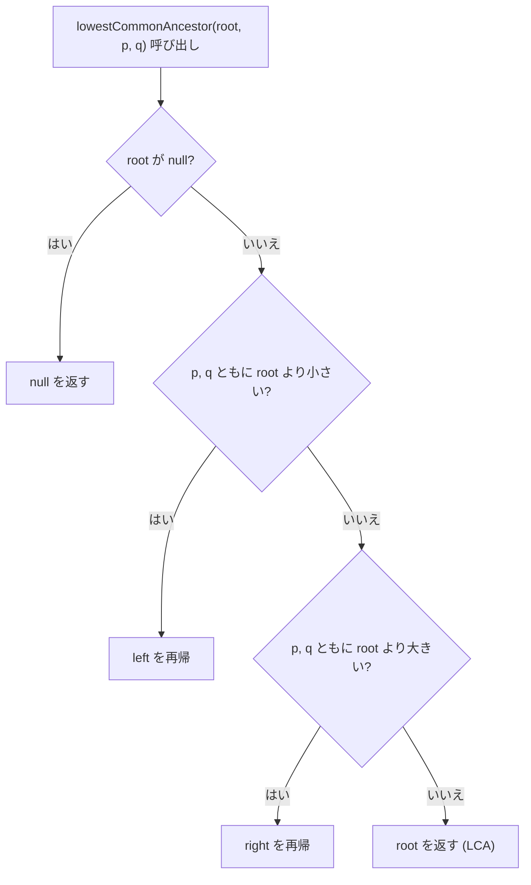
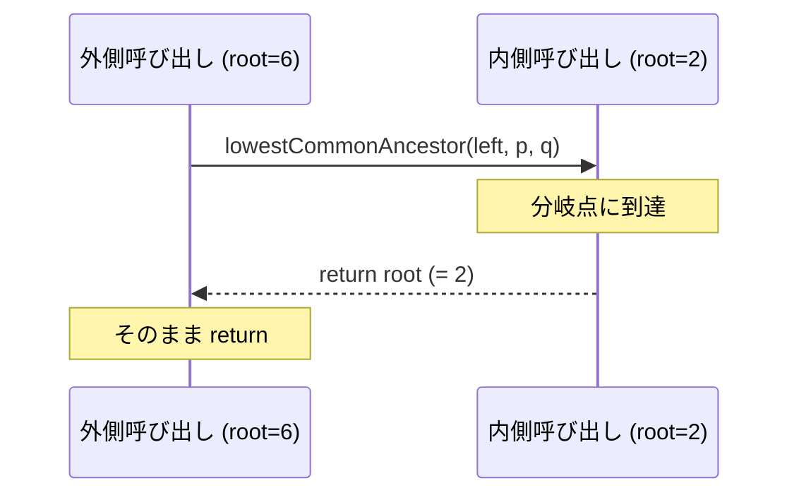

# 解説: 235. Lowest Common Ancestor of a Binary Search Tree (再帰版)

## 1. 問題の整理

- **入力**: 二分探索木 (BST) の `root` と、その BST に存在する 2 つのノード `p`, `q`
- **出力**: `p` と `q` の最小共通祖先 (LCA) のノード
- **LCA の定義**: `p` と `q` の両方を子孫として持つ、**最も深い** ノード
  - **重要**: ノードは「自分自身の子孫」ともみなす  
    → `p` が `q` の祖先なら、LCA は `p` 自身

詳細は `AISolution/explanation.md` (反復版) と共通なのでそちらも参照してください。

## 2. なぜ再帰版を別解として用意するのか

反復版 (`AISolution`) と論理は完全に同じですが、

- **BST の構造をそのまま辿る** ことを言葉そのままに表現できる
- 「左に降りる」を `lowestCommonAncestor(root.left, p, q)` と書ける
- ツリー問題の「DFS の型」に慣れる練習になる
- 面接で「BST じゃない場合は？」(#236) と聞かれたとき、再帰の方がシームレスに切り替えやすい

性能面ではコールスタックを `O(H)` 使う以外は反復版と同等。
ノード数が最大 `10^5`、高さ最大 `10^5` (一直線に偏った木) でも、JVM のデフォルトスタックサイズ (数十万段) で十分間に合います。

## 3. 採用するアプローチ

BST の性質を使って、ルートから「行くべき方向」だけを再帰的に辿る。

### キーアイデア

任意のノード `root` に対して、

```
左部分木の全ノードの値 < root.val < 右部分木の全ノードの値
```

このため、`p`, `q` が `root` から見てどこにいるかは値の大小だけで判定できる。

| `p`, `q` の位置 | 言い換え | 再帰先 |
| --- | --- | --- |
| 両方とも `root.val` より小さい | 両方とも左部分木 | `root.left` を再帰 |
| 両方とも `root.val` より大きい | 両方とも右部分木 | `root.right` を再帰 |
| `p` と `q` が `root.val` を挟む | 一方が左、もう一方が右 | **`root` が LCA** → 返す |
| `root` が `p` または `q` | 片方が今のノード | **`root` が LCA** (もう一方は子孫) → 返す |

最後の 2 行は同じ「else」枝で扱える。

### 反復版との対応

| 反復版 | 再帰版 |
| --- | --- |
| `currentNode = currentNode.left;` (ループ続行) | `return lowestCommonAncestor(root.left, p, q);` |
| `currentNode = currentNode.right;` (ループ続行) | `return lowestCommonAncestor(root.right, p, q);` |
| `return currentNode;` | `return root;` |

末尾再帰 (= 戻り値をそのまま return するだけ) なので、「ループに 1:1 で書き換え可能」と覚えておくと両方の理解が深まります。

## 4. 全体の流れ



## 5. 具体例トレース

例 1 を使います。

入力: `root = [6,2,8,0,4,7,9,null,null,3,5]`, `p = 2`, `q = 8`

ツリー:

```
          6
        /   \
       2     8
      / \   / \
     0   4 7   9
        / \
       3   5
```

| 呼び出し | root.val | pValue | qValue | 判定 | アクション |
| --- | --- | --- | --- | --- | --- |
| 1 | 6 | 2 | 8 | `2 < 6 < 8` → 分岐 | **6 を返す** |

例 2: `p = 2`, `q = 4`

| 呼び出し | root.val | pValue | qValue | 判定 | アクション |
| --- | --- | --- | --- | --- | --- |
| 1 | 6 | 2 | 4 | 両方とも 6 より小さい | left (= 2) を再帰 |
| 2 | 2 | 2 | 4 | `2 < 2` も `4 < 2` も偽 → 分岐 (root が p) | **2 を返す** |
| 1 (戻り) | — | — | — | 再帰の結果 (2) をそのまま return | **最終答え 2** |

末尾再帰なので、再帰呼び出しが返ってきた値をそのまま外に渡しているだけ、という点に注目。



## 6. コードの読み解き

```java
if (root == null) {
  return null;
}
```

- 制約上 `root` は null にならないが、防御的にチェック
- 再帰の途中でも本来到達しないが、安全のため

```java
int rootValue = root.val;
int pValue = p.val;
int qValue = q.val;
```

- 比較で何度も使う値をローカル変数に取り出す
- 再帰呼び出しごとに新しいスタックフレームで取得されるが、コストは無視できる
- コードの可読性が上がる

```java
if (pValue < rootValue && qValue < rootValue) {
  return lowestCommonAncestor(root.left, p, q);
}
```

- `p`, `q` ともに左部分木にいるパターン
- LCA は左部分木の中にあるので、左を再帰してその結果をそのまま返す
- ここでの `return` がポイント。「左を呼んだ結果が答え」と確定しているので、自分の階層では何もしない

```java
if (pValue > rootValue && qValue > rootValue) {
  return lowestCommonAncestor(root.right, p, q);
}
```

- 右側についても同じ理屈

```java
return root;
```

- 残るパターン:
  - **分岐点**: `p < root < q` または `q < root < p` → ここで p と q が左右に分かれる
  - **自分自身が LCA**: `root == p` または `root == q` (値の比較で `pValue == rootValue` または `qValue == rootValue`)
- どちらも `root` を返せばよい
- BST の値が一意であることが効いている (重複があると `==` の意味が変わる)

## 7. 計算量

- **時間計算量**: `O(H)`
  - 各再帰呼び出しは O(1) の処理 (値の比較 3 回程度) しか行わない
  - 必ず一段降りるので、最悪でも木の高さ分の再帰
  - バランスが取れていれば `O(log N)`、偏った木で最悪 `O(N)`
- **空間計算量**: `O(H)`
  - コールスタックの深さが再帰の深さと一致
  - 反復版が `O(1)` だったのに対し、ここはコールスタック分余分にかかる
  - とはいえ `H <= 10^5` なので JVM デフォルトスタックで足りる

## 8. つまずきやすいポイント

- **末尾再帰相当だが、Java は末尾再帰最適化しない**: 「再帰だからスタック消費が多い」のは事実。本問では問題にならないが、汎用的には注意
- **「再帰は `else if` でも書ける」と気づかない**: 一段下がる条件が排他的なので、どの順番で書いても結果は同じ。`if-else if-else` でまとめる方が読みやすい場合もある
- **`return` を書き忘れる**: 再帰の戻り値を return しないと結果が捨てられて null が返る。末尾の `return root;` も忘れがち
- **base case の `root == null` チェックを省略しがち**: 本問では到達しないが、書く癖をつけておくと #236 (普通の二分木) などで助かる
- **「再帰版 vs 反復版」どちらが良いか**: 性能はほぼ同じ。**両方書けることが大事**。面接で「コールスタック消費が嫌なら反復に書き換えられます」と一言添えられると◎
- **#236 への発展**: 再帰版に慣れておくと、BST 縛りを外した #236 (普通の二分木 LCA) にスムーズに移行できる。#236 では `left` と `right` 両方を再帰してから判断する形になる
