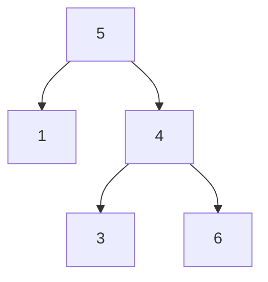
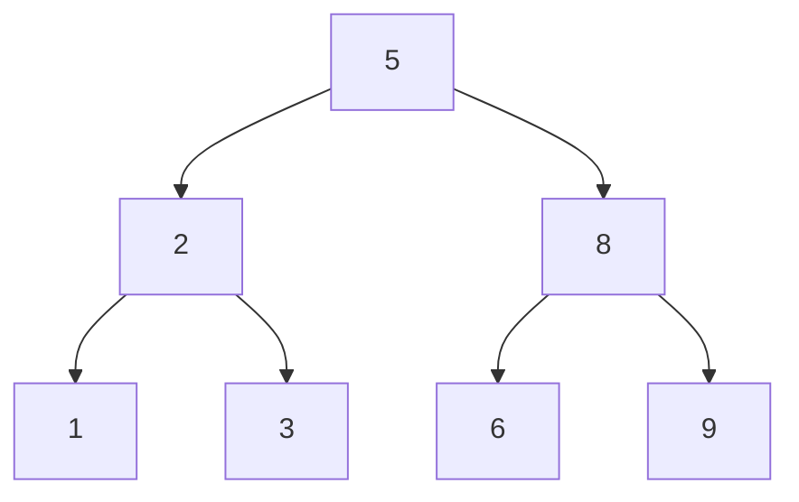
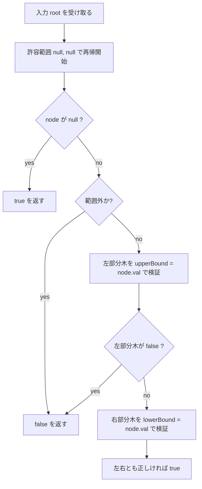
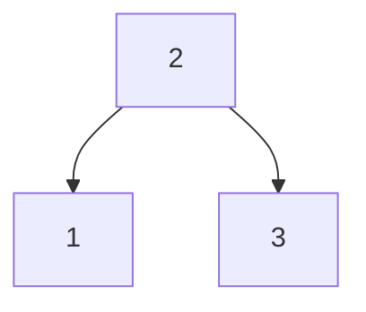
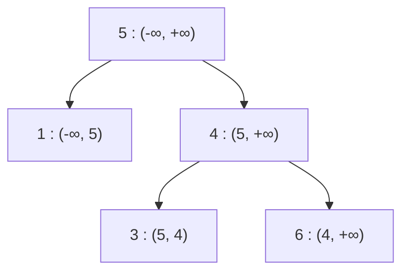

# 解説: 98. Validate Binary Search Tree

## 1. 問題の整理

- 入力は二分木の根 `root` です。
- 返す値は、その木が BST なら `true`、そうでなければ `false` です。
- BST の条件は「左が小さい、右が大きい」ですが、これは親子だけを見ればよいわけではありません。
- あるノードは、自分の親だけでなく、祖先ノードが決めた条件もすべて守る必要があります。

例えば次の木を見てください。



一見すると:

- `1 < 5`
- `3 < 4`
- `4 < 6`

なので、親子関係だけ見れば良さそうに見えるかもしれません。

しかしこの木には 2 つの問題があります。

- `4` は `5` の右の子なので、本来は `4 > 5` でなければならない
- でも実際は `4 < 5` なので、この時点で失格

さらに、

- `3` は `4` の左の子なので、親子だけ見れば `3 < 4` で一見正しそう
- しかし `3` は `5` の右部分木の中にいる
- そのため本来は `3 > 5` でもないといけない
- でも実際は `3 < 5` なので、これも失格

この 2 つ目が「祖先の制約」です。
親だけではなく、もっと上の祖先が決めた範囲も守る必要があります。

制約を正しく満たす 3 階層の例は次のようになります。



この図では:

- `2` は `5` の左部分木なので `2 < 5`
- `8` は `5` の右部分木なので `8 > 5`
- `3` は `2` の右部分木なので `3 > 2`
- さらに `3` は `5` の左部分木の中にいるので `3 < 5`
- `6` は `8` の左部分木なので `6 < 8`
- さらに `6` は `5` の右部分木の中にいるので `6 > 5`

このように、各ノードは親との大小関係だけでなく、祖先から受け継いだ範囲も同時に満たしています。

## 2. 素直に考えるとどうなるか

初見では、各ノードで

- 左の子 `<` 自分
- 右の子 `>` 自分

だけを確認したくなります。

しかしそれでは不十分です。

例 2:

```text
root = [5,1,4,null,null,3,6]
```

図にすると:


`4` は `5` の右にあるので、本来は `4 > 5` でなければなりません。
しかし実際は `4 < 5` なので、この時点で BST ではありません。

さらに `3` も、親 `4` とだけ比べると `3 < 4` で問題なさそうに見えますが、
`5` の右部分木にいる以上は `3 > 5` も満たす必要があります。
親子だけを見る方法では、この「祖先の制約違反」を見落としやすいです。

## 3. 採用するアプローチ

採用するのは、**各ノードが入ってよい値の範囲を持ちながら DFS する方法**です。

- 根にはまだ制限がないので、範囲は `(-∞, +∞)`
- 左に進むと、「今のノードより小さい」という上限がつく
- 右に進むと、「今のノードより大きい」という下限がつく

これなら、親だけでなく祖先から受け継いだ条件も自然にチェックできます。

### なぜこの方法がよいのか

- 各ノードを 1 回ずつ見るだけでよい
- 条件違反を見つけた瞬間に `false` を返せる
- 「祖先の条件も守る」という BST の本質にそのまま対応している

## 4. 全体の流れ



## 5. 具体例トレース

### 例 1: `root = [2,1,3]`



最初の許容範囲は `(-∞, +∞)` です。

| step | current node | allowed range | action | result |
| --- | --- | --- | --- | --- |
| 1 | `2` | `(-∞, +∞)` | 範囲内なので続行 | 左右を調べる |
| 2 | `1` | `(-∞, 2)` | 範囲内なので続行 | 左右を調べる |
| 3 | `null` | `(-∞, 1)` | 空ノード | `true` |
| 4 | `null` | `(1, 2)` | 空ノード | `true` |
| 5 | `3` | `(2, +∞)` | 範囲内なので続行 | 左右を調べる |
| 6 | `null` | `(2, 3)` | 空ノード | `true` |
| 7 | `null` | `(3, +∞)` | 空ノード | `true` |

最終的にすべて条件を満たすので `true` です。

### 例 2: `root = [5,1,4,null,null,3,6]`


この例では `4` が問題です。

| step | current node | allowed range | action | result |
| --- | --- | --- | --- | --- |
| 1 | `5` | `(-∞, +∞)` | 範囲内 | 左右を調べる |
| 2 | `1` | `(-∞, 5)` | 範囲内 | `true` を返せる |
| 3 | `4` | `(5, +∞)` | `4 <= 5` で範囲外 | `false` |

ここで打ち切れます。

### 範囲がどう伝わるかを図で見る



`4` は右部分木にいるので、本来は `(5, +∞)` に入っていなければいけません。
しかし `4` はその範囲を満たさないので失敗です。

## 6. コードの読み解き

### エントリポイント

```java
public boolean isValidBST(TreeNode root) {
    return isValidSubtree(root, null, null);
}
```

最初は下限も上限もありません。
そのため `null, null` を渡して、「まだ制約なし」の状態から始めます。

### 再帰関数の意味

```java
private boolean isValidSubtree(TreeNode node, Long lowerBound, Long upperBound)
```

この関数は、

- `node` を根とする部分木が
- `lowerBound < node.val < upperBound`

という条件を満たしながら BST になっているかを判定します。

### 空ノードの扱い

```java
if (node == null) {
    return true;
}
```

空ノードは BST 条件を壊しません。
再帰の終端として `true` を返します。

### 範囲チェック

```java
if (lowerBound != null && currentValue <= lowerBound) {
    return false;
}

if (upperBound != null && currentValue >= upperBound) {
    return false;
}
```

ここがこの問題の本体です。

- 下限があるなら、それより **厳密に大きい** 必要がある
- 上限があるなら、それより **厳密に小さい** 必要がある

`<=` と `>=` を使っているのは、BST が「重複不可」だからです。

### 左右の再帰

```java
if (!isValidSubtree(node.left, lowerBound, currentValue)) {
    return false;
}

return isValidSubtree(node.right, currentValue, upperBound);
```

左部分木では:

- 下限はそのまま
- 上限は `currentValue`

右部分木では:

- 下限は `currentValue`
- 上限はそのまま

になります。

これで祖先由来の条件がずっと引き継がれます。

## 7. 計算量

- 時間計算量: `O(n)`
- 空間計算量: `O(h)`

### 理由

- 各ノードを 1 回ずつしか見ないので時間は `O(n)`
- 再帰の深さは木の高さ `h` なので追加メモリは `O(h)`
- 最悪で片側に偏った木なら `h = n`

## 8. つまずきやすいポイント

### 1. 親子だけ比べてしまう

それでは不十分です。
祖先から受け継いだ条件も守る必要があります。

### 2. `<` ではなく `<=` / `>=` を使う理由を忘れる

BST では「厳密に小さい」「厳密に大きい」が必要です。
同じ値が出た時点で失敗です。

### 3. `int` のまま境界を持ちたくなる

`Node.val` は `-2^31` から `2^31 - 1` まで取りえます。
境界管理で安全に扱うため、`Long` を使っておく方が安心です。

### 4. inorder の昇順性で解く方法と混同する

この問題は inorder 走査して「前の値より常に大きいか」を確認する方法でも解けます。
ただ、今回は初心者が BST の条件そのものを理解しやすいように、範囲を引き継ぐ方法を採用しています。
