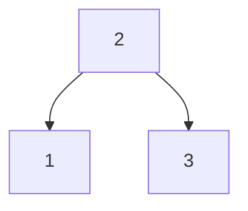
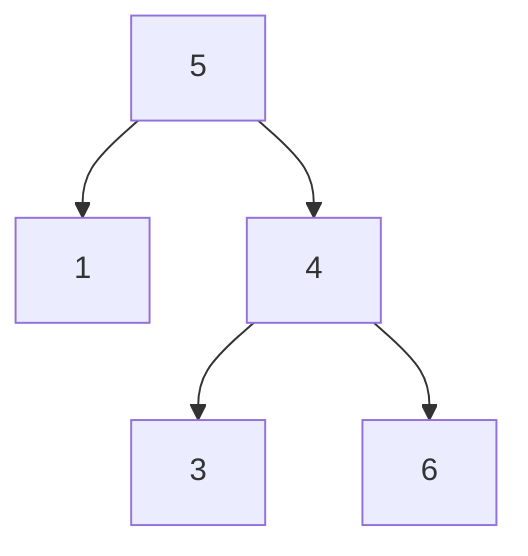

# 98. 二分探索木が有効かどうかを検証する

難易度: Medium

## 問題

二分木の `root` が与えられます。*それが有効な二分探索木（BST）かどうか* を判定してください。

**有効な BST** は次のように定義されます。

- ノードの左部分木に含まれるノードのキーは、すべてそのノードのキーより **厳密に小さい**
- ノードの右部分木に含まれるノードのキーは、すべてそのノードのキーより **厳密に大きい**
- 左右の部分木もともに二分探索木でなければならない

## 例

**例 1:**

```text
入力: root = [2,1,3]
出力: true
```



**例 2:**

```text
入力: root = [5,1,4,null,null,3,6]
出力: false
説明: 根ノードの値は 5 ですが、その右の子ノードの値は 4 です。
```



## 制約

- 木のノード数の範囲は `[1, 10^4]`
- `-2^31 <= Node.val <= 2^31 - 1`

## 備考

- BST は「左が小さい、右が大きい」を各ノードで満たす木です。
- ただし、親子 2 ノードだけを比べればよいわけではありません。
- あるノードが右部分木にあるなら、その値は親だけでなく、さらに上の祖先の条件も満たす必要があります。
- この問題では「そのノードが取りうる最小値と最大値の範囲」を持ちながら木をたどる考え方が重要です。
