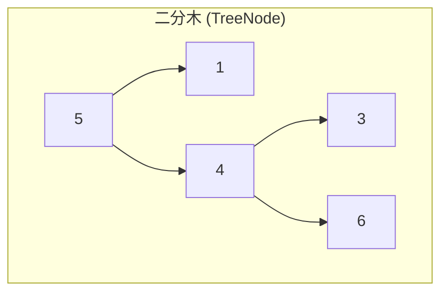
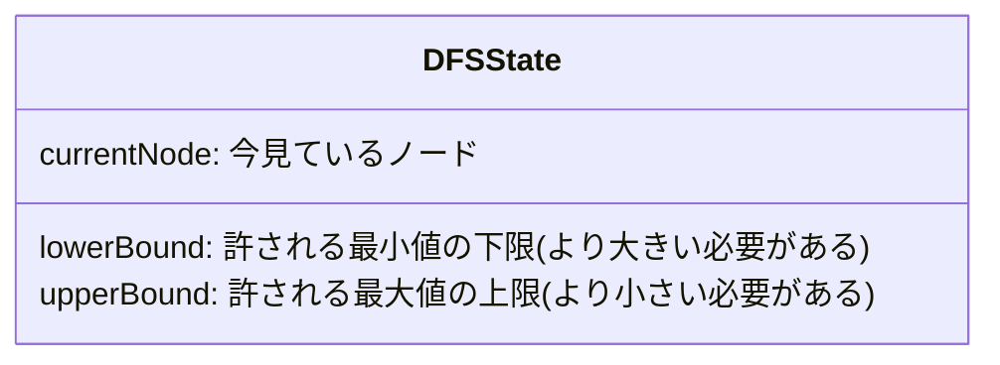
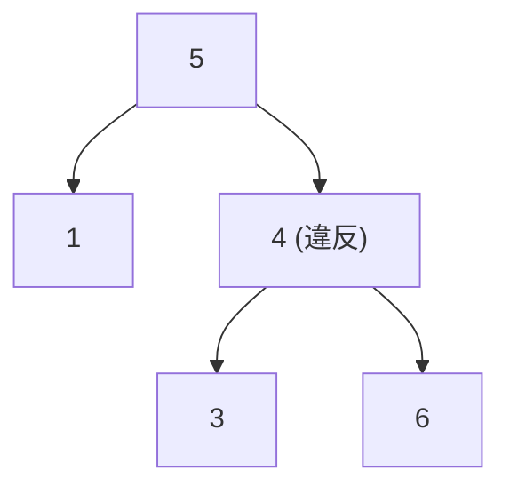

# 解説: 98. Validate Binary Search Tree

## 1. 問題の整理

- 入力として二分木の根 `root` を受け取り、それが BST の条件を満たすなら `true`、満たさなければ `false` を返します。
- ゴールは「各ノードが、その位置で許される値の範囲に収まっているか」を正しく判定することです。
- 見落としやすい点は、「親とだけ比較しても不十分」ということです。たとえば右部分木にあるノードは、直近の親だけでなく、もっと上の祖先ノードの条件も満たす必要があります。

## 2. 素直に考えるとどうなるか

- 初見では「各ノードについて、左の子が小さいか、右の子が大きいかを確認すればよい」と考えがちです。
- しかしその方法では、部分木の奥にあるノードの違反を見逃します。
- 例として `root = [5,1,4,null,null,3,6]` では、`3` は `4` より小さいので `4` の左側としては自然に見えますが、木全体では `5` の右部分木にあるため `5` より大きくなければなりません。この違反は親子だけの比較では検出できません。

## 3. 採用するアプローチ

- 深さ優先探索（DFS）を使い、各ノードに「ここに置いてよい値の下限 `lowerBound` と上限 `upperBound`」を渡しながら調べます。
- ルートにはまだ制限がないので `(null, null)` から始めます。
- 左部分木へ進むときは上限が現在ノード値になり、右部分木へ進むときは下限が現在ノード値になります。
- この方法なら、祖先から受け継いだ制約をすべて保ったまま判定できます。

## 4. 全体の流れ

- ルートから DFS を開始する。
- 現在ノードが `null` なら、その枝では違反がないので `true` を返す。
- 現在ノードの値が `lowerBound` 以下、または `upperBound` 以上なら BST 条件違反なので `false` を返す。
- 左部分木を `(lowerBound, currentValue)` で再帰的に調べる。
- 右部分木を `(currentValue, upperBound)` で再帰的に調べる。
- 左右の結果が両方とも `true` のときだけ、その部分木は有効と判定する。

このアプローチで利用するデータ構造は「二分木」と「再帰で受け渡す境界値」です。

## 5. 具体例トレース

例 2 の `root = [5,1,4,null,null,3,6]` を追います。

| step | current state | action | result |
| --- | --- | --- | --- |
| 1 | `node=5, range=(-inf, +inf)` | 5 が範囲内か確認 | OK |
| 2 | `node=1, range=(-inf, 5)` | 左部分木へ進み、1 が範囲内か確認 | OK |
| 3 | `node=null` | 1 の左を確認 | `true` |
| 4 | `node=null` | 1 の右を確認 | `true` |
| 5 | `node=4, range=(5, +inf)` | 右部分木へ進み、4 が範囲内か確認 | `4 <= 5` なので `false` |

step 5 の時点で、`4` は「5 の右部分木にあるなら 5 より大きいはず」という条件を破っています。

## 6. コードの読み解き

- `isValidBST` は入口のメソッドで、ルートに対して `isValidSubtree(root, null, null)` を呼び出します。
- `isValidSubtree` の引数 `lowerBound` と `upperBound` は、そのノードが満たすべき値の範囲です。
- `currentNode == null` のときに `true` を返すのは、「空の木は BST とみなしてよい」からです。
- `currentValue <= lowerBound` の判定では、下限より大きくなければならない条件を見ています。BST は「厳密に小さい / 大きい」なので、等号も違反です。
- `currentValue >= upperBound` も同様に、上限より厳密に小さい必要があることを確認しています。
- 左再帰 `isValidSubtree(currentNode.left, lowerBound, currentValue)` は、「左の子孫は currentValue より小さい」という条件を新しく追加しています。
- 右再帰 `isValidSubtree(currentNode.right, currentValue, upperBound)` は、「右の子孫は currentValue より大きい」という条件を追加しています。
- 最後に `&&` でつないでいるので、左右どちらか一方でも違反があれば全体が `false` になります。

## 7. 計算量

- 時間計算量は `O(n)` です。各ノードを 1 回ずつ訪問するためです。
- 空間計算量は `O(h)` です。`h` は木の高さで、再帰呼び出しスタックの深さに対応します。
- 平衡木なら `h = O(log n)`、片側に偏った木なら最悪 `h = O(n)` です。

## 8. つまずきやすいポイント

- 親ノードとの大小比較だけで判定してしまうと、祖先由来の制約を見落とします。
- BST の条件は「以下 / 以上」ではなく「より小さい / より大きい」です。重複値は許されません。
- `Node.val` は `int` 範囲ですが、境界を扱う都合で `Long` を使うと実装が安全です。
- `null` を「まだ下限なし / 上限なし」の意味で使うと、初期値を無理に `Integer.MIN_VALUE` や `Integer.MAX_VALUE` に固定しなくて済みます。
